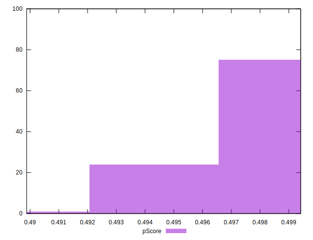
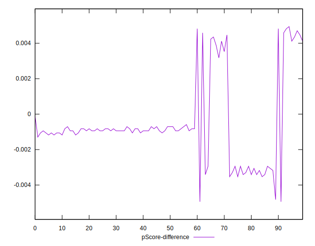

# //uses-rel-preload/samples/pages+cached+noadtech+nomedia

[→ Parent](../..)


## Raw


```yaml
p90min: 756
p90max: 802
p90range: 46
p90mean: 769.5851063829788
p90median: 759
p90stdev: 15.523084782313584
p90skewness: 0.8293173350476792
p90eccentricity: 0.9999999999999988
p90discretization: 4.086956521739131
outlandishness: 1.0025611821969471
confidence: 6.820732113177703
p90confidence: 6.276133737616882

```


## Score


```yaml
p90min: 0.49
p90max: 0.5
p90range: 0.010000000000000009
p90mean: 0.4982978723404257
p90median: 0.5
p90stdev: 0.0037581961133309996
p90skewness: -1.7550294029241436
p90eccentricity: 1.0000000000000016
p90discretization: 47
outlandishness: 0.9992059646881918
confidence: 0.001537791289486095
p90confidence: 0.0015194751397822291

```


## Raw Estimate


## Score Estimate


## P Score


```yaml
p90min: 0.4938823529411765
p90max: 0.49929411764705883
p90range: 0.005411764705882338
p90mean: 0.49769586983729686
p90median: 0.4989411764705882
p90stdev: 0.0018262452685074762
p90skewness: -0.8293173350468884
p90eccentricity: 1.0000000000000002
p90discretization: 4.086956521739131
outlandishness: 0.9995344291309504
confidence: 0.0008024390721385528
p90confidence: 0.0007383686750137491

```


## Score Difference


```yaml
p90min: 0
p90max: 0
p90range: 0
p90mean: 0
p90median: 0
p90stdev: 0
p90skewness: .nan
p90eccentricity: .nan
p90discretization: 94
outlandishness: .nan
confidence: 0
p90confidence: 0

```


## P Score Difference


```yaml
p90min: -0.003529411764705892
p90max: 0.0048235294117647265
p90range: 0.008352941176470619
p90mean: -0.0005519399249061293
p90median: -0.0009411764705882231
p90stdev: 0.002290152640172621
p90skewness: 1.1572334572786902
p90eccentricity: 1.0000000000000002
p90discretization: 3.9166666666666665
outlandishness: 0.887611799610244
confidence: 0.0009898513139740142
p90confidence: 0.000925930924867212

```

