# //uses-rel-preload/samples/pages+cached+noadtech

[→ Parent](../..)


## Raw


```yaml
p90min: 755
p90max: 799
p90range: 44
p90mean: 768.4893617021277
p90median: 759
p90stdev: 14.40282528493353
p90skewness: 0.9200717644856126
p90eccentricity: 0.9999999999999994
p90discretization: 3.6153846153846154
outlandishness: 1.0023192367871108
confidence: 6.377755331134425
p90confidence: 5.8232019573045415

```

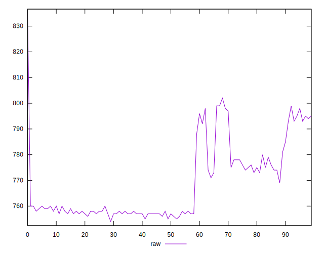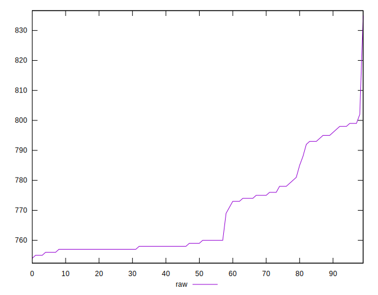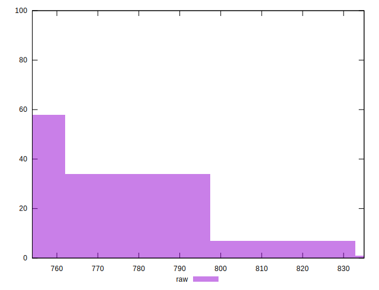
## Score


```yaml
p90min: 0.49
p90max: 0.5
p90range: 0.010000000000000009
p90mean: 0.4985106382978725
p90median: 0.5
p90stdev: 0.003560255432059898
p90skewness: -1.9721272054017542
p90eccentricity: 1.0000000000000013
p90discretization: 47
outlandishness: 0.9991551081134699
confidence: 0.001472453516549767
p90confidence: 0.001439445802495618

```

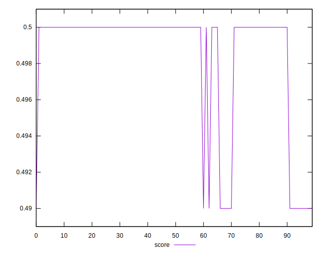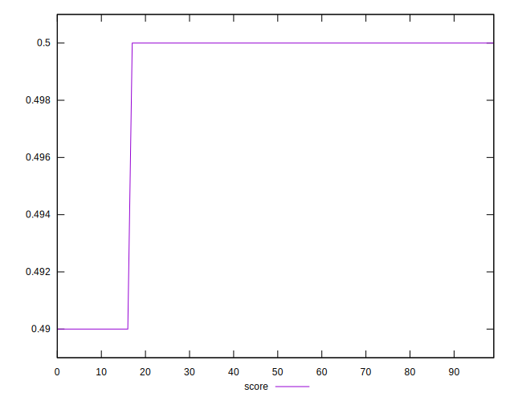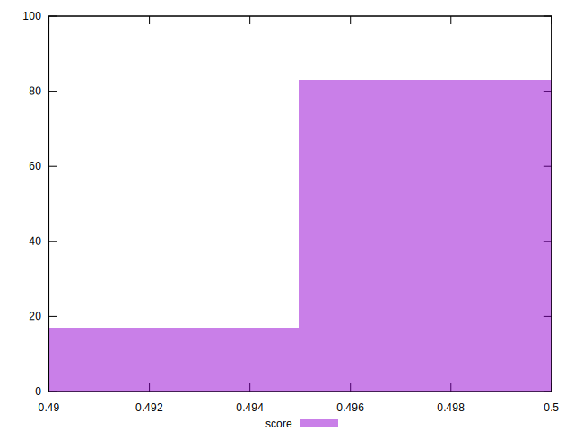
## Raw Estimate

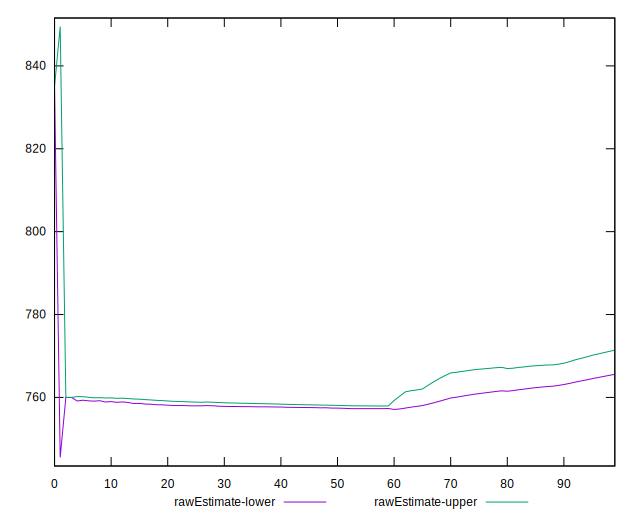
## Score Estimate

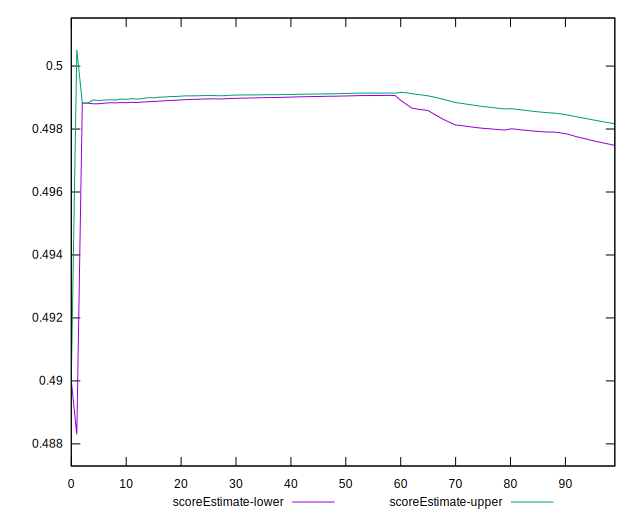
## P Score


```yaml
p90min: 0.49423529411764705
p90max: 0.49941176470588233
p90range: 0.005176470588235282
p90mean: 0.4978247809762204
p90median: 0.4989411764705882
p90stdev: 0.0016944500335215895
p90skewness: -0.9200717644850636
p90eccentricity: 1.000000000000001
p90discretization: 3.6153846153846154
outlandishness: 0.9995790890562357
confidence: 0.0007503241566040492
p90confidence: 0.0006850825832122982

```

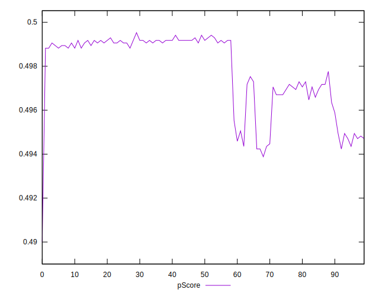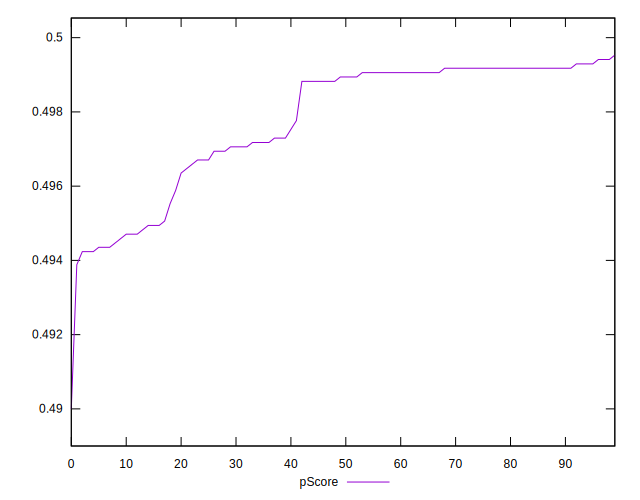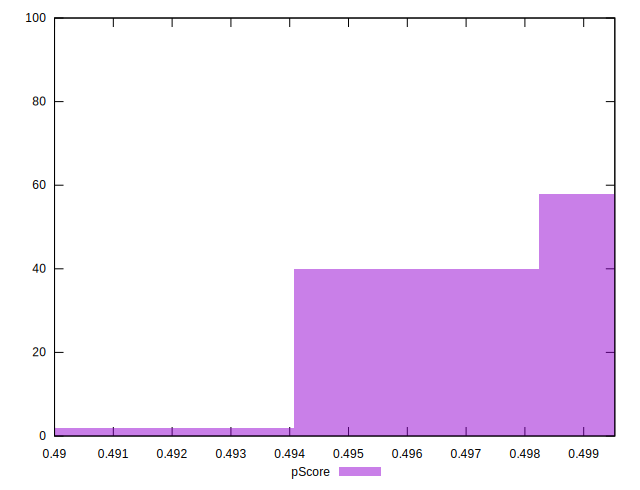
## Score Difference


```yaml
p90min: 0
p90max: 0
p90range: 0
p90mean: 0
p90median: 0
p90stdev: 0
p90skewness: .nan
p90eccentricity: .nan
p90discretization: 94
outlandishness: .nan
confidence: 0
p90confidence: 0

```


## P Score Difference


```yaml
p90min: -0.003647058823529392
p90max: 0.0048235294117647265
p90range: 0.008470588235294119
p90mean: -0.00063078848560701
p90median: -0.0009411764705882231
p90stdev: 0.0022208777630433173
p90skewness: 1.3583694040800771
p90eccentricity: 0.9999999999999987
p90discretization: 3.76
outlandishness: 0.8454510597757621
confidence: 0.0009617814183581795
p90confidence: 0.0008979224201390889

```

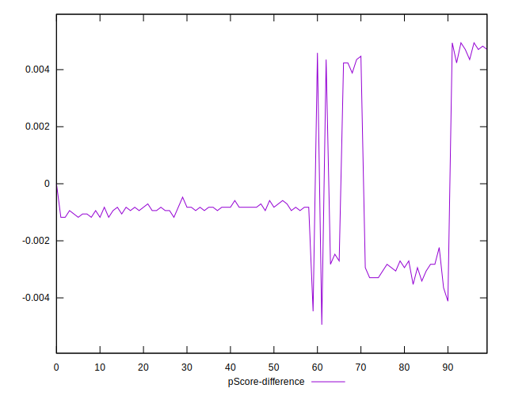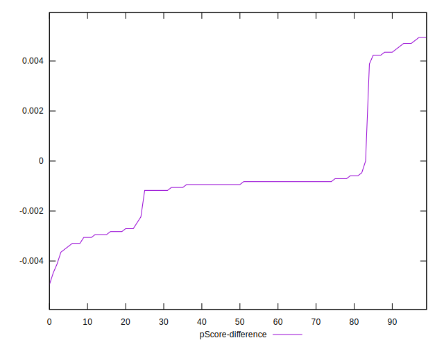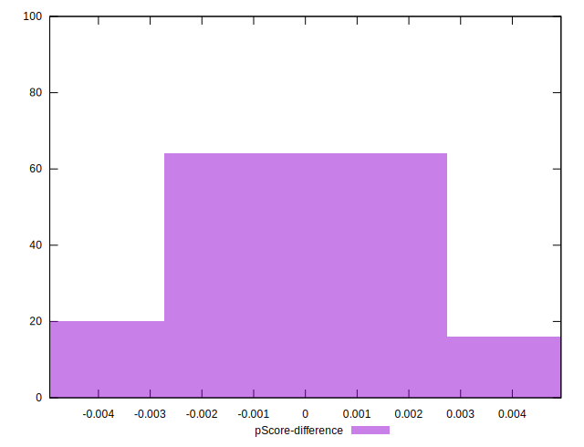