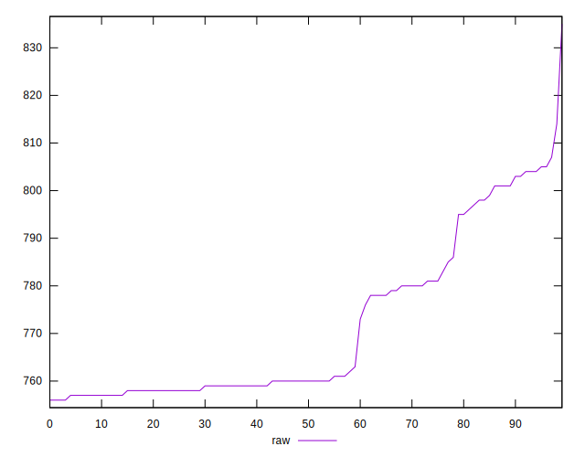

# //uses-rel-preload/samples/pages+cached

[→ Parent](../..)


## Raw


```yaml
p90min: 756
p90max: 805
p90range: 49
p90mean: 771
p90median: 760
p90stdev: 16.704566836392058
p90skewness: 0.8899746635805328
p90eccentricity: 0.9999999999999996
p90discretization: 3.6153846153846154
outlandishness: 1.0025437686835197
confidence: 7.2332985334847715
p90confidence: 6.753818391406787

```


## Score


```yaml
p90min: 0.49
p90max: 0.5
p90range: 0.010000000000000009
p90mean: 0.4980851063829789
p90median: 0.5
p90stdev: 0.003934732342320632
p90skewness: -1.5681404042640197
p90eccentricity: 0.9999999999999979
p90discretization: 47
outlandishness: 0.9992568660074188
confidence: 0.0015966189505992455
p90confidence: 0.0015908504494072761

```


## Raw Estimate


## Score Estimate


## P Score


```yaml
p90min: 0.4935294117647059
p90max: 0.49929411764705883
p90range: 0.0057647058823529496
p90mean: 0.49752941176470594
p90median: 0.4988235294117647
p90stdev: 0.0019652431572225923
p90skewness: -0.8899746635806243
p90eccentricity: 1.0000000000000002
p90discretization: 3.6153846153846154
outlandishness: 0.9995365871597549
confidence: 0.0008509762980570306
p90confidence: 0.000794566869577268

```


## Score Difference


```yaml
p90min: 0
p90max: 0
p90range: 0
p90mean: 0
p90median: 0
p90stdev: 0
p90skewness: .nan
p90eccentricity: .nan
p90discretization: 94
outlandishness: .nan
confidence: 0
p90confidence: 0

```


## P Score Difference


```yaml
p90min: -0.003647058823529392
p90max: 0.004470588235294115
p90range: 0.008117647058823507
p90mean: -0.0005356695869837275
p90median: -0.0009411764705882231
p90stdev: 0.0022403353350975643
p90skewness: 0.9894165941318727
p90eccentricity: 1
p90discretization: 3.9166666666666665
outlandishness: 0.8227507227705452
confidence: 0.0009525247182998836
p90confidence: 0.0009057893052417785

```

