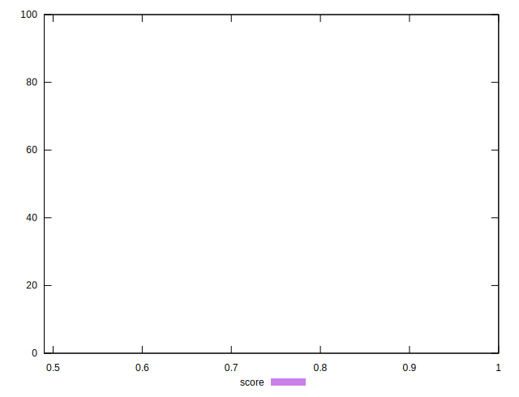
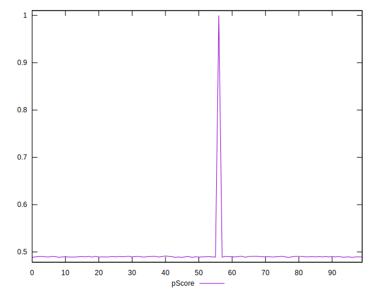

# //uses-rel-preload/samples/pages

[→ Parent](../..)


## Raw


```yaml
p90min: 828
p90max: 847
p90range: 19
p90mean: 836.2446808510638
p90median: 837
p90stdev: 4.7078164297731355
p90skewness: 0.1582705724656732
p90eccentricity: 0.9999999999999974
p90discretization: 4.7
outlandishness: 0.9804025383865607
confidence: 32.68484245922724
p90confidence: 1.9034158441929556

```


## Score


```yaml
p90min: 0.49
p90max: 0.49
p90range: 0
p90mean: 0.4900000000000001
p90median: 0.49
p90stdev: 1.1102230246251565e-16
p90skewness: -1
p90eccentricity: 1
p90discretization: 94
outlandishness: 1.02092465639317
confidence: 0.019891423326347676
p90confidence: 4.488739370326686e-17

```


## Raw Estimate


## Score Estimate


## P Score


```yaml
p90min: 0.48858823529411766
p90max: 0.4908235294117647
p90range: 0.0022352941176470575
p90mean: 0.4898535669586984
p90median: 0.48976470588235294
p90stdev: 0.0005538607564438974
p90skewness: -0.15827057246589504
p90eccentricity: 0.9999999999999992
p90discretization: 4.7
outlandishness: 1.0208749760130187
confidence: 0.01989917887284222
p90confidence: 0.0002239312757874062

```


## Score Difference


```yaml
p90min: 0
p90max: 0
p90range: 0
p90mean: 0
p90median: 0
p90stdev: 0
p90skewness: .nan
p90eccentricity: .nan
p90discretization: 94
outlandishness: .nan
confidence: 0
p90confidence: 0

```


## P Score Difference


```yaml
p90min: -0.0014117647058823346
p90max: 0.0007058823529411673
p90range: 0.002117647058823502
p90mean: -0.0001551939924906024
p90median: -0.00023529411764705577
p90stdev: 0.0005448892518935462
p90skewness: -0.17778025482669063
p90eccentricity: 0.9999999999999992
p90discretization: 4.947368421052632
outlandishness: 1.0628944849115611
confidence: 0.0002404733531764623
p90confidence: 0.00022030400948207774

```

