# //uses-text-compression/samples/pages+cached+noadtech+nomedia

[→ Parent](../..)


## Raw


```yaml
p90min: 2460
p90max: 2740
p90range: 280
p90mean: 2571.7021276595747
p90median: 2550
p90stdev: 74.21415673106344
p90skewness: 0.9664547204823996
p90eccentricity: 1.0000000000000002
p90discretization: 7.833333333333333
outlandishness: 1.001398685147665
confidence: 31.866748175025528
p90confidence: 30.005503377737398

```

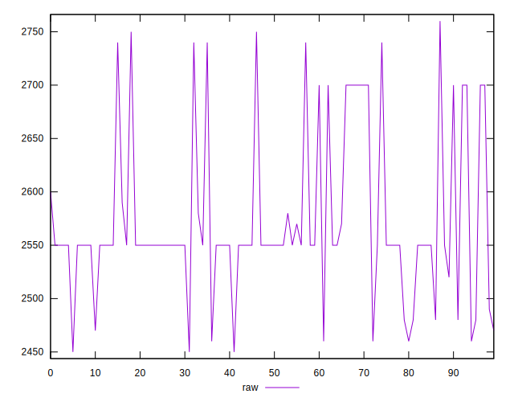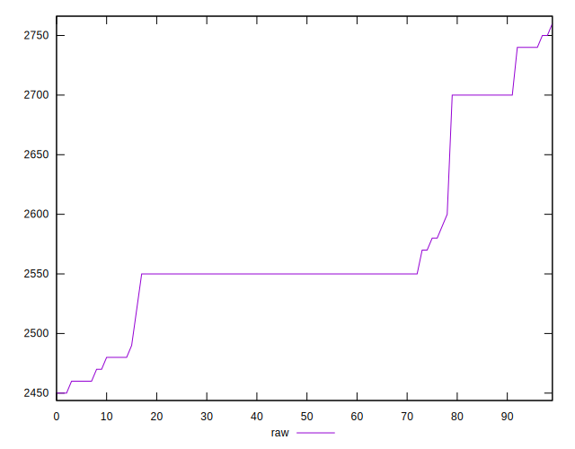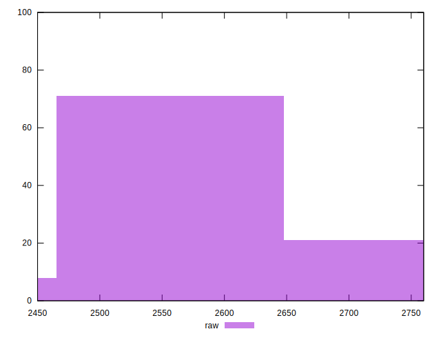
## Score


```yaml
p90min: 0.27
p90max: 0.3
p90range: 0.02999999999999997
p90mean: 0.2871276595744678
p90median: 0.29
p90stdev: 0.00929680114575356
p90skewness: -0.8309598065664316
p90eccentricity: 1.0000000000000004
p90discretization: 23.5
outlandishness: 0.9970233373660412
confidence: 0.004075782688540898
p90confidence: 0.003758786873937497

```

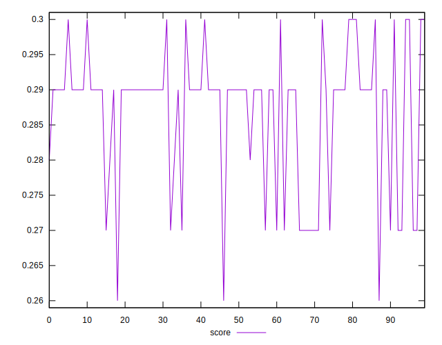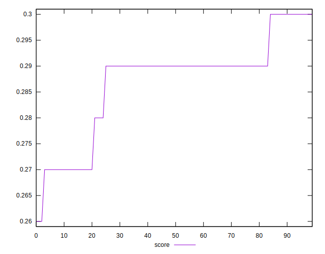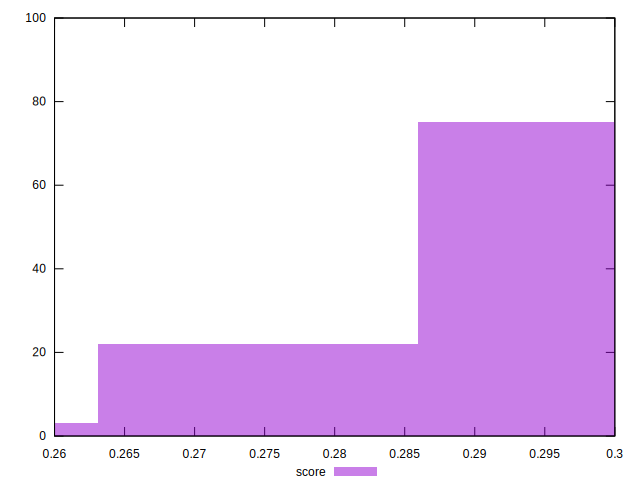
## Raw Estimate

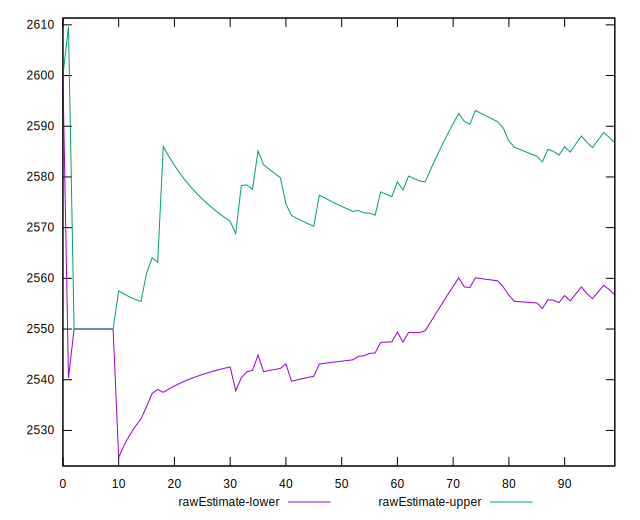
## Score Estimate

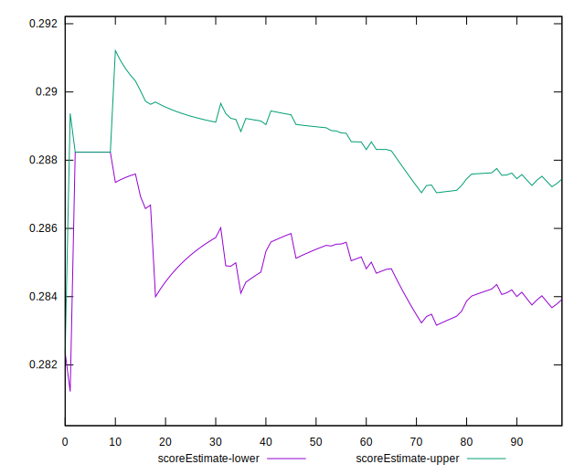
## P Score


```yaml
p90min: 0.26588235294117646
p90max: 0.2988235294117647
p90range: 0.03294117647058825
p90mean: 0.2856821026282854
p90median: 0.28823529411764703
p90stdev: 0.008731077262478048
p90skewness: -0.966454720482568
p90eccentricity: 1.0000000000000022
p90discretization: 7.833333333333333
outlandishness: 0.9985197806223505
confidence: 0.003749029197061824
p90confidence: 0.003530059220910281

```

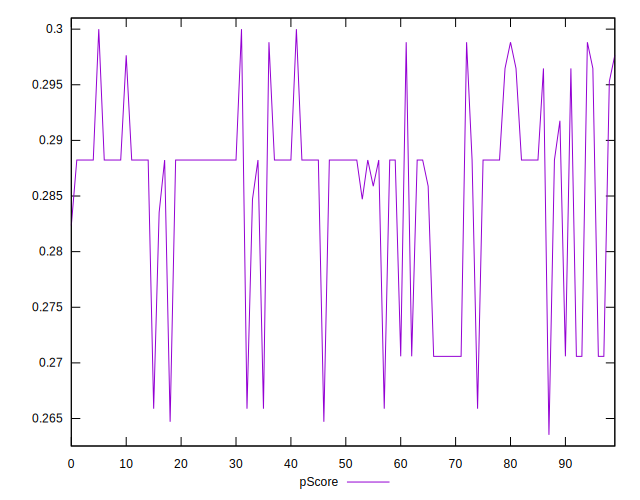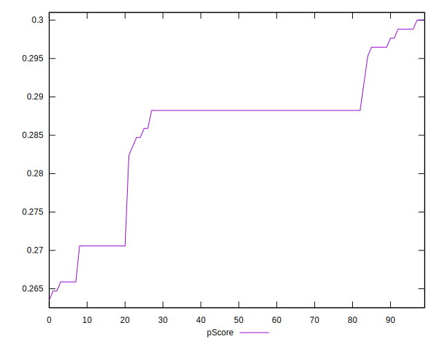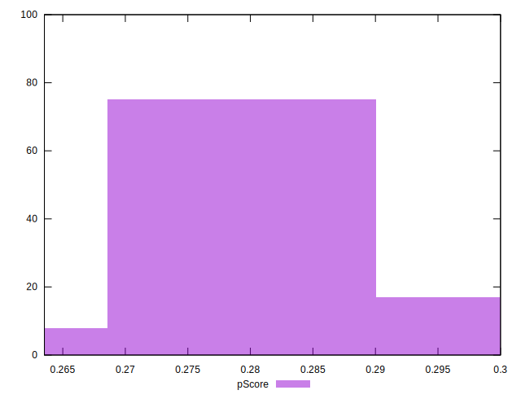
## Score Difference


```yaml
p90min: 0
p90max: 0
p90range: 0
p90mean: 0
p90median: 0
p90stdev: 0
p90skewness: .nan
p90eccentricity: .nan
p90discretization: 94
outlandishness: .nan
confidence: 0
p90confidence: 0

```


## P Score Difference


```yaml
p90min: -0.004117647058823559
p90max: 0.004705882352941115
p90range: 0.008823529411764675
p90mean: -0.001320400500625789
p90median: -0.001764705882352946
p90stdev: 0.001583723648543258
p90skewness: 1.2126237865038858
p90eccentricity: 1.0000000000000004
p90discretization: 7.230769230769231
outlandishness: 0.86692867635498
confidence: 0.0007550314490079225
p90confidence: 0.0006403148318180235

```

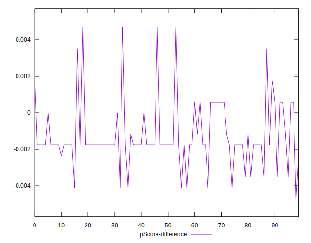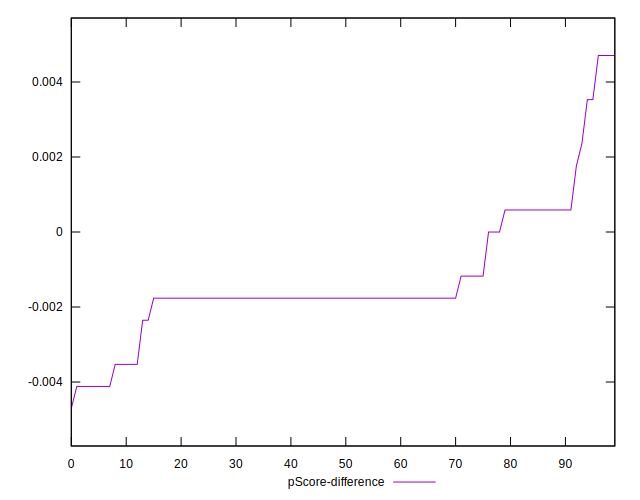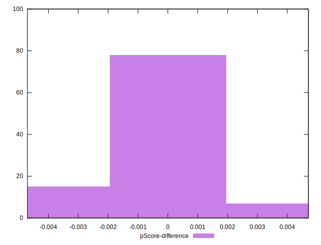