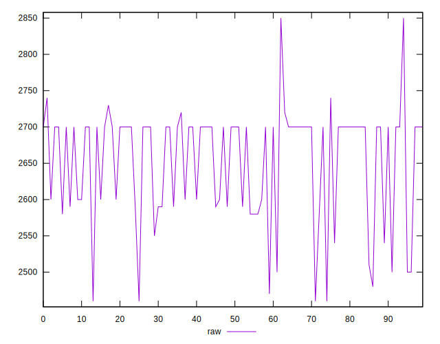
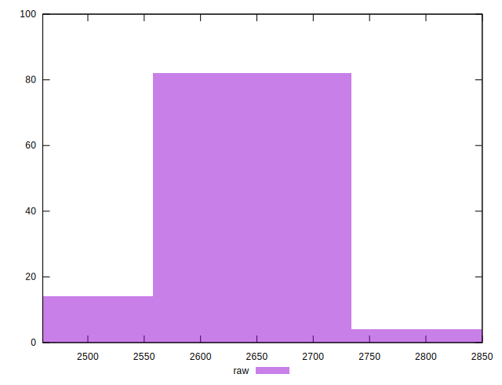
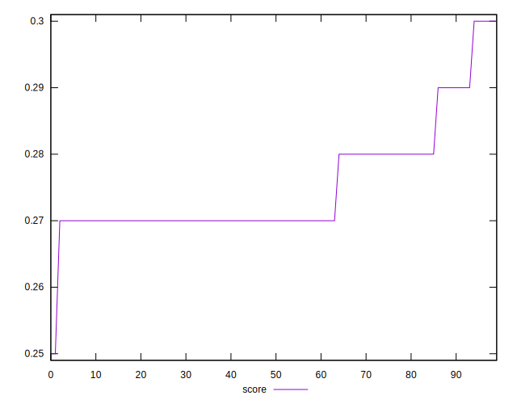
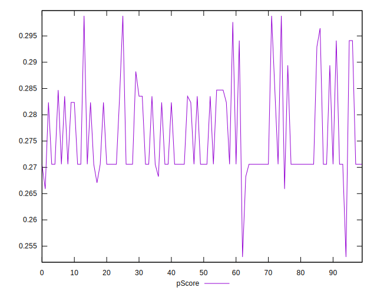

# //uses-text-compression/samples/pages+cached+noadtech

[→ Parent](../..)


## Raw


```yaml
p90min: 2460
p90max: 2740
p90range: 280
p90mean: 2652.978723404255
p90median: 2700
p90stdev: 71.67939534844892
p90skewness: -1.0787332270336247
p90eccentricity: 0.9999999999999996
p90discretization: 6.714285714285714
outlandishness: 0.9992623062802617
confidence: 32.31980016217841
p90confidence: 28.9806747658135

```


## Score


```yaml
p90min: 0.27
p90max: 0.3
p90range: 0.02999999999999997
p90mean: 0.2749999999999997
p90median: 0.27
p90stdev: 0.007821138840728853
p90skewness: 1.534303410842187
p90eccentricity: 0.9999999999999982
p90discretization: 23.5
outlandishness: 1.0014550743801656
confidence: 0.003697221533470504
p90confidence: 0.0031621622914030246

```


## Raw Estimate


## Score Estimate


## P Score


```yaml
p90min: 0.26588235294117646
p90max: 0.2988235294117647
p90range: 0.03294117647058825
p90mean: 0.2761201501877345
p90median: 0.27058823529411763
p90stdev: 0.00843287004099398
p90skewness: 1.0787332270336318
p90eccentricity: 1.0000000000000036
p90discretization: 6.714285714285714
outlandishness: 1.0008341871299469
confidence: 0.0038023294308445173
p90confidence: 0.0034094911489192313

```


## Score Difference


```yaml
p90min: 0
p90max: 0
p90range: 0
p90mean: 0
p90median: 0
p90stdev: 0
p90skewness: .nan
p90eccentricity: .nan
p90discretization: 94
outlandishness: .nan
confidence: 0
p90confidence: 0

```


## P Score Difference


```yaml
p90min: -0.002941176470588225
p90max: 0.004705882352941115
p90range: 0.00764705882352934
p90mean: 0.0010763454317897067
p90median: 0.0005882352941176117
p90stdev: 0.0015578332932246126
p90skewness: 0.36261464633914636
p90eccentricity: 1.0000000000000009
p90discretization: 7.230769230769231
outlandishness: 0.9251755543537024
confidence: 0.0007256035485738694
p90confidence: 0.0006298471100492565

```

