# //uses-webp-images/samples/pages+cached+noadtech

[→ Parent](../..)


## Raw


```yaml
p90min: 450
p90max: 630
p90range: 180
p90mean: 475.3191489361702
p90median: 450
p90stdev: 56.39341533275589
p90skewness: 2.0909336539889694
p90eccentricity: 1.0000000000000016
p90discretization: 15.666666666666666
outlandishness: 1.0176691311897437
confidence: 24.185510840730547
p90confidence: 22.800404785046837

```

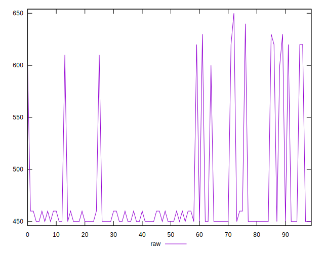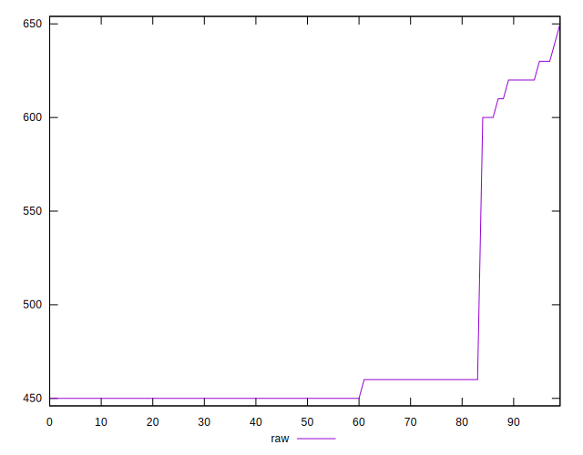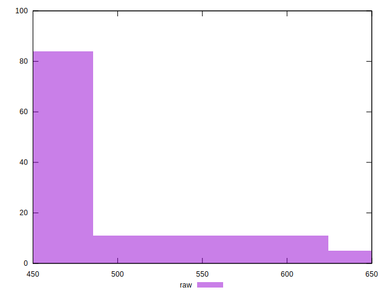
## Score


```yaml
p90min: 0.57
p90max: 0.67
p90range: 0.10000000000000009
p90mean: 0.6542553191489368
p90median: 0.67
p90stdev: 0.03253441260606302
p90skewness: -2.039300252252737
p90eccentricity: 0.9999999999999979
p90discretization: 23.5
outlandishness: 0.9931175739308612
confidence: 0.013836846014298026
p90confidence: 0.013153978571521223

```

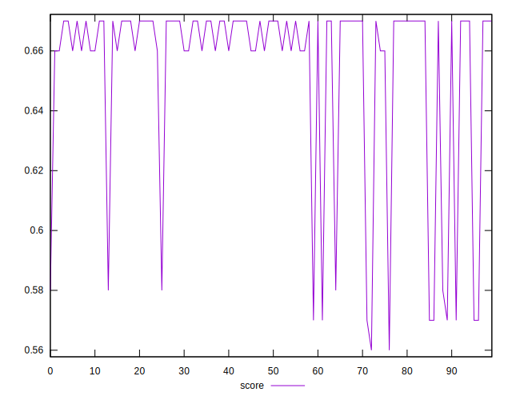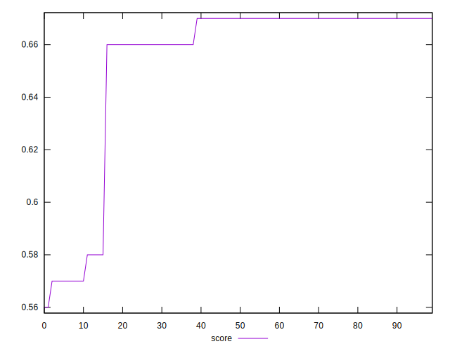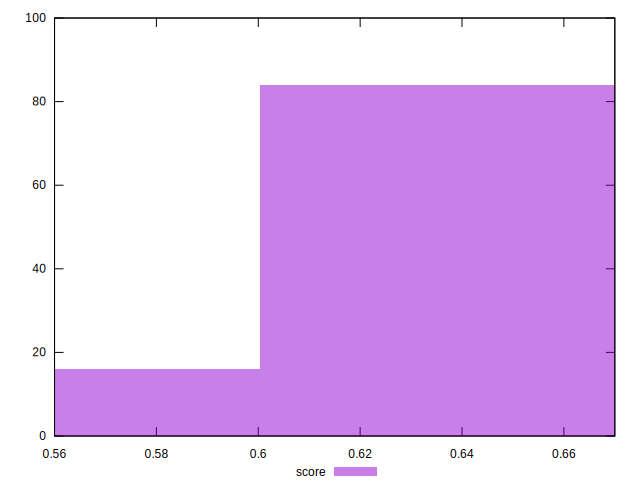
## Raw Estimate

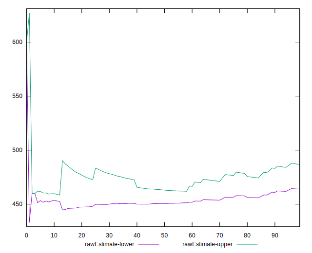
## Score Estimate

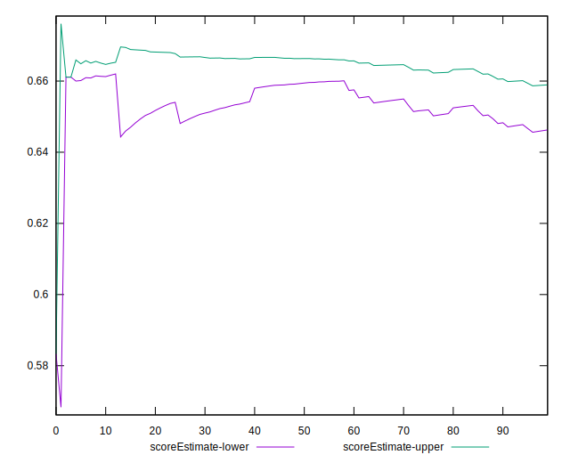
## P Score


```yaml
p90min: 0.5666666666666667
p90max: 0.6666666666666666
p90range: 0.09999999999999998
p90mean: 0.6526004728132384
p90median: 0.6666666666666666
p90stdev: 0.0313296751848644
p90skewness: -2.090933653988932
p90eccentricity: 0.9999999999999994
p90discretization: 15.666666666666666
outlandishness: 0.9928943917874486
confidence: 0.013436394911516991
p90confidence: 0.012666891547248251

```

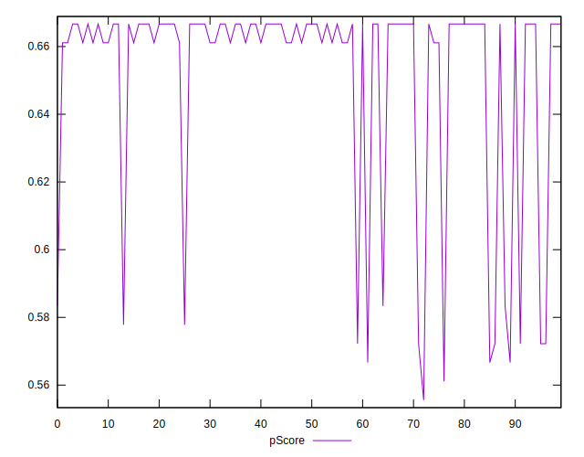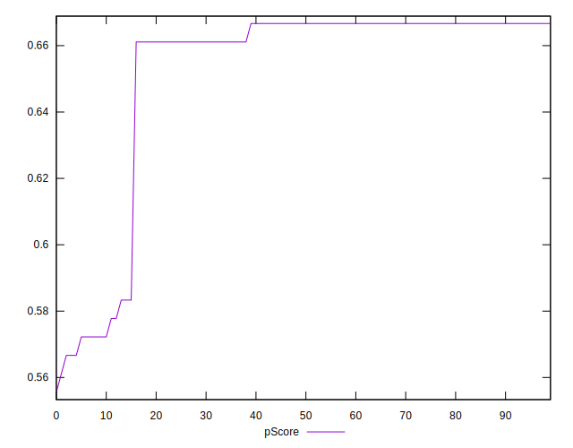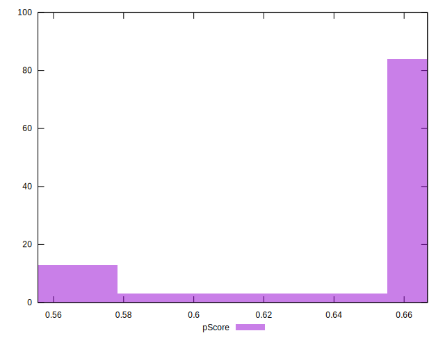
## Score Difference


```yaml
p90min: 0
p90max: 1.1102230246251565e-16
p90range: 1.1102230246251565e-16
p90mean: 7.086529944415892e-18
p90median: 0
p90stdev: 2.713934347484319e-17
p90skewness: 3.568591947091798
p90eccentricity: 0.9999999999999983
p90discretization: 47
outlandishness: 1.9881000000000004
confidence: 1.2454613861688434e-17
p90confidence: 1.0972699794392905e-17

```

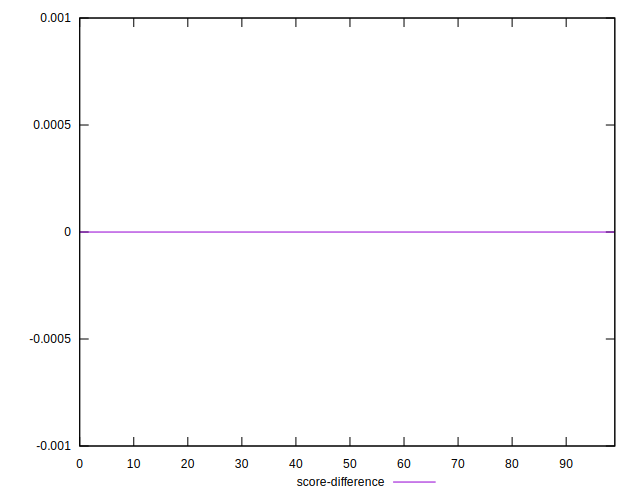
## P Score Difference


```yaml
p90min: -0.0033333333333334103
p90max: 0.0022222222222222365
p90range: 0.005555555555555647
p90mean: -0.0018203309692671984
p90median: -0.0033333333333334103
p90stdev: 0.0021795613374215035
p90skewness: 0.8076856890425573
p90eccentricity: 1.000000000000001
p90discretization: 18.8
outlandishness: 0.8951125822229709
confidence: 0.0009081453688759131
p90confidence: 0.0008812177885275777

```

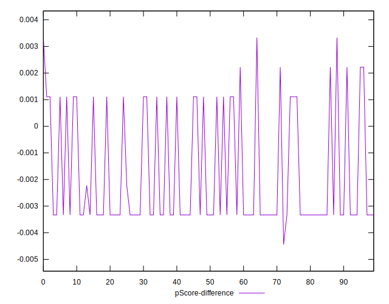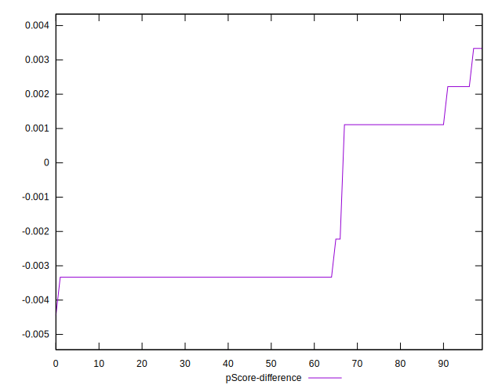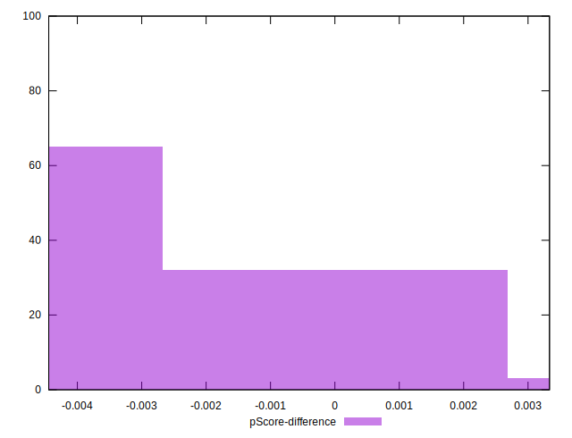