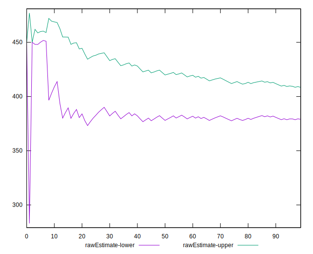
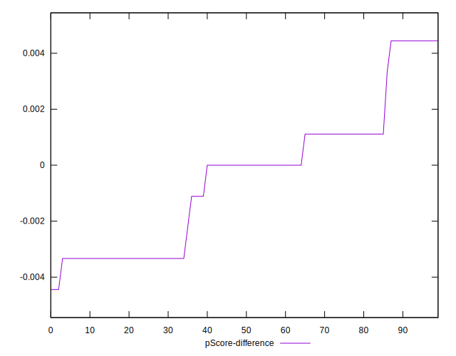

# //uses-webp-images/samples/pages+cached

[→ Parent](../..)


## Raw


```yaml
p90min: 300
p90max: 470
p90range: 170
p90mean: 393.72340425531917
p90median: 450
p90stdev: 72.946848072622
p90skewness: -0.37199185213886987
p90eccentricity: 0.9999999999999994
p90discretization: 11.75
outlandishness: 1.0059856934611169
confidence: 30.05076709478892
p90confidence: 29.493118195361756

```


## Score


```yaml
p90min: 0.66
p90max: 0.75
p90range: 0.08999999999999997
p90mean: 0.6984042553191493
p90median: 0.67
p90stdev: 0.03920223591890129
p90skewness: 0.3589765533107333
p90eccentricity: 1.0000000000000002
p90discretization: 15.666666666666666
outlandishness: 0.9979842613040019
confidence: 0.016265150557160282
p90confidence: 0.015849844208862384

```


## Raw Estimate


## Score Estimate


## P Score


```yaml
p90min: 0.6555555555555556
p90max: 0.75
p90range: 0.09444444444444444
p90mean: 0.6979314420803783
p90median: 0.6666666666666666
p90stdev: 0.040526026707012254
p90skewness: 0.3719918521388909
p90eccentricity: 0.9999999999999983
p90discretization: 11.75
outlandishness: 0.9981277295711933
confidence: 0.016694870608216058
p90confidence: 0.016385065664089878

```


## Score Difference


```yaml
p90min: 0
p90max: 0
p90range: 0
p90mean: 0
p90median: 0
p90stdev: 0
p90skewness: .nan
p90eccentricity: .nan
p90discretization: 94
outlandishness: .nan
confidence: 0
p90confidence: 0

```


## P Score Difference


```yaml
p90min: -0.0033333333333334103
p90max: 0.004444444444444473
p90range: 0.007777777777777883
p90mean: -0.0004491725768321837
p90median: 0
p90stdev: 0.0024862064917513115
p90skewness: 0.3693728255239779
p90eccentricity: 1.0000000000000013
p90discretization: 11.75
outlandishness: 0.8835999999999955
confidence: 0.0010376274857323616
p90confidence: 0.0010051973986086099

```

