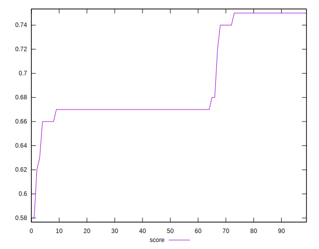
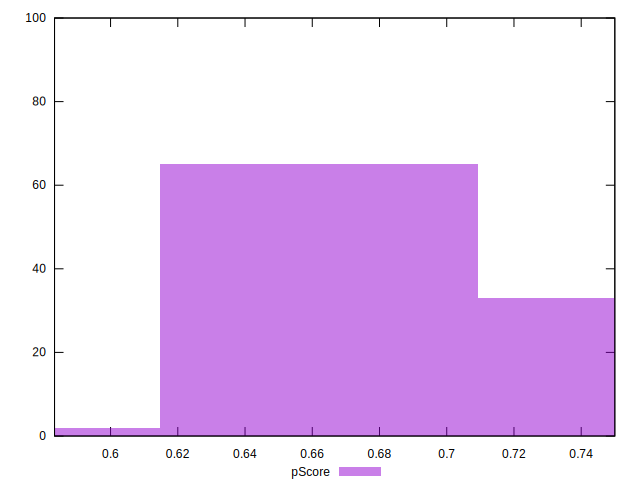

# //uses-webp-images/samples/pages

[→ Parent](../..)


## Raw


```yaml
p90min: 300
p90max: 510
p90range: 210
p90mean: 404.1489361702128
p90median: 450
p90stdev: 69.18076190688565
p90skewness: -0.7543352631743575
p90eccentricity: 0.9999999999999996
p90discretization: 11.75
outlandishness: 1.0106732350632444
confidence: 29.779355067872242
p90confidence: 27.970453030865546

```


## Score


```yaml
p90min: 0.63
p90max: 0.75
p90range: 0.12
p90mean: 0.6939361702127667
p90median: 0.67
p90stdev: 0.03705137563433455
p90skewness: 0.7331679476607352
p90eccentricity: 0.9999999999999987
p90discretization: 13.428571428571429
outlandishness: 0.9961527187198704
confidence: 0.016149151765755248
p90confidence: 0.014980230534378691

```


## Raw Estimate


## Score Estimate


## P Score


```yaml
p90min: 0.6333333333333333
p90max: 0.75
p90range: 0.1166666666666667
p90mean: 0.6921394799054368
p90median: 0.6666666666666666
p90stdev: 0.0384337566149365
p90skewness: 0.7543352631743814
p90eccentricity: 0.9999999999999994
p90discretization: 11.75
outlandishness: 0.9965498173926173
confidence: 0.01654408614881792
p90confidence: 0.015539140572703093

```


## Score Difference


```yaml
p90min: 0
p90max: 0
p90range: 0
p90mean: 0
p90median: 0
p90stdev: 0
p90skewness: .nan
p90eccentricity: .nan
p90discretization: 94
outlandishness: .nan
confidence: 0
p90confidence: 0

```


## P Score Difference


```yaml
p90min: -0.0033333333333334103
p90max: 0.0033333333333334103
p90range: 0.006666666666666821
p90mean: -0.0017966903073286487
p90median: -0.0033333333333334103
p90stdev: 0.0019388225582801914
p90skewness: 0.8086904705239709
p90eccentricity: 1.0000000000000027
p90discretization: 10.444444444444445
outlandishness: 0.8490652527700853
confidence: 0.0008545949098492735
p90confidence: 0.0007838847651685247

```

