# //bootup-time/samples/pages+cached+noadtech+nomedia+nocss

[→ Parent](../..)


## Raw


```yaml
p90min: 89.83600000000001
p90max: 269.22
p90range: 179.38400000000001
p90mean: 115.71940425531919
p90median: 105.08800000000001
p90stdev: 34.502577383627056
p90skewness: 2.9656246490190217
p90eccentricity: 0.9999999999999997
p90discretization: 1
outlandishness: 1.0878407324352144
confidence: 18.667638469589043
p90confidence: 13.949726680539658

```

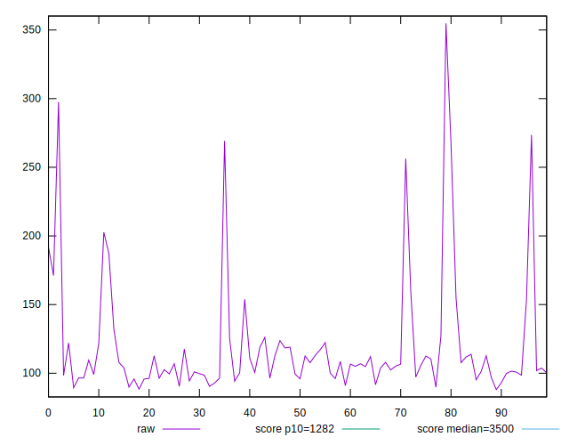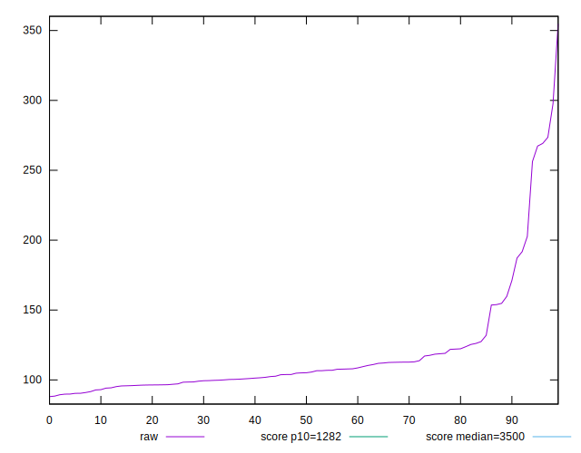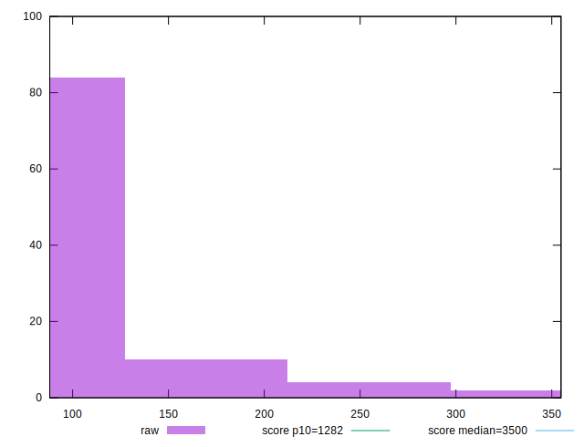
## Score


```yaml
p90min: 1
p90max: 1
p90range: 0
p90mean: 1
p90median: 1
p90stdev: 0
p90skewness: .nan
p90eccentricity: .nan
p90discretization: 94
outlandishness: 1
confidence: 0
p90confidence: 0

```


## Raw Estimate

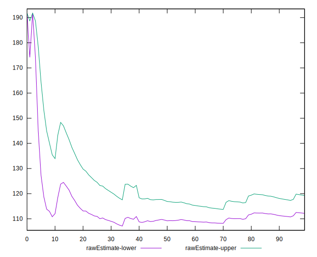
## Score Estimate

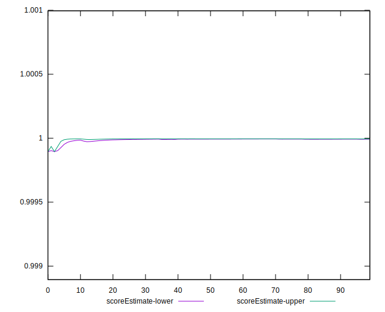
## P Score


```yaml
p90min: 0.999467795099291
p90max: 0.9999985173078176
p90range: 0.0005307222085266794
p90mean: 0.9999747760307638
p90median: 0.9999961461886224
p90stdev: 0.0000874844270130228
p90skewness: -4.9804313305134205
p90eccentricity: 0.9999999999999999
p90discretization: 1
outlandishness: 0.999939972449838
confidence: 0.0000835279130861185
p90confidence: 0.000035370802362562427

```

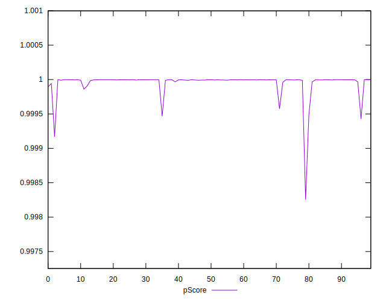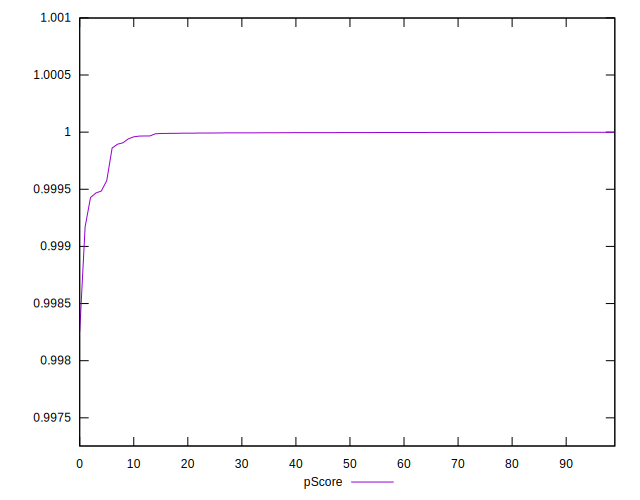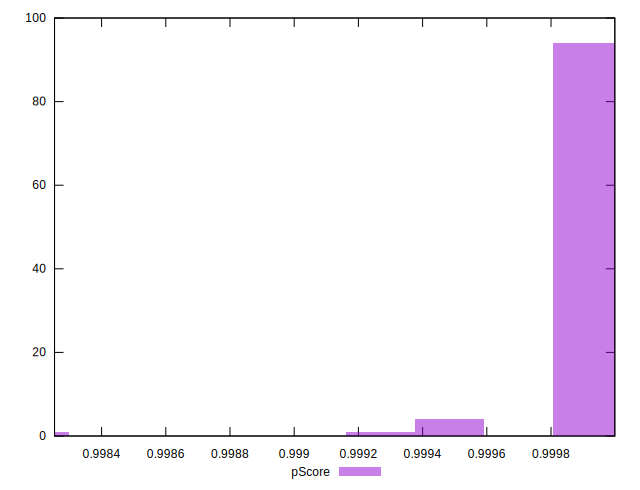
## Score Difference


```yaml
p90min: 0
p90max: 0
p90range: 0
p90mean: 0
p90median: 0
p90stdev: 0
p90skewness: .nan
p90eccentricity: .nan
p90discretization: 94
outlandishness: .nan
confidence: 0
p90confidence: 0

```


## P Score Difference


```yaml
p90min: -0.0005322049007090435
p90max: -0.000001482692182364076
p90range: 0.0005307222085266794
p90mean: -0.000025223969236241842
p90median: -0.0000038538113775743454
p90stdev: 0.0000874844270130228
p90skewness: -4.9804313305351675
p90eccentricity: 1.0000000000000002
p90discretization: 1
outlandishness: 4.795569537915969
confidence: 0.0000835279130861185
p90confidence: 0.000035370802362562427

```

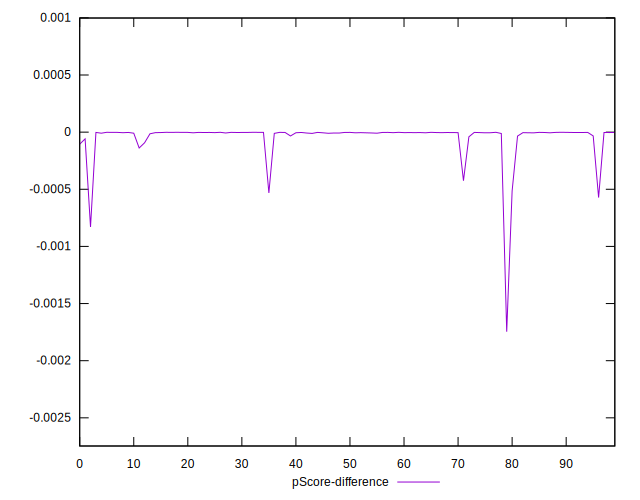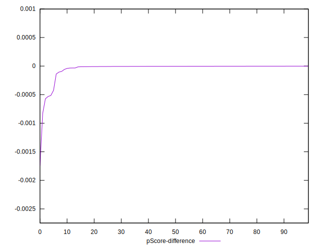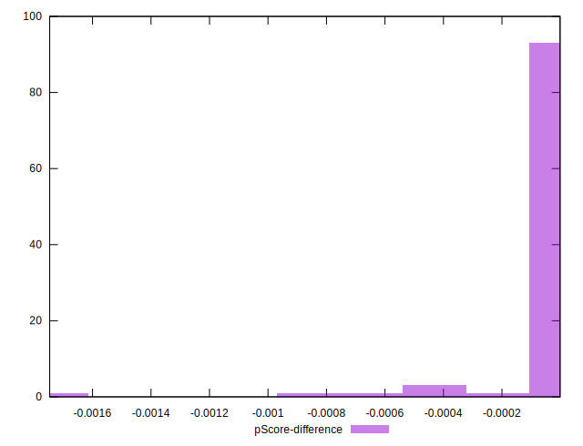