# //bootup-time/samples/pages+cached+noadtech+nomedia

[→ Parent](../..)


## Raw


```yaml
p90min: 93.40400000000002
p90max: 231.16799999999995
p90range: 137.76399999999992
p90mean: 115.47965957446812
p90median: 105.27800000000002
p90stdev: 27.161916741562987
p90skewness: 2.2696935389559756
p90eccentricity: 0.9999999999999997
p90discretization: 1.010752688172043
outlandishness: 1.0612908919743518
confidence: 14.120245380961743
p90confidence: 10.981826385068349

```

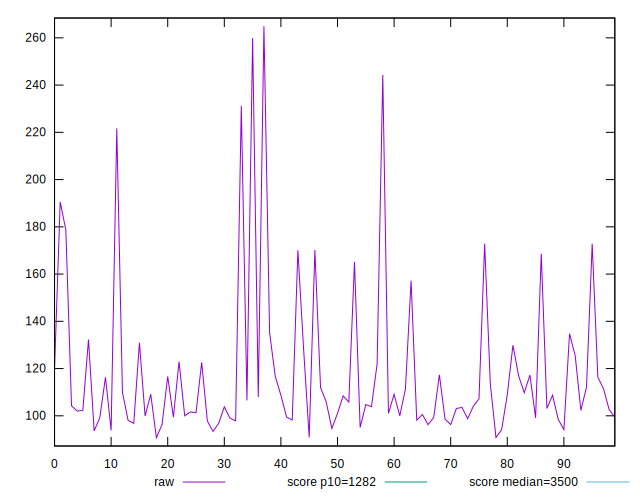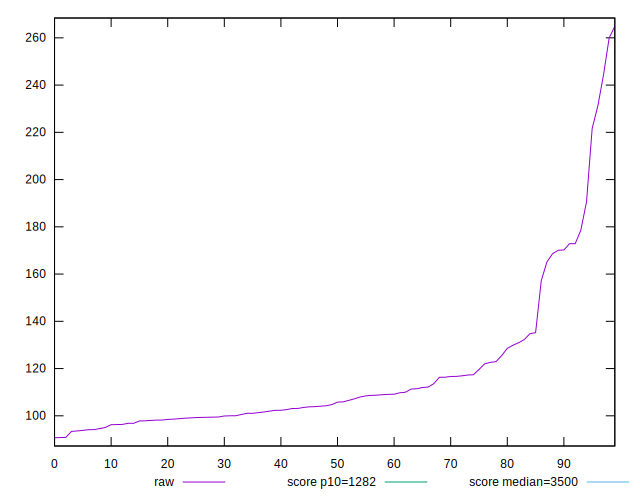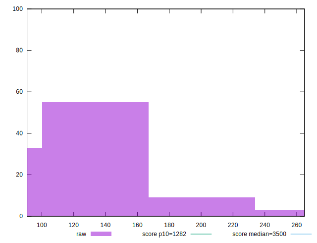
## Score


```yaml
p90min: 1
p90max: 1
p90range: 0
p90mean: 1
p90median: 1
p90stdev: 0
p90skewness: .nan
p90eccentricity: .nan
p90discretization: 94
outlandishness: 1
confidence: 0
p90confidence: 0

```


## Raw Estimate

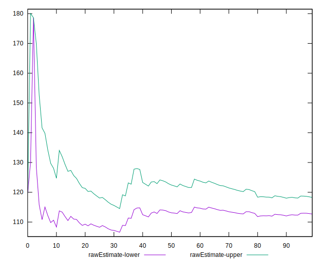
## Score Estimate

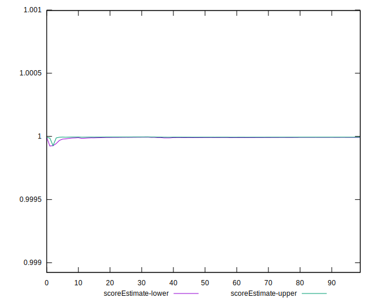
## P Score


```yaml
p90min: 0.999737193891917
p90max: 0.99999811354076
p90range: 0.00026091964884300545
p90mean: 0.9999847293147908
p90median: 0.9999961030907094
p90stdev: 0.00003763113191940255
p90skewness: -4.860973964803614
p90eccentricity: 0.9999999999999997
p90discretization: 1.010752688172043
outlandishness: 0.9999759502658296
confidence: 0.00003153962088323474
p90confidence: 0.000015214631623552438

```

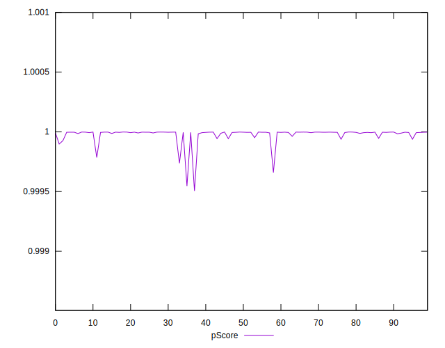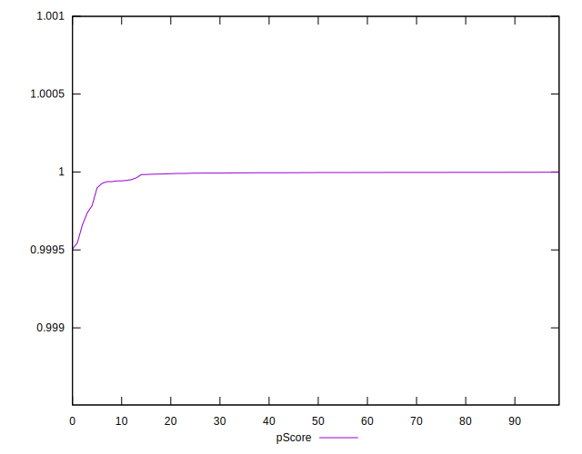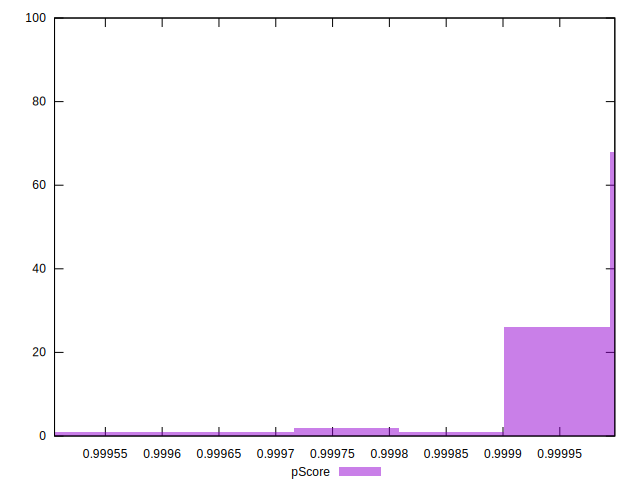
## Score Difference


```yaml
p90min: 0
p90max: 0
p90range: 0
p90mean: 0
p90median: 0
p90stdev: 0
p90skewness: .nan
p90eccentricity: .nan
p90discretization: 94
outlandishness: .nan
confidence: 0
p90confidence: 0

```


## P Score Difference


```yaml
p90min: -0.00026280610808304683
p90max: -0.0000018864592400413827
p90range: 0.00026091964884300545
p90mean: -0.000015270685209220186
p90median: -0.0000038969092905905
p90stdev: 0.00003763113191940254
p90skewness: -4.860973964769347
p90eccentricity: 1
p90discretization: 1.010752688172043
outlandishness: 3.194943484732841
confidence: 0.000031539620883234756
p90confidence: 0.000015214631623552432

```

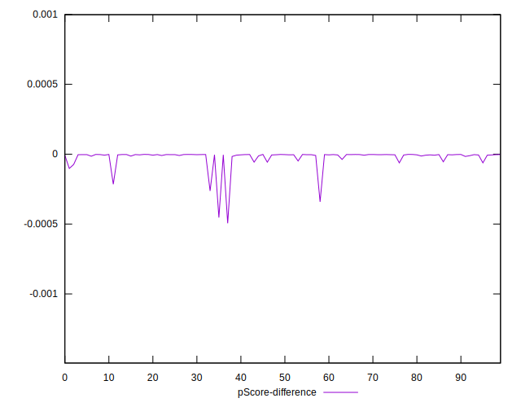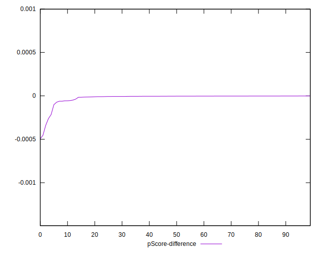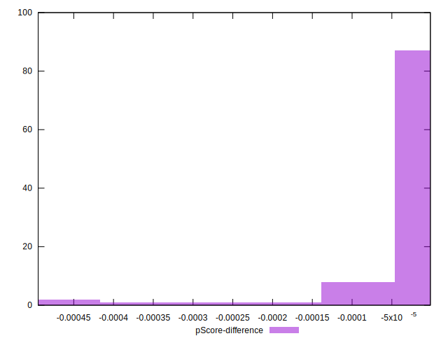