# //bootup-time/samples/pages+cached+noadtech

[→ Parent](../..)


## Raw


```yaml
p90min: 91.43200000000002
p90max: 271.856
p90range: 180.42399999999998
p90mean: 123.69395744680857
p90median: 103.89799999999997
p90stdev: 43.571975571830926
p90skewness: 1.8871349716105819
p90eccentricity: 1.0000000000000002
p90discretization: 1
outlandishness: 1.066058068627943
confidence: 20.21261894647804
p90confidence: 17.616572333133213

```

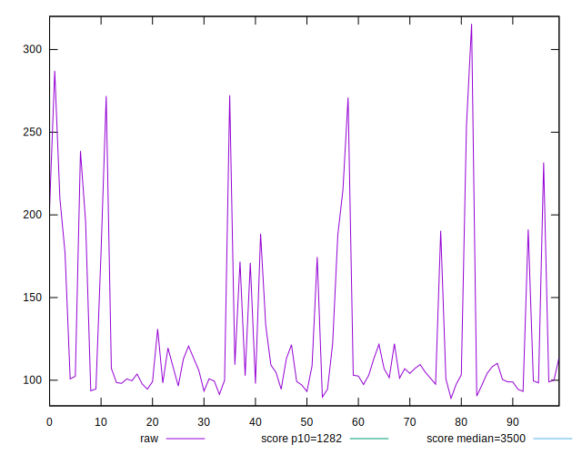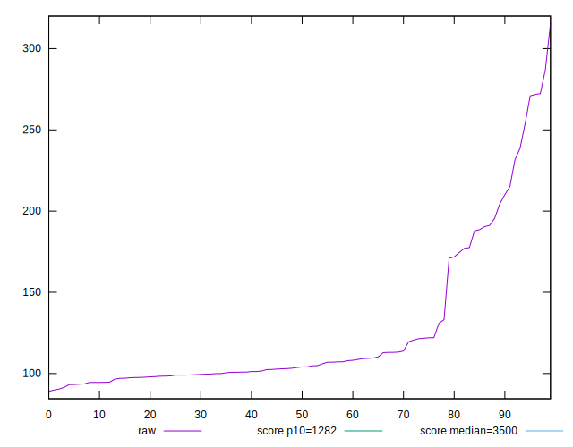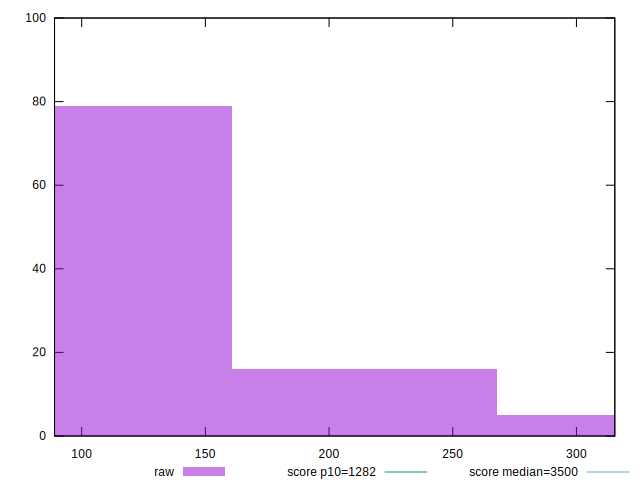
## Score


```yaml
p90min: 1
p90max: 1
p90range: 0
p90mean: 1
p90median: 1
p90stdev: 0
p90skewness: .nan
p90eccentricity: .nan
p90discretization: 94
outlandishness: 1
confidence: 0
p90confidence: 0

```


## Raw Estimate

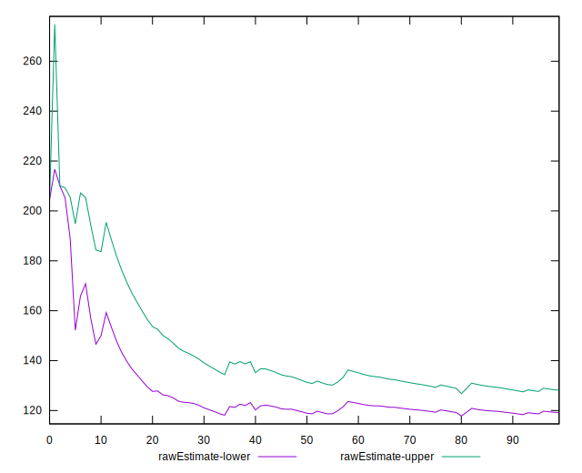
## Score Estimate

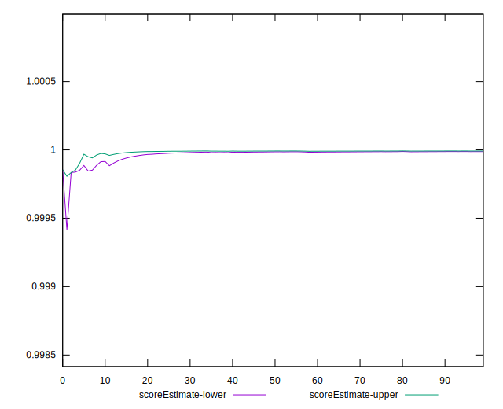
## P Score


```yaml
p90min: 0.9994439048917342
p90max: 0.999998346249261
p90range: 0.0005544413575268026
p90mean: 0.9999603805191445
p90median: 0.9999963996823593
p90stdev: 0.00010054208958280163
p90skewness: -3.6949162144824865
p90eccentricity: 1.0000000000000007
p90discretization: 1
outlandishness: 0.9999579037338765
confidence: 0.00006427395282344174
p90confidence: 0.000040650141987246984

```

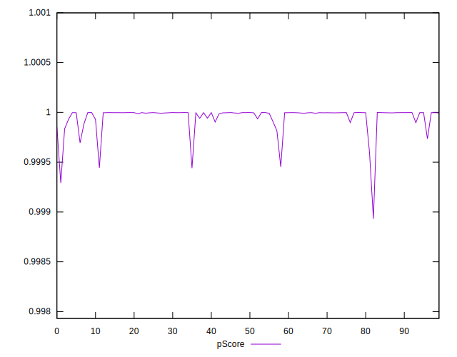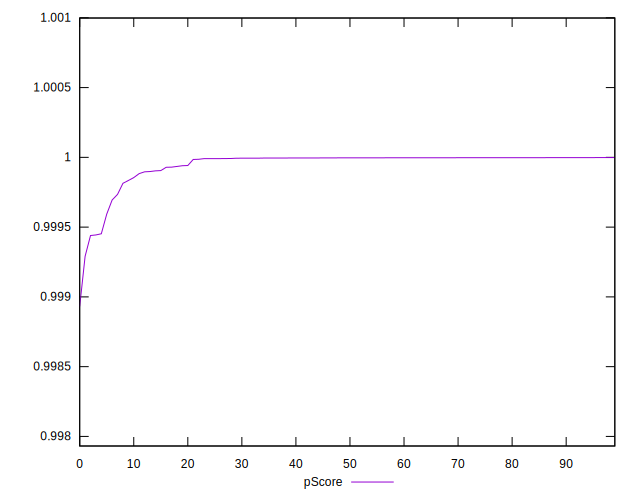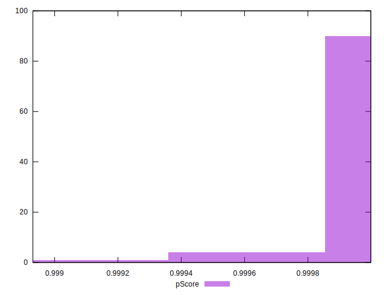
## Score Difference


```yaml
p90min: 0
p90max: 0
p90range: 0
p90mean: 0
p90median: 0
p90stdev: 0
p90skewness: .nan
p90eccentricity: .nan
p90discretization: 94
outlandishness: .nan
confidence: 0
p90confidence: 0

```


## P Score Difference


```yaml
p90min: -0.0005560951082658194
p90max: -0.000001653750739016857
p90range: 0.0005544413575268026
p90mean: -0.0000396194808553073
p90median: -0.0000036003176406840254
p90stdev: 0.00010054208958280167
p90skewness: -3.6949162144720518
p90eccentricity: 0.9999999999999994
p90discretization: 1
outlandishness: 2.3447011662936497
confidence: 0.00006427395282344173
p90confidence: 0.000040650141987247005

```

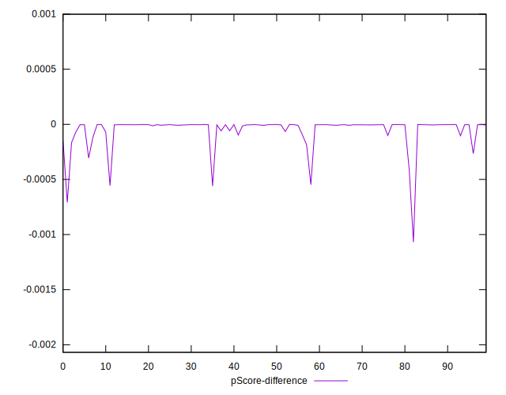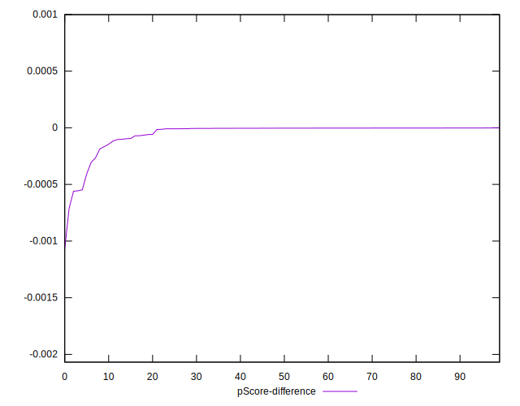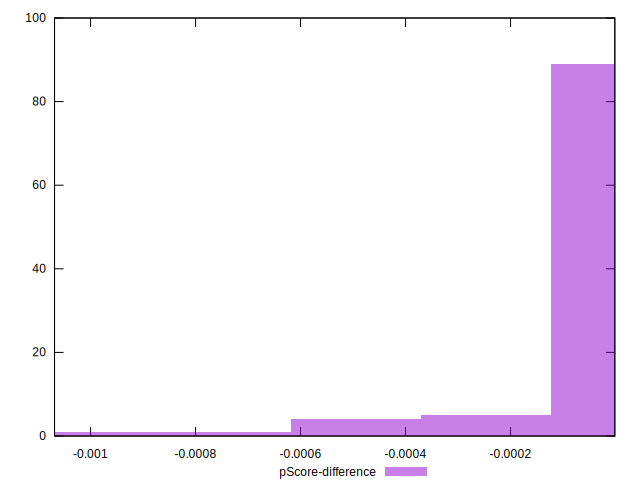