# //bootup-time/samples/pages+cached

[→ Parent](../..)


## Raw


```yaml
p90min: 640.8160000000003
p90max: 1474.3039999999996
p90range: 833.4879999999994
p90mean: 813.4334468085109
p90median: 742.5480000000002
p90stdev: 169.53680615220307
p90skewness: 1.483375019224838
p90eccentricity: 0.9999999999999997
p90discretization: 1
outlandishness: 1.0424819963949394
confidence: 82.8042203134087
p90confidence: 68.54537508369323

```

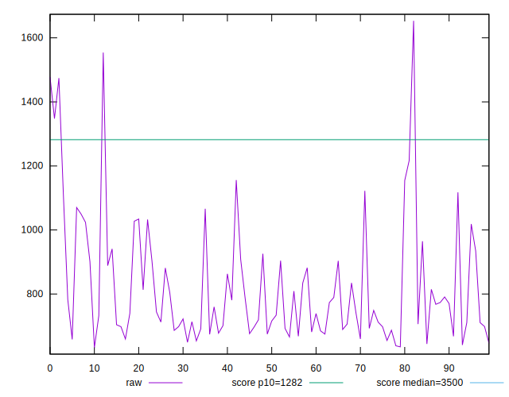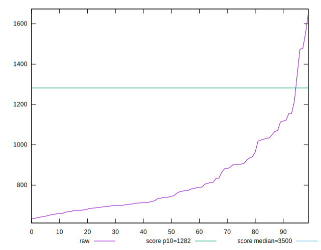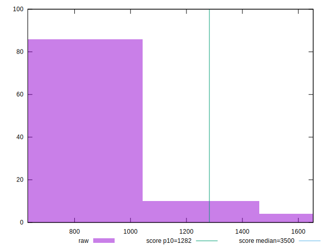
## Score


```yaml
p90min: 0.87
p90max: 0.98
p90range: 0.10999999999999999
p90mean: 0.9659574468085109
p90median: 0.98
p90stdev: 0.021453519719962733
p90skewness: -2.0223862994974757
p90eccentricity: 1.000000000000001
p90discretization: 9.4
outlandishness: 0.9940924510906479
confidence: 0.011584630713848484
p90confidence: 0.008673866102857133

```

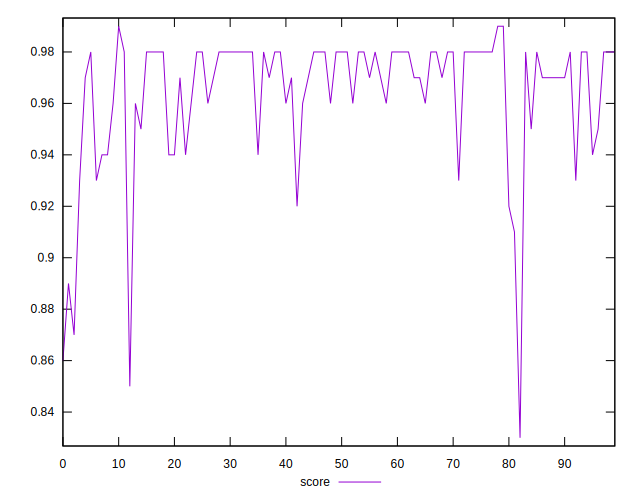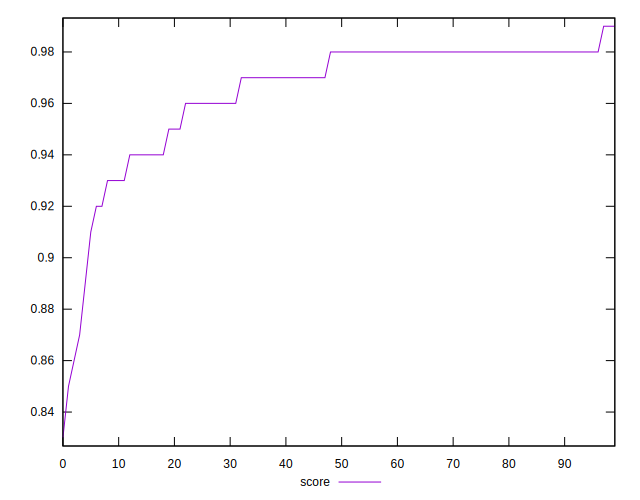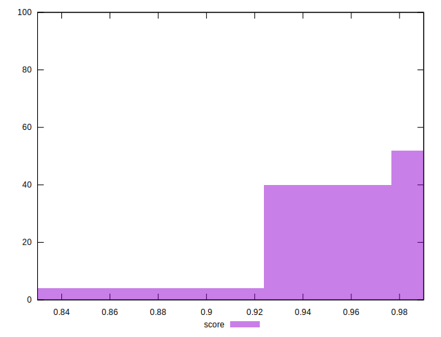
## Raw Estimate

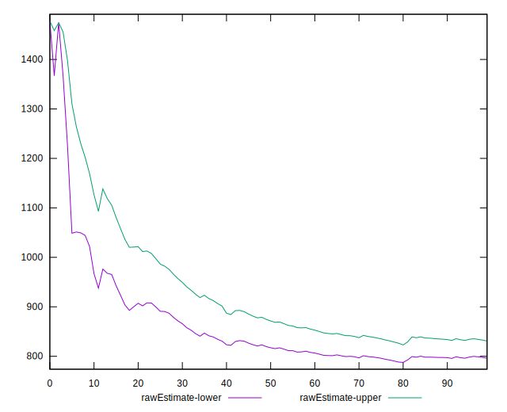
## Score Estimate

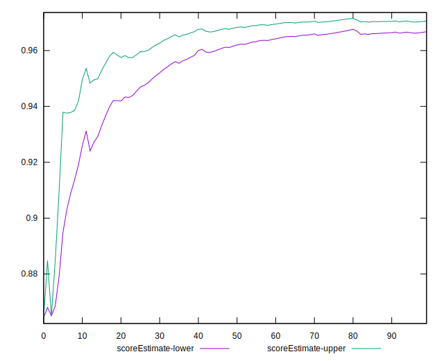
## P Score


```yaml
p90min: 0.8650320172986529
p90max: 0.9848590401797404
p90range: 0.11982702288108749
p90mean: 0.9662735522603976
p90median: 0.9760562224870158
p90stdev: 0.022056291009013906
p90skewness: -2.037924268022063
p90eccentricity: 1.0000000000000002
p90discretization: 1
outlandishness: 0.9938679642831306
confidence: 0.011642155006286988
p90confidence: 0.008917572381366362

```

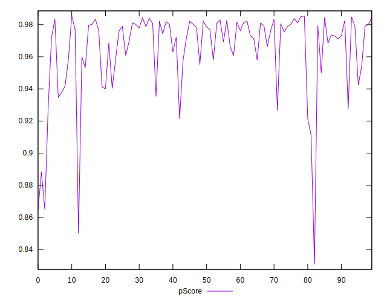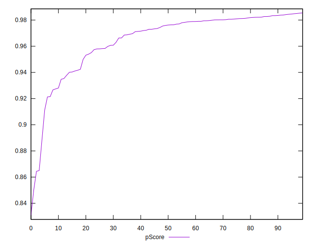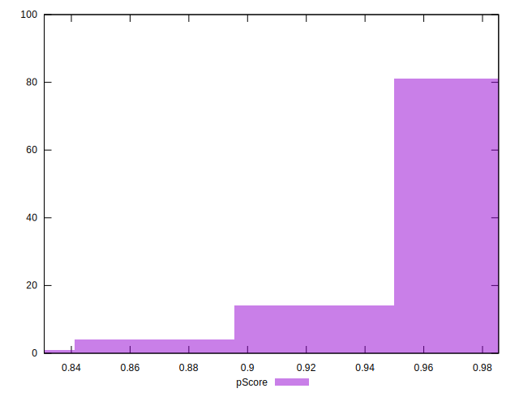
## Score Difference


```yaml
p90min: 0
p90max: 1.1102230246251565e-16
p90range: 1.1102230246251565e-16
p90mean: 9.448706592554524e-18
p90median: 0
p90stdev: 3.097965630742169e-17
p90skewness: 2.973722121485781
p90eccentricity: 0.9999999999999972
p90discretization: 47
outlandishness: 1.67055625
confidence: 1.3616944344102388e-17
p90confidence: 1.2525375520226102e-17

```

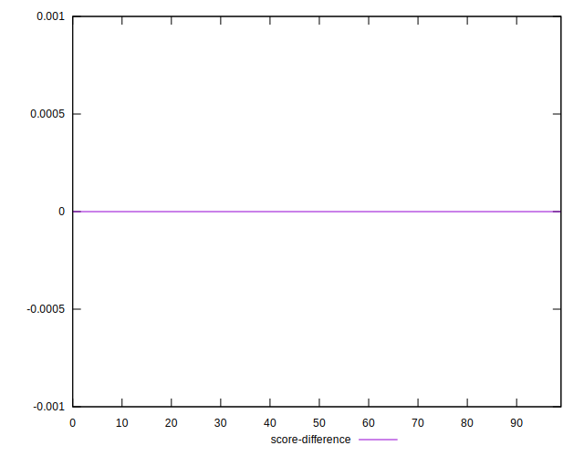
## P Score Difference


```yaml
p90min: -0.004698795029686287
p90max: 0.00444642275421514
p90range: 0.009145217783901427
p90mean: 0.00022533178178639094
p90median: 0.00031929243887002245
p90stdev: 0.0024307939276029776
p90skewness: -0.22146024896020994
p90eccentricity: 1.0000000000000002
p90discretization: 1
outlandishness: 0.8388990267999351
confidence: 0.0010343137057178347
p90confidence: 0.0009827935614708098

```

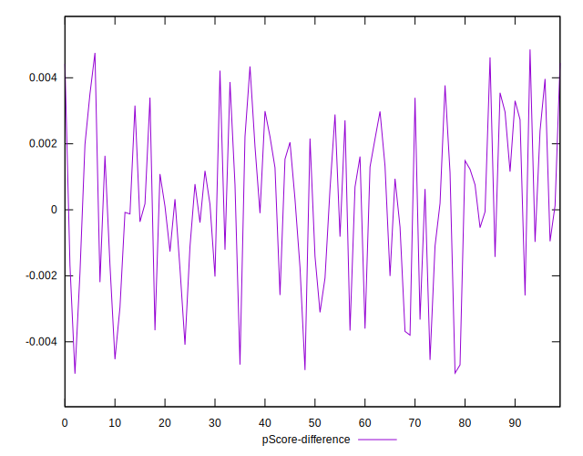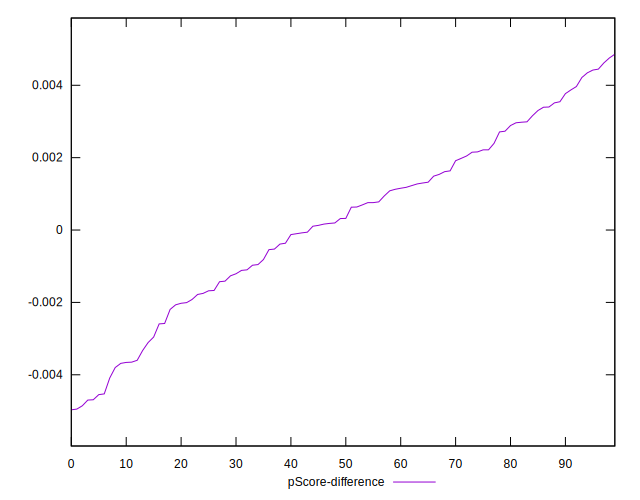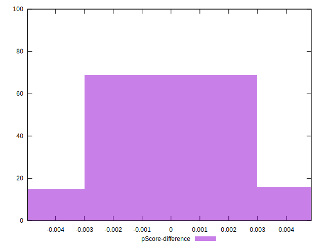