# //bootup-time/samples/pages

[→ Parent](../..)


## Raw


```yaml
p90min: 638.8560000000001
p90max: 1297.5479999999989
p90range: 658.6919999999988
p90mean: 822.6453617021278
p90median: 775.6720000000005
p90stdev: 176.5146300262236
p90skewness: 1.3296438398870403
p90eccentricity: 0.9999999999999996
p90discretization: 1
outlandishness: 1.0397317777491104
confidence: 85.9941971709643
p90confidence: 71.36657695465034

```

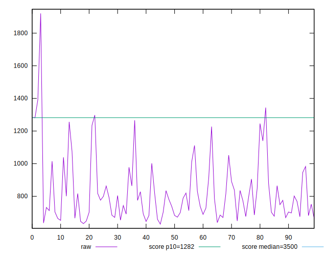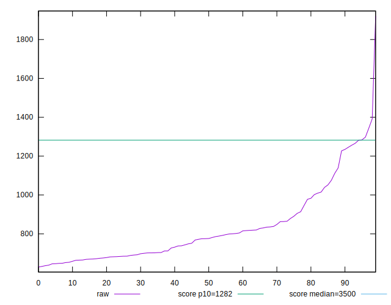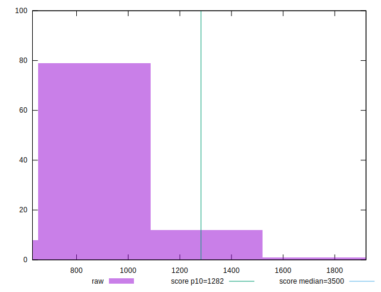
## Score


```yaml
p90min: 0.9
p90max: 0.99
p90range: 0.08999999999999997
p90mean: 0.9645744680851059
p90median: 0.97
p90stdev: 0.022908926700947966
p90skewness: -1.694454774754477
p90eccentricity: 1.0000000000000002
p90discretization: 9.4
outlandishness: 0.9944623034610584
confidence: 0.012229861162704104
p90confidence: 0.009262301261423803

```

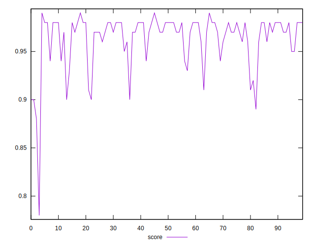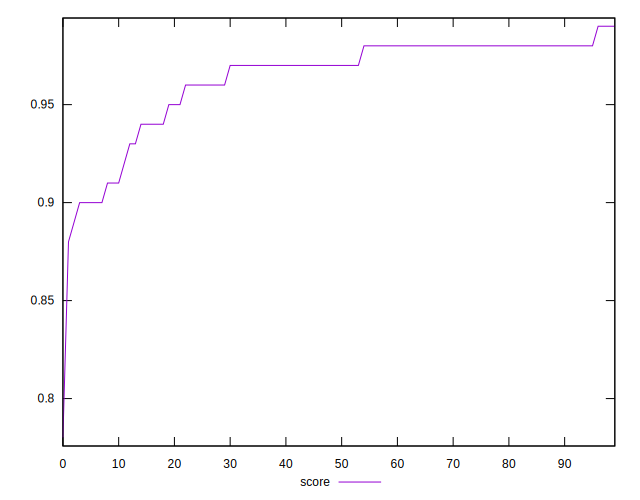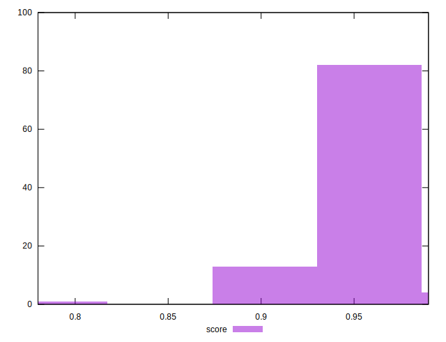
## Raw Estimate

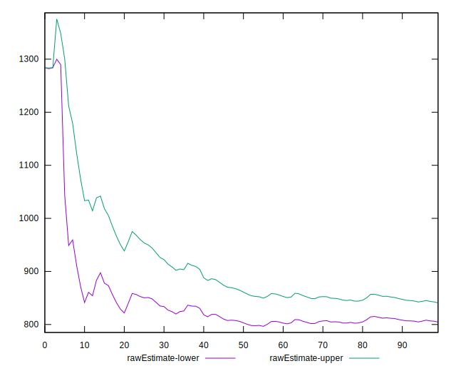
## Score Estimate

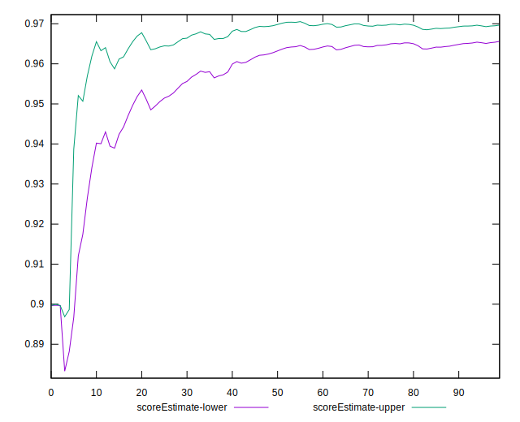
## P Score


```yaml
p90min: 0.8972736899828987
p90max: 0.9850076318507024
p90range: 0.0877339418678037
p90mean: 0.9650549095309007
p90median: 0.9727399019710019
p90stdev: 0.023057789844192312
p90skewness: -1.672682703530277
p90eccentricity: 0.9999999999999999
p90discretization: 1
outlandishness: 0.9940720612029132
confidence: 0.012292380071862436
p90confidence: 0.00932248807407769

```

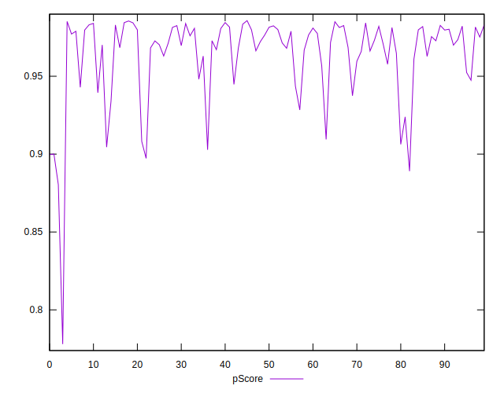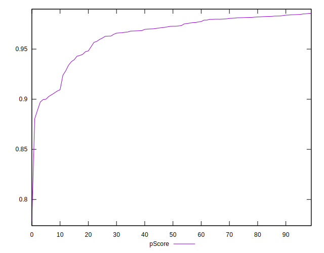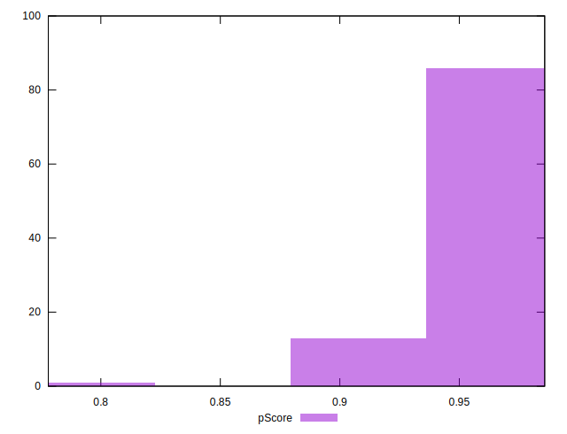
## Score Difference


```yaml
p90min: 0
p90max: 1.1102230246251565e-16
p90range: 1.1102230246251565e-16
p90mean: 5.9054416203465774e-18
p90median: 0
p90stdev: 2.4915085490873315e-17
p90skewness: 3.981981890375801
p90eccentricity: 0.9999999999999967
p90discretization: 47
outlandishness: 2.262016
confidence: 1.180666453332408e-17
p90confidence: 1.0073410718148072e-17

```

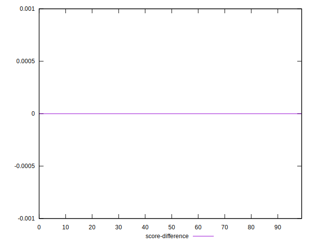
## P Score Difference


```yaml
p90min: -0.004536126600761303
p90max: 0.004464850281161836
p90range: 0.00900097688192314
p90mean: 0.00031532346541315577
p90median: 0.0002996361931708602
p90stdev: 0.0025259587885069963
p90skewness: -0.2124451172693797
p90eccentricity: 0.9999999999999999
p90discretization: 1
outlandishness: 0.8473750800721244
confidence: 0.0010642432175799403
p90confidence: 0.001021269637748885

```

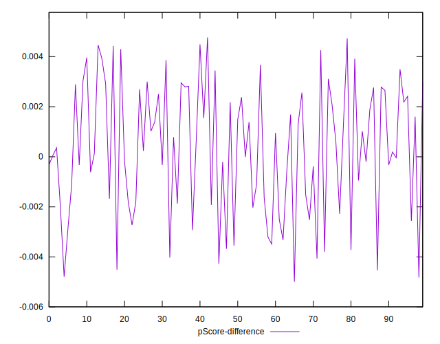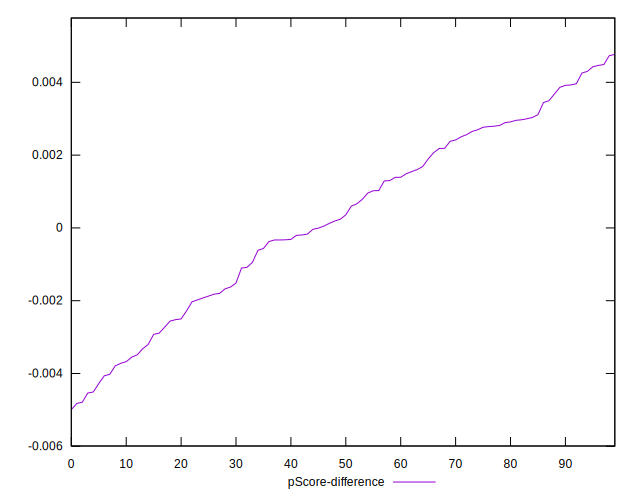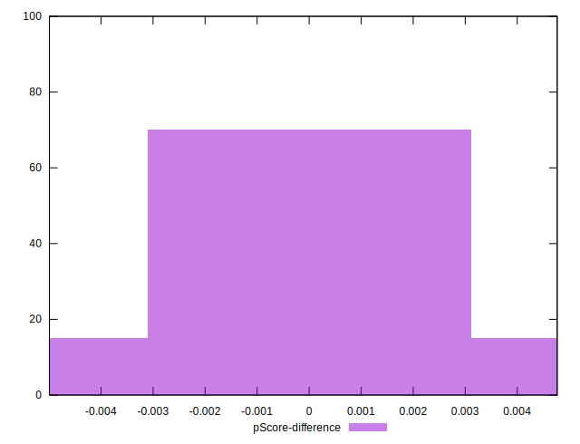