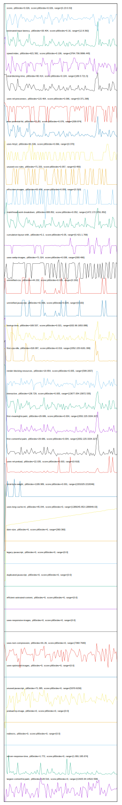

# //correlation/pages+cached

[→ Parent](../..)

[0. score, p90stdev=0.026, score:p90stdev=0.026, range=[0.23:0.53]](../../meta/score/samples/pages+cached)  
[1. estimated-input-latency, p90stdev=26.404, score:p90stdev=0.16, range=[12.8:392]](../../estimated-input-latency/samples/pages+cached/)  
[2. speed-index, p90stdev=621.582, score:p90stdev=0.106, range=[3764.706:9996.445]](../../speed-index/samples/pages+cached/)  
[3. total-blocking-time, p90stdev=90.414, score:p90stdev=0.104, range=[189.5:721.5]](../../total-blocking-time/samples/pages+cached/)  
[4. uses-rel-preconnect, p90stdev=115.464, score:p90stdev=0.096, range=[0:371.298]](../../uses-rel-preconnect/samples/pages+cached/)  
[5. max-potential-fid, p90stdev=71.83, score:p90stdev=0.076, range=[309:974]](../../max-potential-fid/samples/pages+cached/)  
[6. uses-http2, p90stdev=81.536, score:p90stdev=0.066, range=[0:370]](../../uses-http2/samples/pages+cached/)  
[7. unused-css-rules, p90stdev=71.333, score:p90stdev=0.057, range=[0:450]](../../unused-css-rules/samples/pages+cached/)  
[8. offscreen-images, p90stdev=63.454, score:p90stdev=0.055, range=[0:310]](../../offscreen-images/samples/pages+cached/)  
[9. mainthread-work-breakdown, p90stdev=308.852, score:p90stdev=0.052, range=[1472.172:3761.852]](../../mainthread-work-breakdown/samples/pages+cached/)  
[10. cumulative-layout-shift, p90stdev=0.2, score:p90stdev=0.05, range=[0.421:1.769]](../../cumulative-layout-shift/samples/pages+cached/)  
[11. uses-webp-images, p90stdev=71.324, score:p90stdev=0.038, range=[300:490]](../../uses-webp-images/samples/pages+cached/)  
[12. unminified-css, p90stdev=44.232, score:p90stdev=0.035, range=[0:150]](../../unminified-css/samples/pages+cached/)  
[13. unminified-javascript, p90stdev=42.006, score:p90stdev=0.034, range=[0:150]](../../unminified-javascript/samples/pages+cached/)  
[14. bootup-time, p90stdev=169.537, score:p90stdev=0.021, range=[632.66:1653.088]](../../bootup-time/samples/pages+cached/)  
[15. first-cpu-idle, p90stdev=318.087, score:p90stdev=0.019, range=[2052.225:6181.399]](../../first-cpu-idle/samples/pages+cached/)  
[16. render-blocking-resources, p90stdev=19.954, score:p90stdev=0.005, range=[599:2057]](../../render-blocking-resources/samples/pages+cached/)  
[17. interactive, p90stdev=138.729, score:p90stdev=0.005, range=[13677.054:15872.535]](../../interactive/samples/pages+cached/)  
[18. first-meaningful-paint, p90stdev=29.686, score:p90stdev=0.004, range=[2052.225:3334.327]](../../first-meaningful-paint/samples/pages+cached/)  
[19. first-contentful-paint, p90stdev=29.686, score:p90stdev=0.004, range=[2052.225:3334.327]](../../first-contentful-paint/samples/pages+cached/)  
[20. uses-rel-preload, p90stdev=22.035, score:p90stdev=0.003, range=[0:918]](../../uses-rel-preload/samples/pages+cached/)  
[21. total-byte-weight, p90stdev=1189.989, score:p90stdev=0.001, range=[2201025:2218346]](../../total-byte-weight/samples/pages+cached/)  
[22. uses-long-cache-ttl, p90stdev=45.044, score:p90stdev=0, range=[1389245.953:1389949.03]](../../uses-long-cache-ttl/samples/pages+cached/)  
[23. uses-passive-event-listeners, p90stdev=NaN, score:p90stdev=0, range=[NaN:NaN]](../../uses-passive-event-listeners/samples/pages+cached/)  
[24. no-document-write, p90stdev=NaN, score:p90stdev=0, range=[NaN:NaN]](../../no-document-write/samples/pages+cached/)  
[25. dom-size, p90stdev=0, score:p90stdev=0, range=[360:360]](../../dom-size/samples/pages+cached/)  
[26. legacy-javascript, p90stdev=0, score:p90stdev=0, range=[0:0]](../../legacy-javascript/samples/pages+cached/)  
[27. duplicated-javascript, p90stdev=0, score:p90stdev=0, range=[0:0]](../../duplicated-javascript/samples/pages+cached/)  
[28. efficient-animated-content, p90stdev=0, score:p90stdev=0, range=[0:0]](../../efficient-animated-content/samples/pages+cached/)  
[29. uses-responsive-images, p90stdev=0, score:p90stdev=0, range=[0:0]](../../uses-responsive-images/samples/pages+cached/)  
[30. uses-text-compression, p90stdev=91.26, score:p90stdev=0, range=[7360:7930]](../../uses-text-compression/samples/pages+cached/)  
[31. uses-optimized-images, p90stdev=0, score:p90stdev=0, range=[0:0]](../../uses-optimized-images/samples/pages+cached/)  
[32. unused-javascript, p90stdev=71.385, score:p90stdev=0, range=[5370:6150]](../../unused-javascript/samples/pages+cached/)  
[33. preload-lcp-image, p90stdev=0, score:p90stdev=0, range=[0:0]](../../preload-lcp-image/samples/pages+cached/)  
[34. unsized-images, p90stdev=NaN, score:p90stdev=0, range=[NaN:NaN]](../../unsized-images/samples/pages+cached/)  
[35. third-party-summary, p90stdev=NaN, score:p90stdev=0, range=[NaN:NaN]](../../third-party-summary/samples/pages+cached/)  
[36. font-display, p90stdev=NaN, score:p90stdev=0, range=[NaN:NaN]](../../font-display/samples/pages+cached/)  
[37. redirects, p90stdev=0, score:p90stdev=0, range=[0:0]](../../redirects/samples/pages+cached/)  
[38. server-response-time, p90stdev=1.772, score:p90stdev=0, range=[1.891:195.674]](../../server-response-time/samples/pages+cached/)  
[39. largest-contentful-paint, p90stdev=128.516, score:p90stdev=0, range=[13425.94:14522.558]](../../largest-contentful-paint/samples/pages+cached/)  
