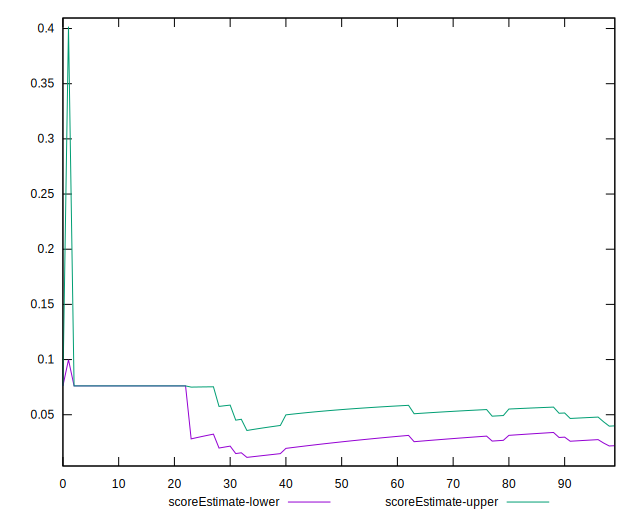

# //cumulative-layout-shift/samples/pages+cached+noadtech+nomedia+nocss

[→ Parent](../..)


## Raw


```yaml
p90min: 0.6958385416666666
p90max: 3.864670138888889
p90range: 3.1688315972222227
p90mean: 0.9655263371749399
p90median: 0.6958385416666666
p90stdev: 0.8842305699000202
p90skewness: 2.973722121485781
p90eccentricity: 0.999999999999997
p90discretization: 47
outlandishness: 1.1596609025478763
confidence: 0.389724053505596
p90confidence: 0.3575029956613177

```


## Score


```yaml
p90min: 0
p90max: 0.08
p90range: 0.08
p90mean: 0.07319148936170218
p90median: 0.08
p90stdev: 0.02232319497634723
p90skewness: -2.973722121485801
p90eccentricity: 0.9999999999999996
p90discretization: 47
outlandishness: 1.075381058173337
confidence: 0.02109558685782989
p90confidence: 0.009025484244090517

```


## Raw Estimate


## Score Estimate


## P Score


```yaml
p90min: 0.00006417586681428666
p90max: 0.07611248195409825
p90range: 0.07604830608728397
p90mean: 0.06964028569135063
p90median: 0.07611248195409825
p90stdev: 0.021220514555092173
p90skewness: -2.973722121485786
p90eccentricity: 1.000000000000002
p90discretization: 47
outlandishness: 1.0823233806690926
confidence: 0.020869791577559058
p90confidence: 0.00857965985475693

```


## Score Difference


```yaml
p90min: 0
p90max: 0
p90range: 0
p90mean: 0
p90median: 0
p90stdev: 0
p90skewness: .nan
p90eccentricity: .nan
p90discretization: 94
outlandishness: .nan
confidence: 0
p90confidence: 0

```


## P Score Difference


```yaml
p90min: -0.003887518045901747
p90max: 0.00006417586681428666
p90range: 0.003951693912716034
p90mean: -0.0035480715140330083
p90median: -0.003887518045901747
p90stdev: 0.001102138693869513
p90skewness: 2.969885240409986
p90eccentricity: 0.9999999999999994
p90discretization: 31.333333333333332
outlandishness: 0.9454207582142921
confidence: 0.000484407573932264
p90confidence: 0.00044560536369733783

```

