# //cumulative-layout-shift/samples/pages+cached+noadtech+nomedia

[→ Parent](../..)


## Raw


```yaml
p90min: 0.4553914388020833
p90max: 1.7413474527994792
p90range: 1.2859560139973958
p90mean: 0.9189105681290866
p90median: 1.1013706461588542
p90stdev: 0.388164477518073
p90skewness: 0.1372665751000458
p90eccentricity: 1.000000000000001
p90discretization: 6.714285714285714
outlandishness: 1.0245632298411018
confidence: 0.16156860122632982
p90confidence: 0.156938663111039

```

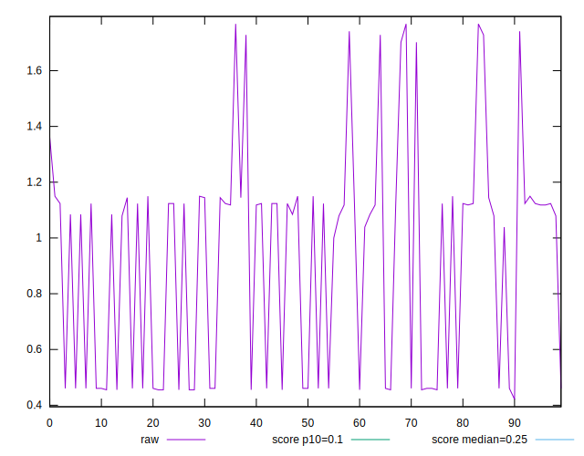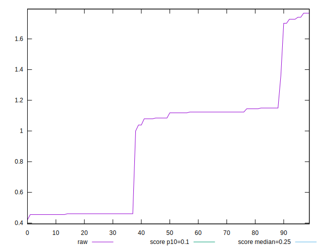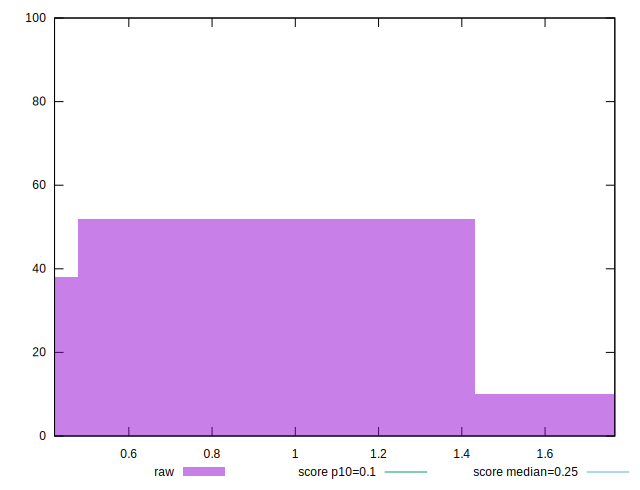
## Score


```yaml
p90min: 0
p90max: 0.2
p90range: 0.2
p90mean: 0.08553191489361693
p90median: 0.02
p90stdev: 0.08832504068058389
p90skewness: 0.5163133519562108
p90eccentricity: 0.9999999999999999
p90discretization: 18.8
outlandishness: 1.0274999387391401
confidence: 0.035109317976901
p90confidence: 0.03571067062156292

```

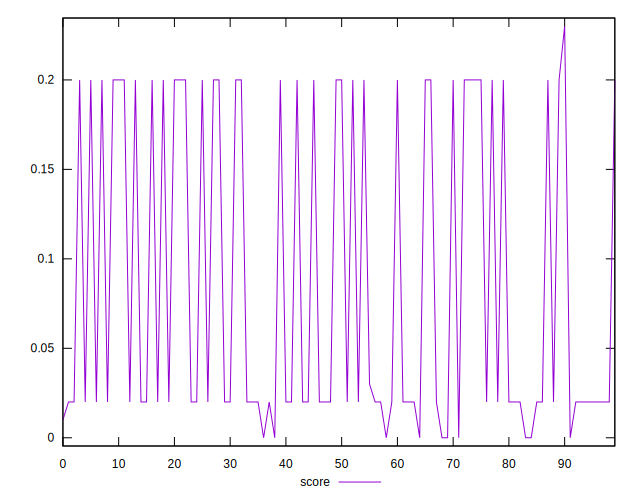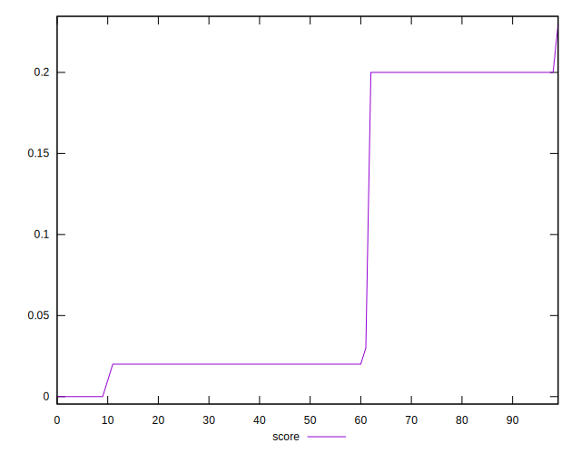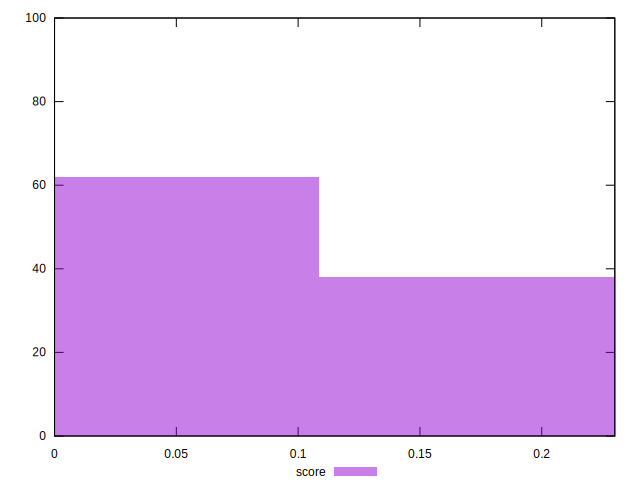
## Raw Estimate

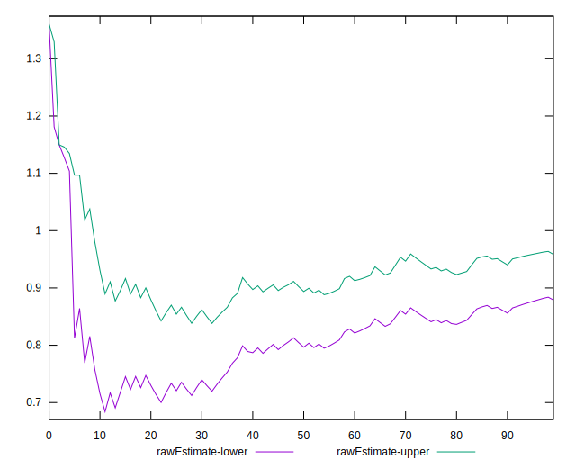
## Score Estimate

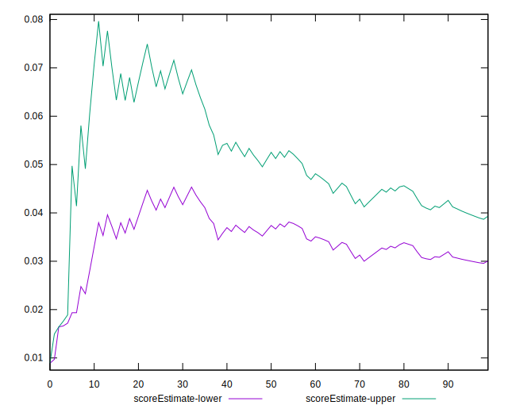
## P Score


```yaml
p90min: 0.0033170872863506617
p90max: 0.20080382120146933
p90range: 0.19748673391511867
p90mean: 0.08395807863947129
p90median: 0.019071501368743915
p90stdev: 0.0878050770055874
p90skewness: 0.521670562026845
p90eccentricity: 0.9999999999999999
p90discretization: 6.714285714285714
outlandishness: 1.0335531028571803
confidence: 0.034918077619332605
p90confidence: 0.03550044426457627

```

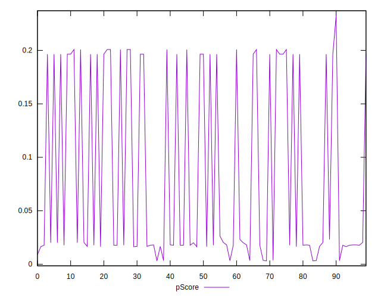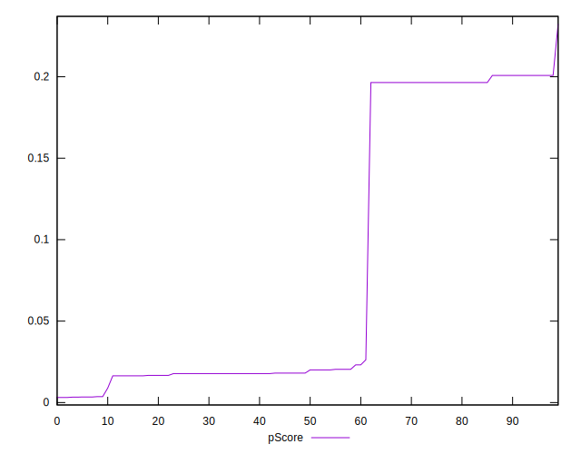
## Score Difference


```yaml
p90min: 0
p90max: 0
p90range: 0
p90mean: 0
p90median: 0
p90stdev: 0
p90skewness: .nan
p90eccentricity: .nan
p90discretization: 94
outlandishness: .nan
confidence: 0
p90confidence: 0

```


## P Score Difference


```yaml
p90min: -0.0035791534417845376
p90max: 0.0034250563607062245
p90range: 0.007004209802490762
p90mean: -0.0014290334074937088
p90median: -0.002209008254524119
p90stdev: 0.0022204303679361323
p90skewness: 0.8186478644217918
p90eccentricity: 1.0000000000000002
p90discretization: 6.714285714285714
outlandishness: 0.8858693624281702
confidence: 0.0009214369055027827
p90confidence: 0.000897741533957919

```

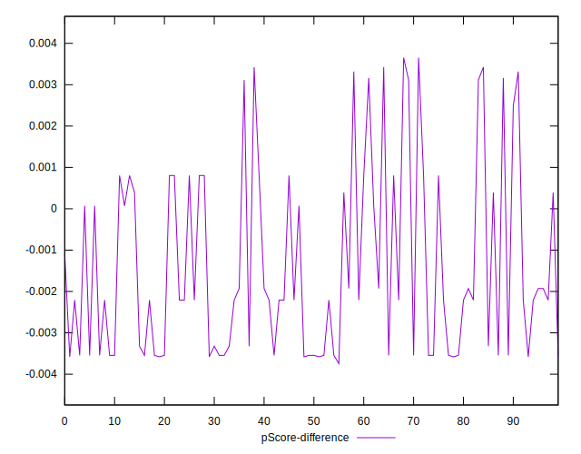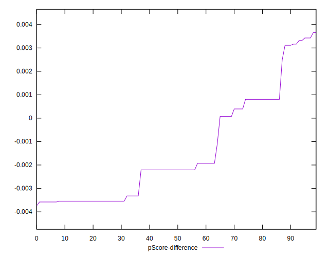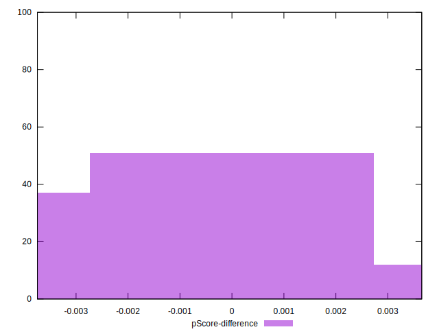