# //cumulative-layout-shift/samples/pages+cached+noadtech

[→ Parent](../..)


## Raw


```yaml
p90min: 0.40105458641052244
p90max: 1.7281674194335936
p90range: 1.3271128330230713
p90mean: 0.8857256173072977
p90median: 1.063967794418335
p90stdev: 0.3911595624238852
p90skewness: 0.20329545488817696
p90eccentricity: 1
p90discretization: 5.529411764705882
outlandishness: 1.0248467312464744
confidence: 0.16303859621612765
p90confidence: 0.1581496049881208

```

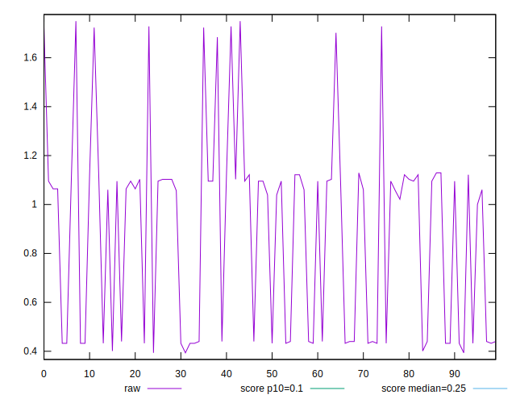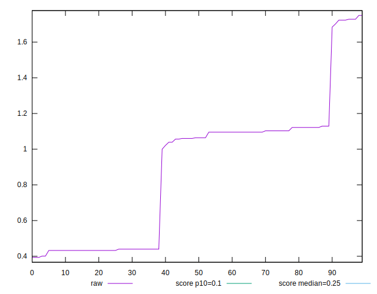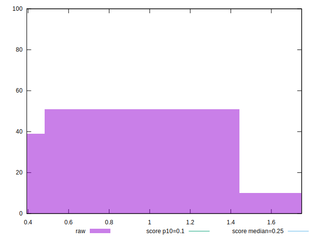
## Score


```yaml
p90min: 0
p90max: 0.25
p90range: 0.25
p90mean: 0.0944680851063829
p90median: 0.02
p90stdev: 0.0976709305964022
p90skewness: 0.4829169460433573
p90eccentricity: 1.0000000000000007
p90discretization: 15.666666666666666
outlandishness: 1.0456444302410515
confidence: 0.03930192580904835
p90confidence: 0.039489304561355035

```

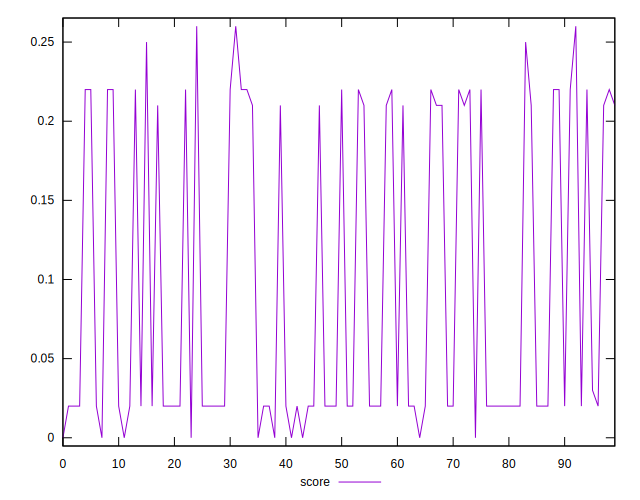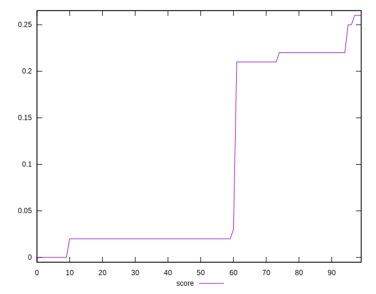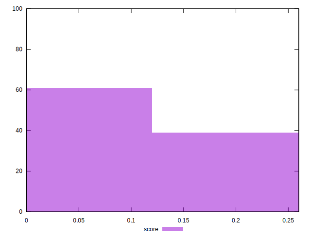
## Raw Estimate

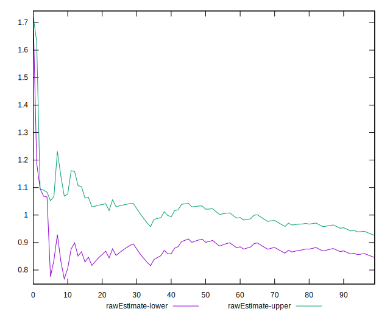
## Score Estimate

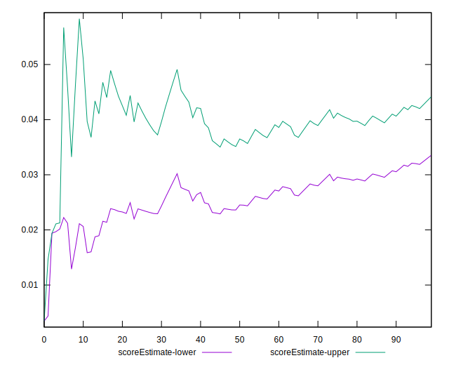
## P Score


```yaml
p90min: 0.0034250563607062245
p90max: 0.25429208279392723
p90range: 0.250867026433221
p90mean: 0.09556916810650923
p90median: 0.021401038784392923
p90stdev: 0.09895636097342597
p90skewness: 0.48526751446593785
p90eccentricity: 0.9999999999999999
p90discretization: 5.529411764705882
outlandishness: 1.0476150211827995
confidence: 0.03977131283613862
p90confidence: 0.04000901653031809

```

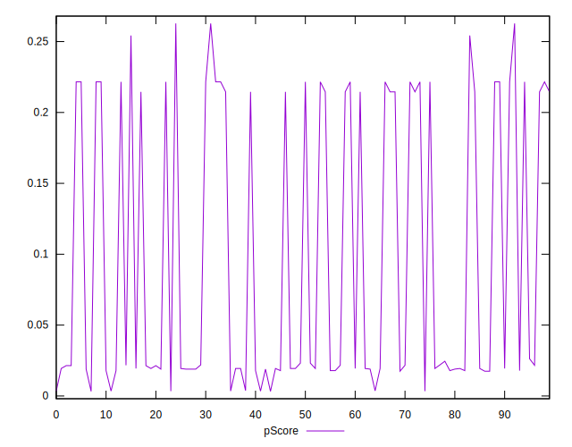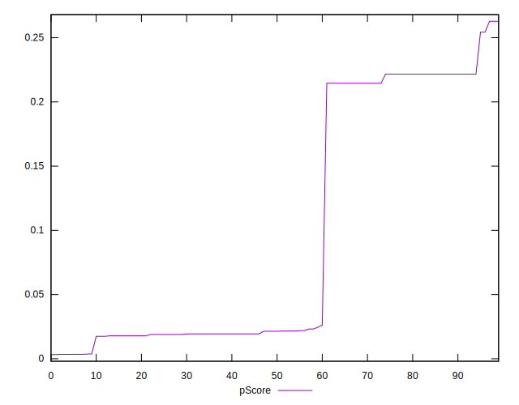
## Score Difference


```yaml
p90min: 0
p90max: 0
p90range: 0
p90mean: 0
p90median: 0
p90stdev: 0
p90skewness: .nan
p90eccentricity: .nan
p90discretization: 94
outlandishness: .nan
confidence: 0
p90confidence: 0

```


## P Score Difference


```yaml
p90min: -0.0025228769097088537
p90max: 0.004542675850018968
p90range: 0.007065552759727822
p90mean: 0.001244247042219815
p90median: 0.0015906045438749128
p90stdev: 0.0021204658863245166
p90skewness: -0.01337753224654121
p90eccentricity: 0.9999999999999988
p90discretization: 5.222222222222222
outlandishness: 0.9582148556558828
confidence: 0.0008839372786021096
p90confidence: 0.0008573249244757065

```

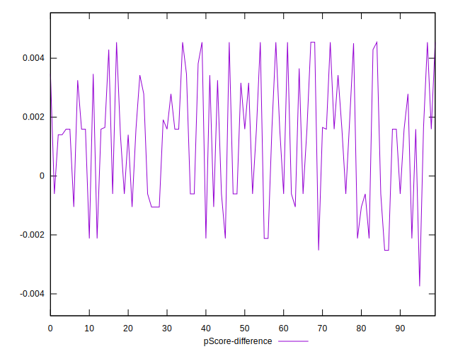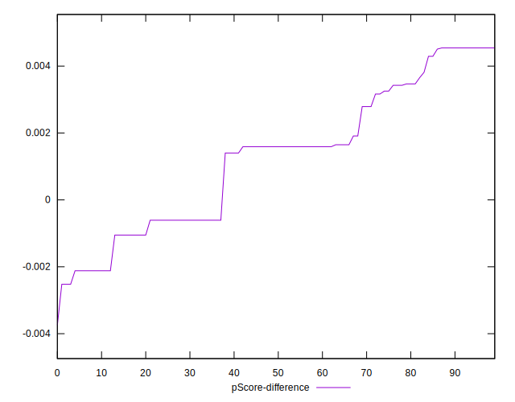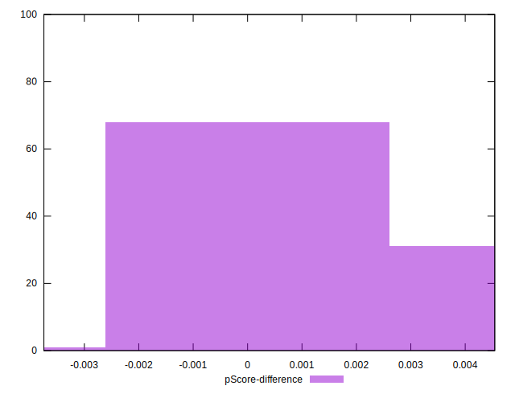