# //cumulative-layout-shift/samples/pages+cached

[→ Parent](../..)


## Raw


```yaml
p90min: 0.45831777000427243
p90max: 1.742803344726562
p90range: 1.2844855747222896
p90mean: 1.0770520051185117
p90median: 1.122510274887085
p90stdev: 0.19986467311187747
p90skewness: -2.1070497023076906
p90eccentricity: 0.9999999999999999
p90discretization: 2.764705882352941
outlandishness: 1.0023267618261142
confidence: 0.09877423608677786
p90confidence: 0.08080722584884766

```

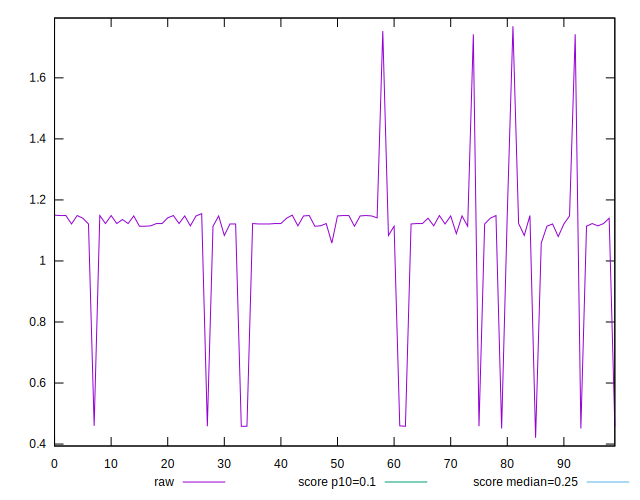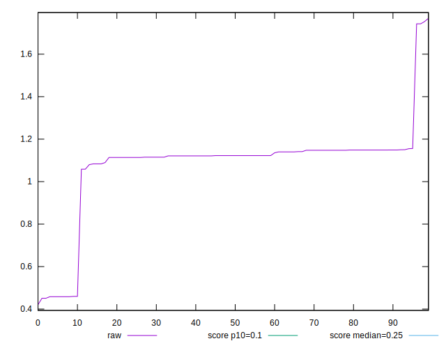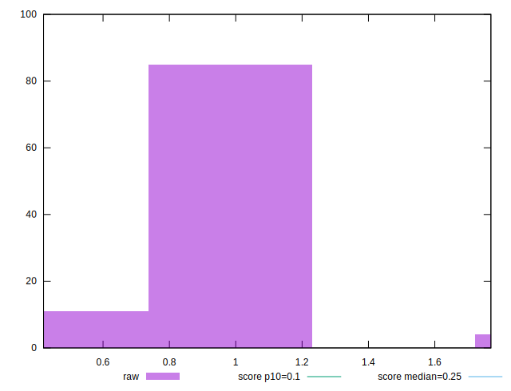
## Score


```yaml
p90min: 0
p90max: 0.2
p90range: 0.2
p90mean: 0.03510638297872342
p90median: 0.02
p90stdev: 0.050333878461327676
p90skewness: 2.9641582241470514
p90eccentricity: 1.0000000000000013
p90discretization: 31.333333333333332
outlandishness: 1.253178479338843
confidence: 0.022601741759418315
p90confidence: 0.020350475255805682

```

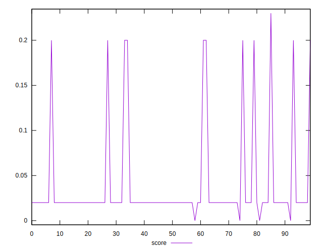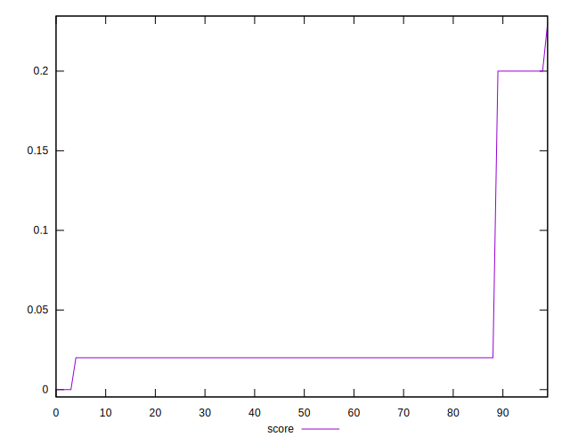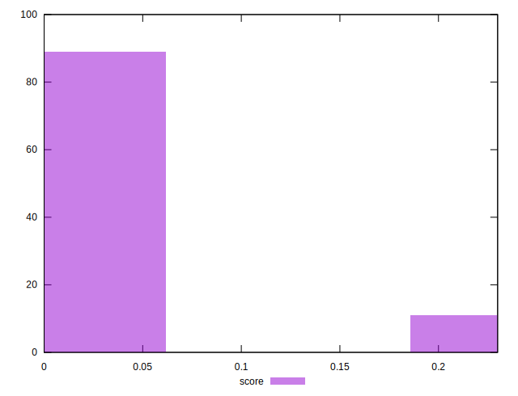
## Raw Estimate

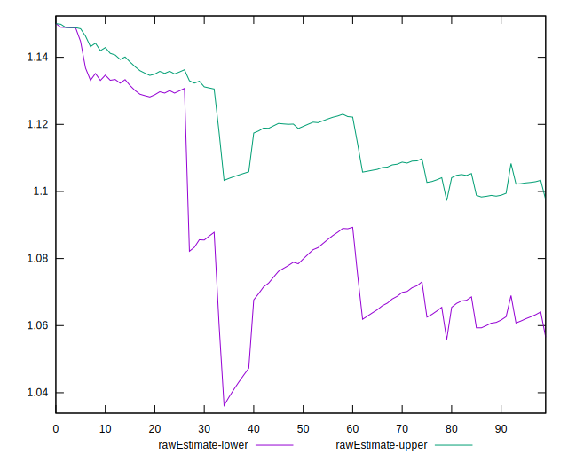
## Score Estimate

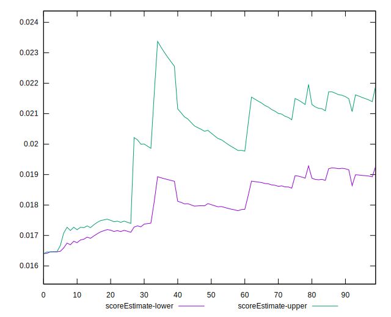
## P Score


```yaml
p90min: 0.003305399777234652
p90max: 0.1982991066631432
p90range: 0.19499370688590856
p90mean: 0.0328168844596327
p90median: 0.017840233168241015
p90stdev: 0.05042036345410362
p90skewness: 2.966394126382904
p90eccentricity: 1
p90discretization: 3.1333333333333333
outlandishness: 1.2969704984132828
confidence: 0.022819395637818655
p90confidence: 0.020385441977212572

```

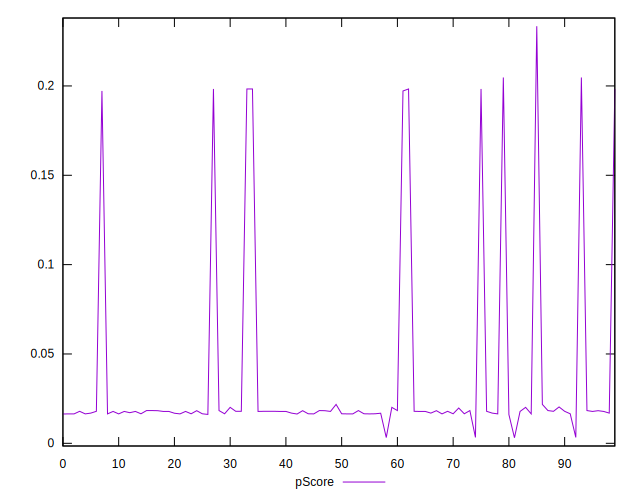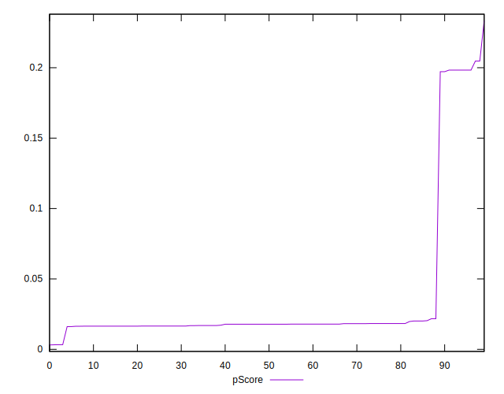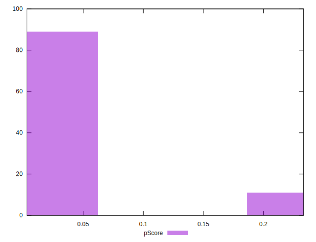
## Score Difference


```yaml
p90min: 0
p90max: 0
p90range: 0
p90mean: 0
p90median: 0
p90stdev: 0
p90skewness: .nan
p90eccentricity: .nan
p90discretization: 94
outlandishness: .nan
confidence: 0
p90confidence: 0

```


## P Score Difference


```yaml
p90min: -0.0035967520083595543
p90max: 0.003305399777234652
p90range: 0.0069021517855942065
p90mean: -0.002066442506586417
p90median: -0.002159766831758985
p90stdev: 0.0015637615894713507
p90skewness: 1.8848396184055027
p90eccentricity: 1.0000000000000002
p90discretization: 3.2413793103448274
outlandishness: 0.8692499920141905
confidence: 0.0007435803750761422
p90confidence: 0.0006322439777210181

```

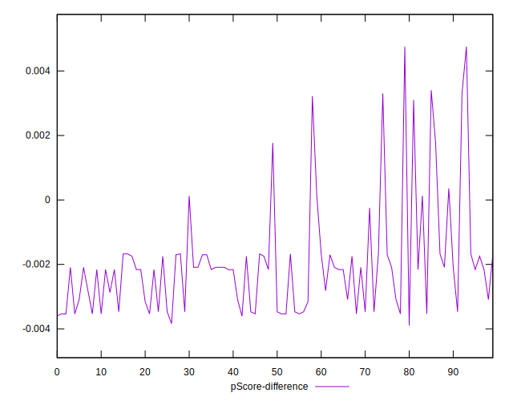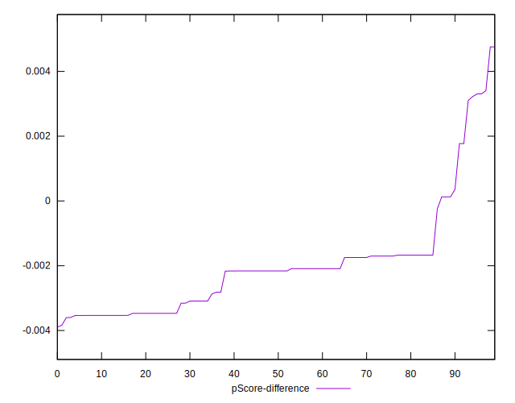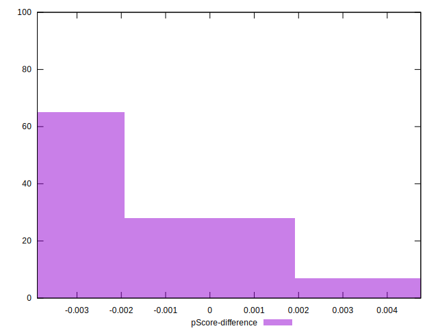