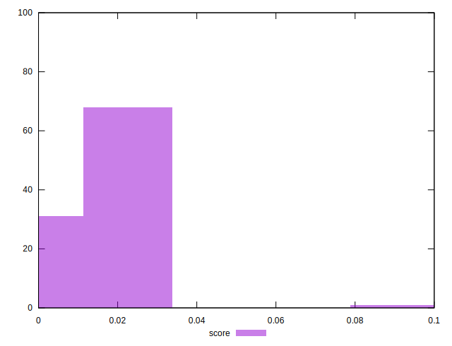

# //cumulative-layout-shift/samples/pages

[→ Parent](../..)


## Raw


```yaml
p90min: 1.121230978012085
p90max: 1.7690829467773437
p90range: 0.6478519687652586
p90mean: 1.3139455377700482
p90median: 1.1475105800628662
p90stdev: 0.2814420806881894
p90skewness: 0.8829386170456343
p90eccentricity: 0.9999999999999991
p90discretization: 4.476190476190476
outlandishness: 1.0036675778574742
confidence: 0.11514301050459273
p90confidence: 0.11378976296030871

```


## Score


```yaml
p90min: 0
p90max: 0.02
p90range: 0.02
p90mean: 0.014042553191489369
p90median: 0.02
p90stdev: 0.009146461812853052
p90skewness: -0.8839599998785518
p90eccentricity: 0.9999999999999999
p90discretization: 47
outlandishness: 1.0809697887970617
confidence: 0.004940353505890265
p90confidence: 0.003698003223487894

```


## Raw Estimate


## Score Estimate


## P Score


```yaml
p90min: 0.0031022719549900213
p90max: 0.01791041875881938
p90range: 0.014808146803829358
p90mean: 0.013199009338135679
p90median: 0.01652981343283516
p90stdev: 0.006479110491325656
p90skewness: -0.8622997470869491
p90eccentricity: 1.0000000000000007
p90discretization: 5.875
outlandishness: 1.1018440514576184
confidence: 0.004137813366988699
p90confidence: 0.002619567213256942

```


## Score Difference


```yaml
p90min: 0
p90max: 0
p90range: 0
p90mean: 0
p90median: 0
p90stdev: 0
p90skewness: .nan
p90eccentricity: .nan
p90discretization: 94
outlandishness: .nan
confidence: 0
p90confidence: 0

```


## P Score Difference


```yaml
p90min: -0.0035967520083595543
p90max: 0.0033156671300033635
p90range: 0.006912419138362918
p90mean: -0.0007839672883295564
p90median: -0.0021590923302969404
p90stdev: 0.0027102015117618228
p90skewness: 0.7144348183839697
p90eccentricity: 1.0000000000000007
p90discretization: 5.875
outlandishness: 0.9034567885999157
confidence: 0.001089333903288996
p90confidence: 0.0010957607577514962

```

