# //estimated-input-latency/samples/pages+cached

[→ Parent](../..)


## Raw


```yaml
p90min: 12.8
p90max: 136.00000000000074
p90range: 123.20000000000074
p90mean: 39.128510638297904
p90median: 29.760000000000005
p90stdev: 26.404004628645954
p90skewness: 1.6999344689617046
p90eccentricity: 1.0000000000000002
p90discretization: 1.146341463414634
outlandishness: 1.4332968393250685
confidence: 22.273053520487608
p90confidence: 10.67539516674203

```

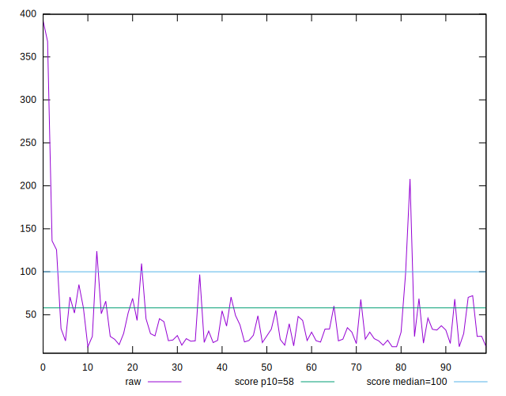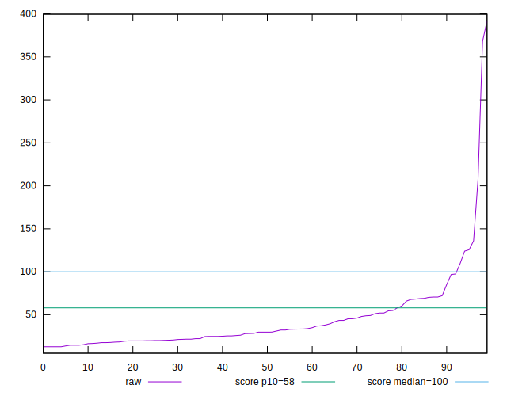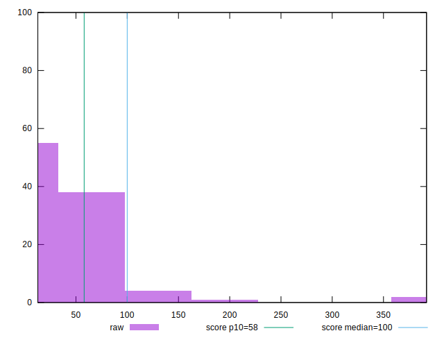
## Score


```yaml
p90min: 0.23
p90max: 1
p90range: 0.77
p90mean: 0.9287234042553191
p90median: 1
p90stdev: 0.15984190355814681
p90skewness: -2.9034880223433377
p90eccentricity: 0.9999999999999949
p90discretization: 4.086956521739131
outlandishness: 0.9462096920809996
confidence: 0.08648434304496701
p90confidence: 0.06462563193297668

```

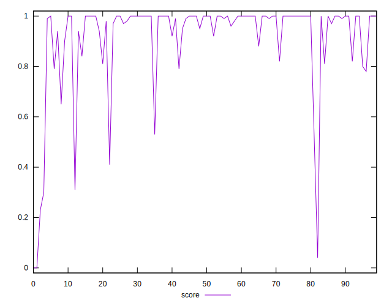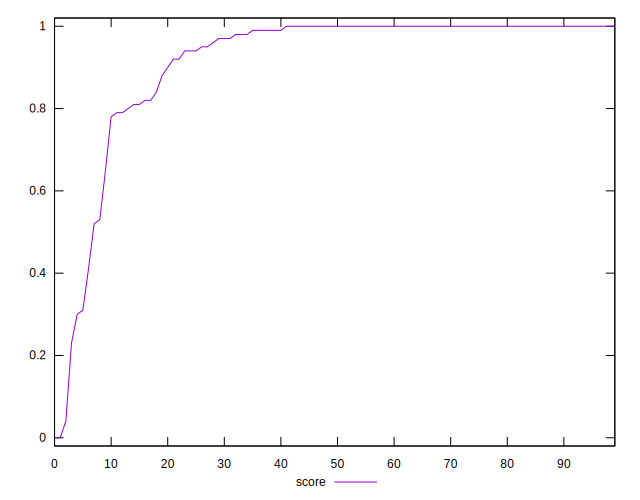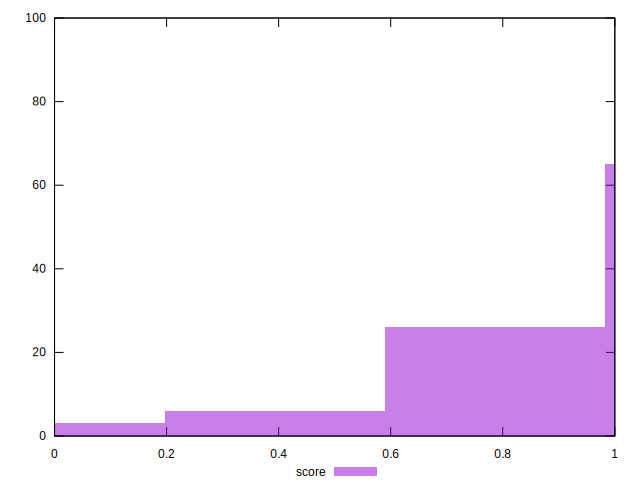
## Raw Estimate

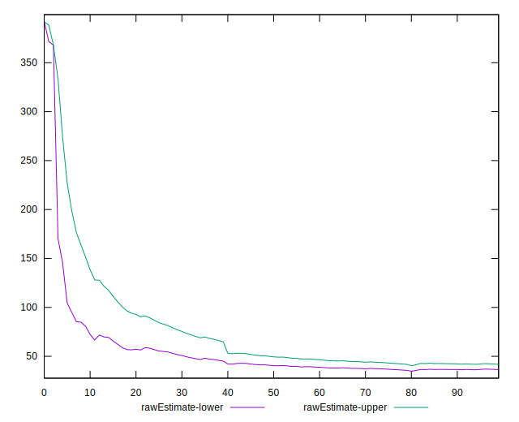
## Score Estimate

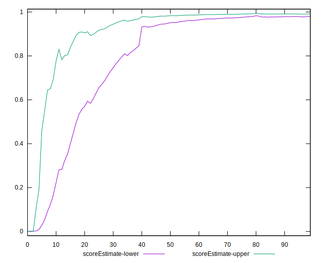
## P Score


```yaml
p90min: 0.2347159678525531
p90max: 0.9999993380488856
p90range: 0.7652833701963325
p90mean: 0.9281341165112135
p90median: 0.9978237252943796
p90stdev: 0.1594275666753436
p90skewness: -2.9078212657495457
p90eccentricity: 1.000000000000001
p90discretization: 1.1898734177215189
outlandishness: 0.9463378279057272
confidence: 0.08628339149407856
p90confidence: 0.0644581115125598

```


## Score Difference


```yaml
p90min: 0
p90max: 1.1102230246251565e-16
p90range: 1.1102230246251565e-16
p90mean: 5.3148974583119196e-18
p90median: 0
p90stdev: 2.300091806633268e-17
p90skewness: 4.229488855444225
p90eccentricity: 1.0000000000000004
p90discretization: 31.333333333333332
outlandishness: 2.4544444444444444
confidence: 1.1254344734729734e-17
p90confidence: 9.299494262683337e-18

```

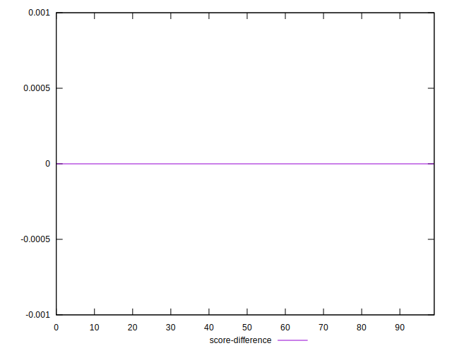
## P Score Difference


```yaml
p90min: -0.004777679734607521
p90max: 0.004572036912599664
p90range: 0.009349716647207185
p90mean: -0.0005390296416690278
p90median: -0.00011617685079273743
p90stdev: 0.001947020270783254
p90skewness: 0.11613168360578104
p90eccentricity: 1.0000000000000002
p90discretization: 1.2207792207792207
outlandishness: 0.9025463648649534
confidence: 0.000871467934480469
p90confidence: 0.000787199179844039

```

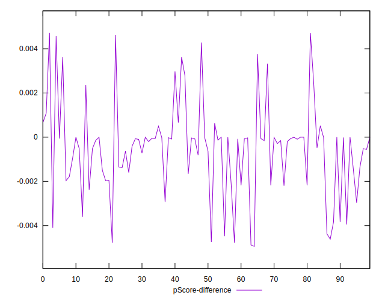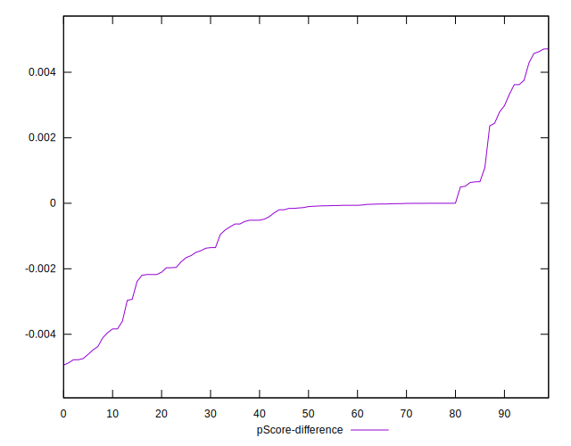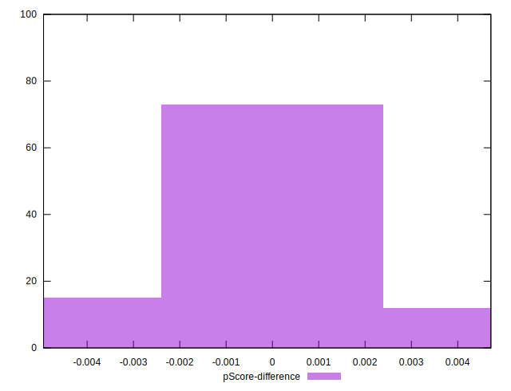