# //estimated-input-latency/samples/pages

[→ Parent](../..)


## Raw


```yaml
p90min: 12.8
p90max: 226.4
p90range: 213.6
p90mean: 46.74255319148936
p90median: 40.800000000000004
p90stdev: 37.886232934451
p90skewness: 2.543718263142321
p90eccentricity: 1.0000000000000002
p90discretization: 1.1604938271604939
outlandishness: 1.3246690802107872
confidence: 23.395881625023357
p90confidence: 15.317771438189673

```

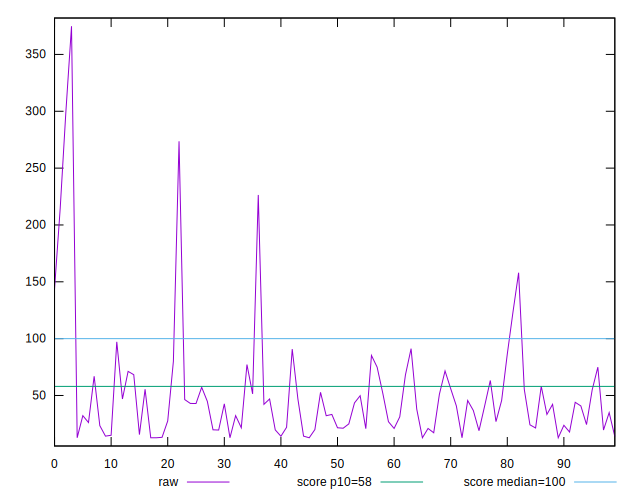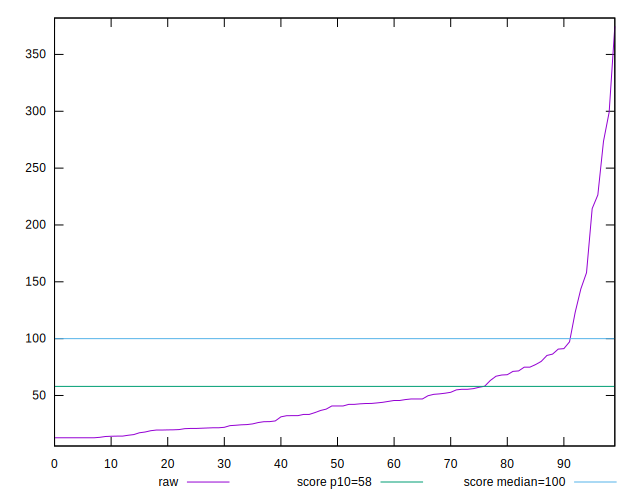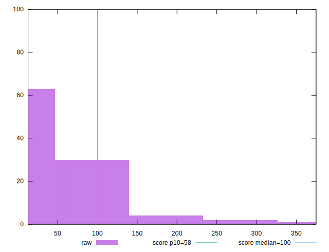
## Score


```yaml
p90min: 0.03
p90max: 1
p90range: 0.97
p90mean: 0.8960638297872341
p90median: 0.98
p90stdev: 0.2086033499920025
p90skewness: -2.755133783981826
p90eccentricity: 1.0000000000000013
p90discretization: 3.357142857142857
outlandishness: 0.9478801304225591
confidence: 0.09961418567109853
p90confidence: 0.08434035766888215

```

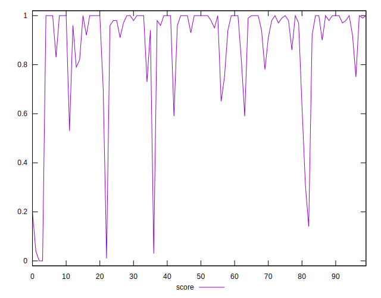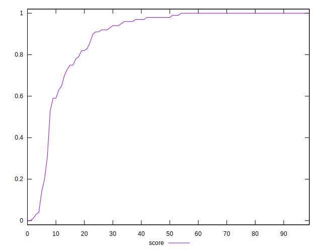
## Raw Estimate

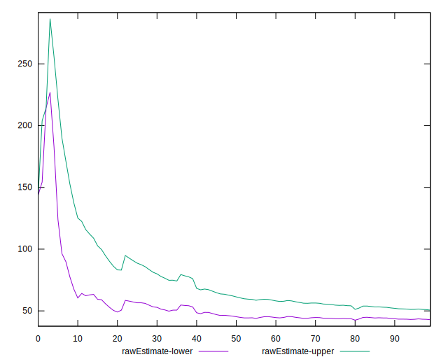
## Score Estimate

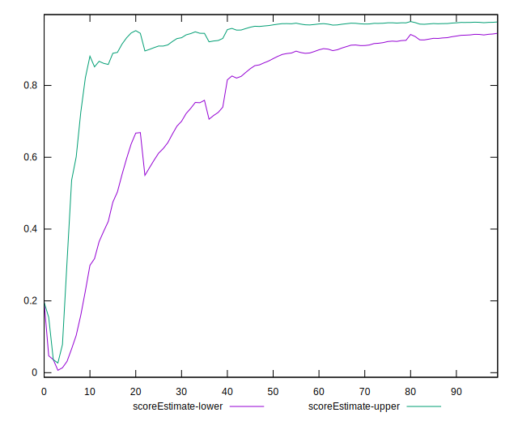
## P Score


```yaml
p90min: 0.02727595203242761
p90max: 0.9999993380488856
p90range: 0.972723386016458
p90mean: 0.895554765737445
p90median: 0.9825330086638016
p90stdev: 0.20889492001241314
p90skewness: -2.7587050934994393
p90eccentricity: 0.9999999999999996
p90discretization: 1.1898734177215189
outlandishness: 0.9480226818224723
confidence: 0.09961981562754689
p90confidence: 0.08445824225610425

```

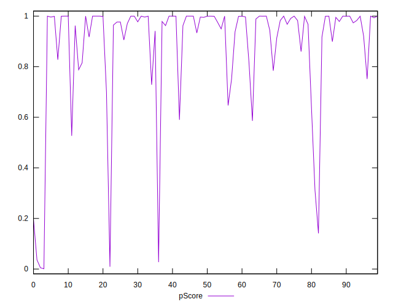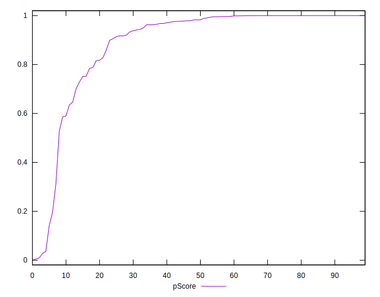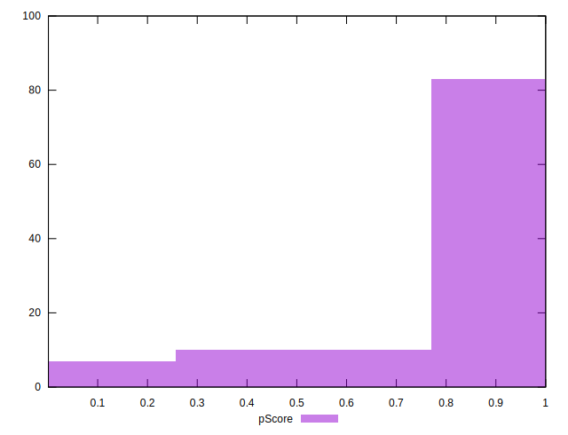
## Score Difference


```yaml
p90min: 0
p90max: 1.1102230246251565e-16
p90range: 1.1102230246251565e-16
p90mean: 5.9054416203465774e-18
p90median: 0
p90stdev: 2.4915085490873306e-17
p90skewness: 3.9819818903758057
p90eccentricity: 0.9999999999999976
p90discretization: 47
outlandishness: 2.262016
confidence: 1.1806664533324076e-17
p90confidence: 1.0073410718148069e-17

```

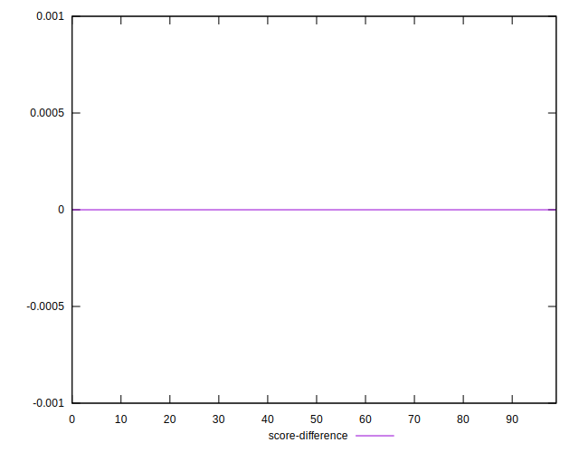
## P Score Difference


```yaml
p90min: -0.004560699422800463
p90max: 0.004054984955256691
p90range: 0.008615684378057153
p90mean: -0.0004506506034729362
p90median: -0.0001205244174697917
p90stdev: 0.0019642430894025345
p90skewness: 0.022237245625121898
p90eccentricity: 0.9999999999999989
p90discretization: 1.236842105263158
outlandishness: 0.910706438180851
confidence: 0.0008782322371573564
p90confidence: 0.0007941625324578494

```

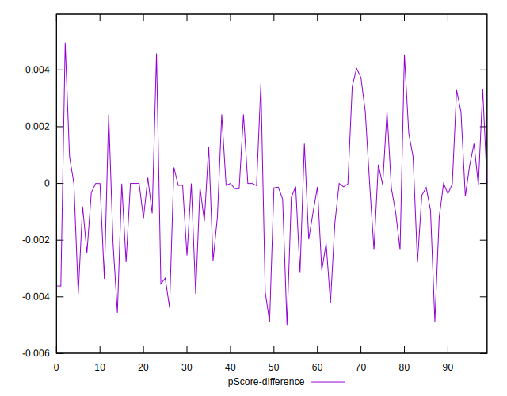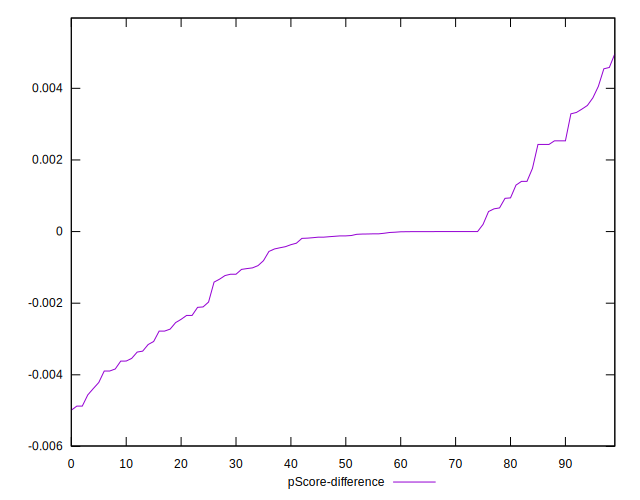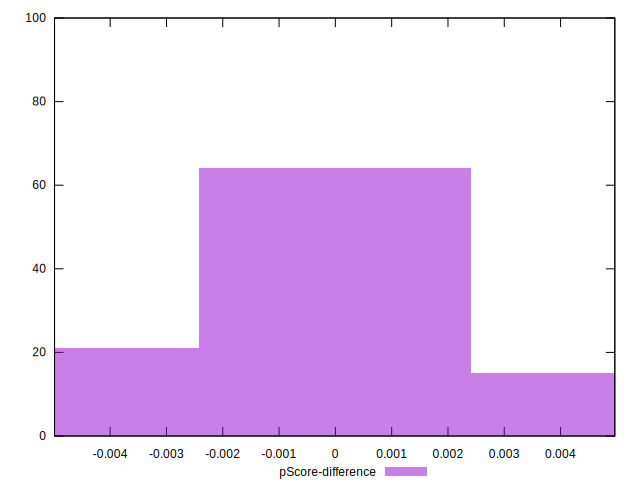