# //first-contentful-paint/samples/pages+cached+noadtech+nomedia

[→ Parent](../..)


## Raw


```yaml
p90min: 1908.1375
p90max: 2141.0334999999995
p90range: 232.8959999999995
p90mean: 1953.3695452127656
p90median: 1924.73675
p90stdev: 63.69724920449317
p90skewness: 1.6855972983987837
p90eccentricity: 1.0000000000000002
p90discretization: 1
outlandishness: 1.008122937242828
confidence: 33.417573385065936
p90confidence: 25.75341566008808

```

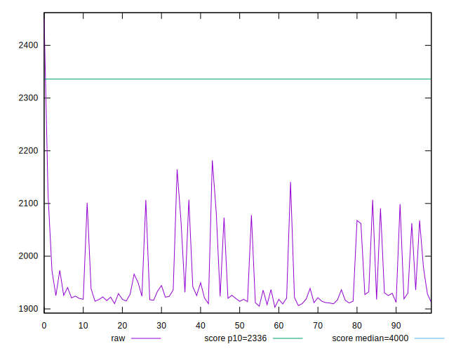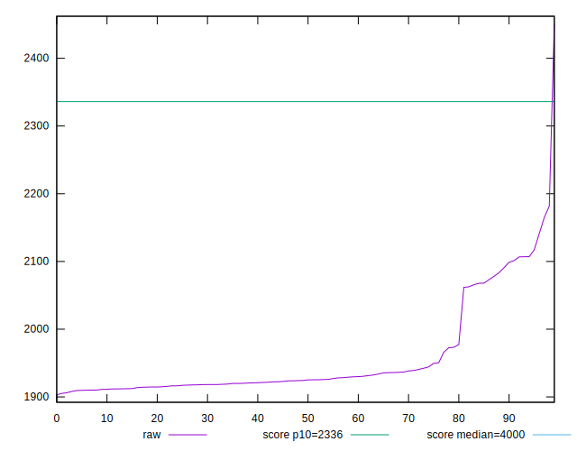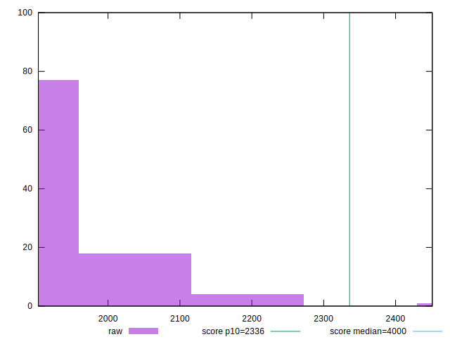
## Score


```yaml
p90min: 0.93
p90max: 0.96
p90range: 0.029999999999999916
p90mean: 0.956063829787233
p90median: 0.96
p90stdev: 0.00788455062284587
p90skewness: -1.655218299531814
p90eccentricity: 0.9999999999999989
p90discretization: 23.5
outlandishness: 0.99756685405742
confidence: 0.004452009763157916
p90confidence: 0.003187800289950868

```

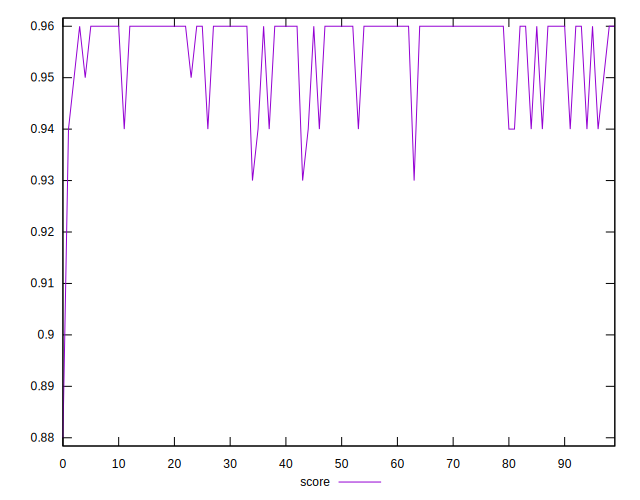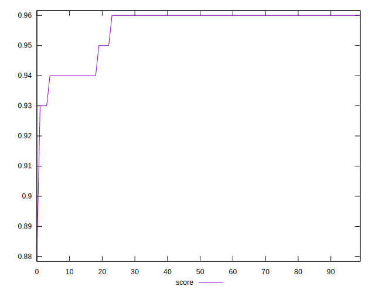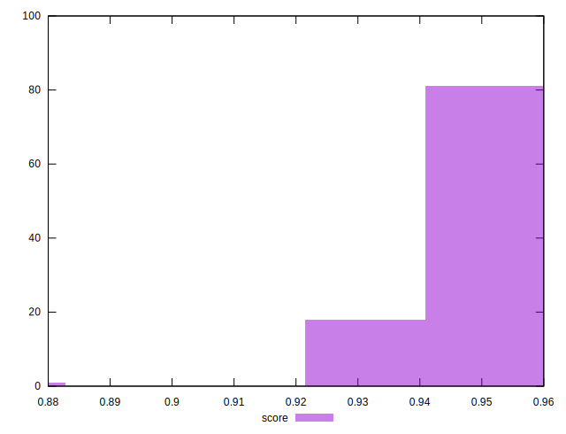
## Raw Estimate

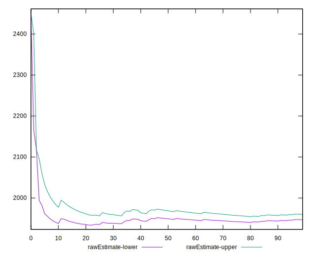
## Score Estimate

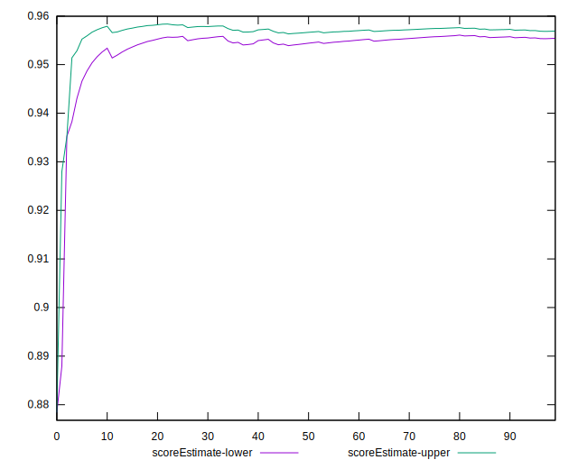
## P Score


```yaml
p90min: 0.9317836938788946
p90max: 0.9611006826611772
p90range: 0.029316988782282616
p90mean: 0.9558004647664694
p90median: 0.9593302175042525
p90stdev: 0.007823326221635113
p90skewness: -1.73806540107118
p90eccentricity: 0.9999999999999992
p90discretization: 1
outlandishness: 0.9975297778136808
confidence: 0.004532232377548761
p90confidence: 0.0031630466707190767

```

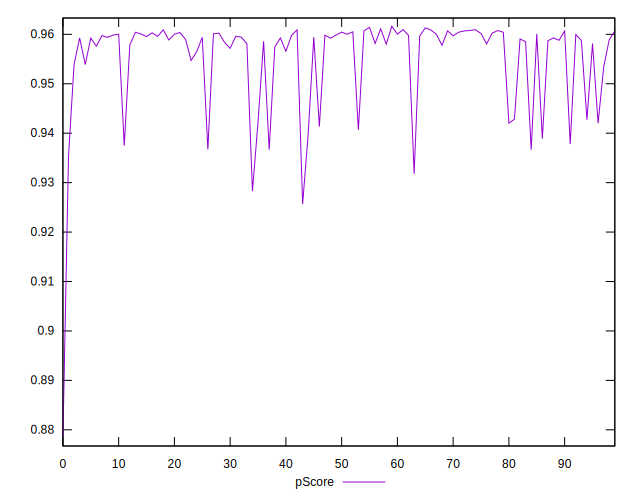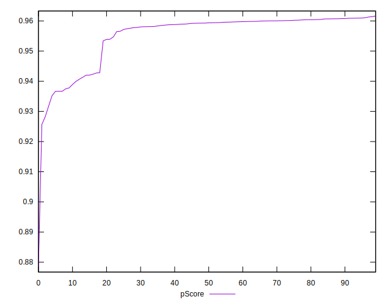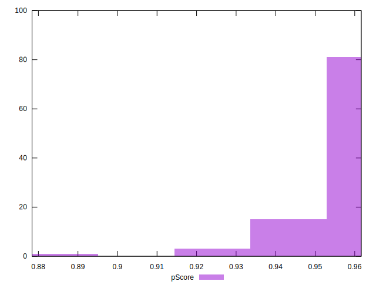
## Score Difference


```yaml
p90min: 0
p90max: 1.1102230246251565e-16
p90range: 1.1102230246251565e-16
p90mean: 1.8897413185109047e-17
p90median: 0
p90stdev: 4.1724358560768534e-17
p90skewness: 1.7550294029241187
p90eccentricity: 0.9999999999999972
p90discretization: 47
outlandishness: 1.2460140625
confidence: 1.7072912966554707e-17
p90confidence: 1.6869562855317603e-17

```

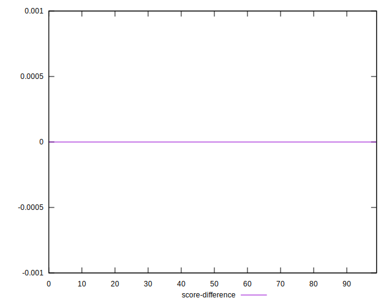
## P Score Difference


```yaml
p90min: -0.003418769140825284
p90max: 0.003385246777237949
p90range: 0.006804015918063233
p90mean: -0.0002980522049272184
p90median: -0.00015880457691108685
p90stdev: 0.0014093155011287706
p90skewness: -0.05482660341454136
p90eccentricity: 1.0000000000000002
p90discretization: 1
outlandishness: 0.8874888558516346
confidence: 0.0006719744485392135
p90confidence: 0.0005697999262143075

```

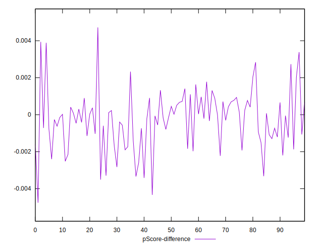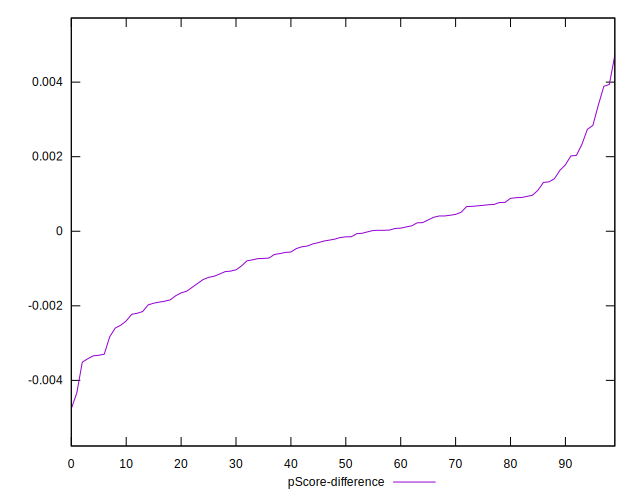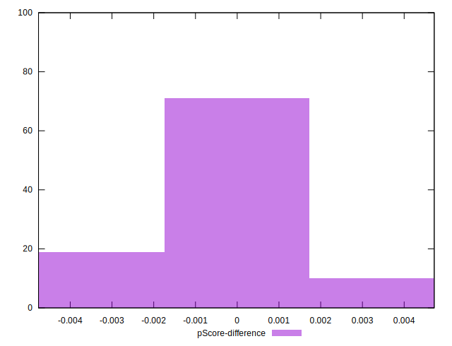