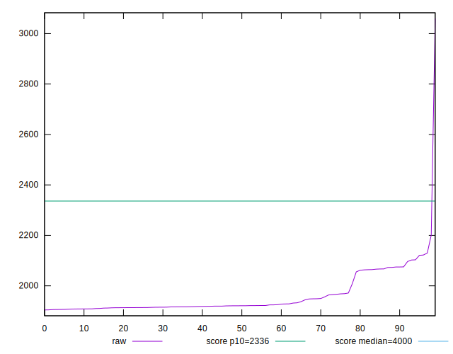
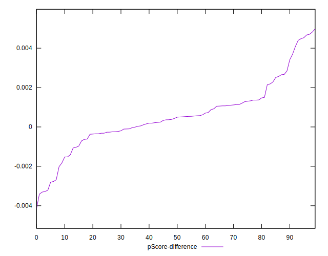

# //first-contentful-paint/samples/pages+cached+noadtech

[→ Parent](../..)


## Raw


```yaml
p90min: 1906.0104999999999
p90max: 2122.05965
p90range: 216.04915000000028
p90mean: 1954.2384303191493
p90median: 1920.888875
p90stdev: 63.750200876553876
p90skewness: 1.4132660879366556
p90eccentricity: 1.0000000000000002
p90discretization: 1
outlandishness: 1.0141687551010443
confidence: 50.86437714066793
p90confidence: 25.77482453468639

```


## Score


```yaml
p90min: 0.93
p90max: 0.96
p90range: 0.029999999999999916
p90mean: 0.9552127659574455
p90median: 0.96
p90stdev: 0.00847131874536956
p90skewness: -1.4315547117137999
p90eccentricity: 0.9999999999999999
p90discretization: 23.5
outlandishness: 0.9945369393318165
confidence: 0.009136375845495582
p90confidence: 0.003425036333016542

```


## Raw Estimate


## Score Estimate


## P Score


```yaml
p90min: 0.9345315665726972
p90max: 0.9613240255678768
p90range: 0.02679245899517957
p90mean: 0.9557014150695238
p90median: 0.9597449818276741
p90stdev: 0.0077420300148174455
p90skewness: -1.469400744085599
p90eccentricity: 0.9999999999999999
p90discretization: 1
outlandishness: 0.9946642129516722
confidence: 0.009096837996658749
p90confidence: 0.0031301778258017326

```


## Score Difference


```yaml
p90min: 0
p90max: 1.1102230246251565e-16
p90range: 1.1102230246251565e-16
p90mean: 2.362176648138631e-17
p90median: 0
p90stdev: 4.543737504845804e-17
p90skewness: 1.4036631612571022
p90eccentricity: 1.0000000000000022
p90discretization: 47
outlandishness: 1.168561
confidence: 1.831460671328082e-17
p90confidence: 1.8370771434250756e-17

```


## P Score Difference


```yaml
p90min: -0.0032771549189024585
p90max: 0.004669734748721233
p90range: 0.007946889667623691
p90mean: 0.0005446742299955572
p90median: 0.0004655075929472785
p90stdev: 0.001607567015670365
p90skewness: 0.3091478943428734
p90eccentricity: 1.0000000000000002
p90discretization: 1
outlandishness: 1.0133400026248431
confidence: 0.000734053731203025
p90confidence: 0.0006499549364069852

```

