# //first-contentful-paint/samples/pages+cached

[→ Parent](../..)


## Raw


```yaml
p90min: 2059.3695000000002
p90max: 2235.197
p90range: 175.82749999999987
p90mean: 2090.614349468085
p90median: 2080.27225
p90stdev: 29.68590932100389
p90skewness: 2.7197700413258357
p90eccentricity: 0.9999999999999996
p90discretization: 1
outlandishness: 1.0245945562032763
confidence: 68.95683439762729
p90confidence: 12.002301065421332

```

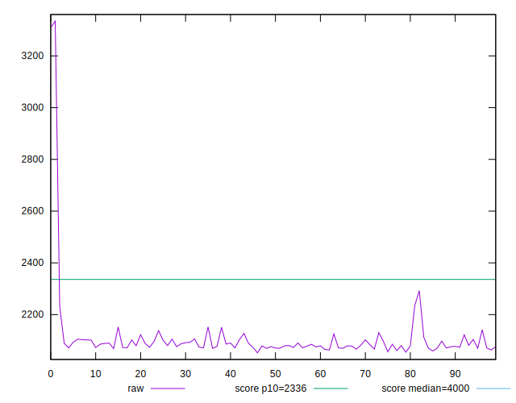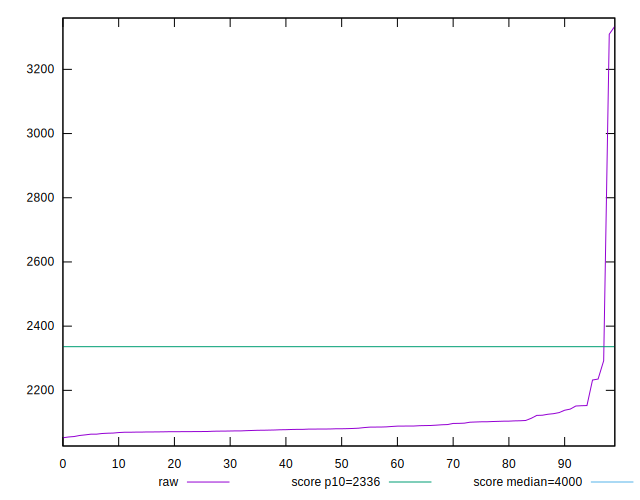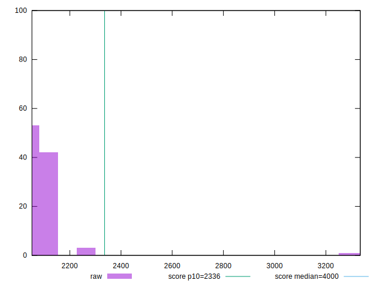
## Score


```yaml
p90min: 0.92
p90max: 0.94
p90range: 0.019999999999999907
p90mean: 0.9385106382978714
p90median: 0.94
p90stdev: 0.004114697788470969
p90skewness: -2.837069357940118
p90eccentricity: 1.0000000000000004
p90discretization: 31.333333333333332
outlandishness: 0.9880792668531675
confidence: 0.01484711205531848
p90confidence: 0.0016636122247907553

```

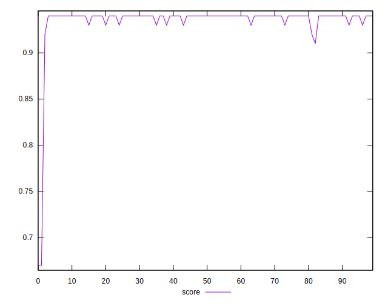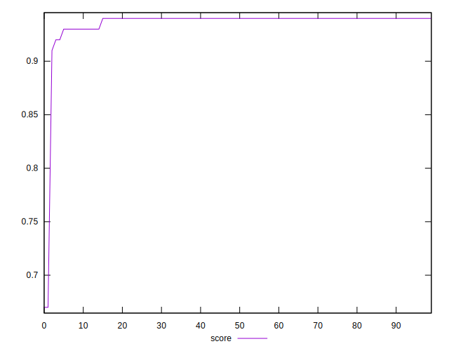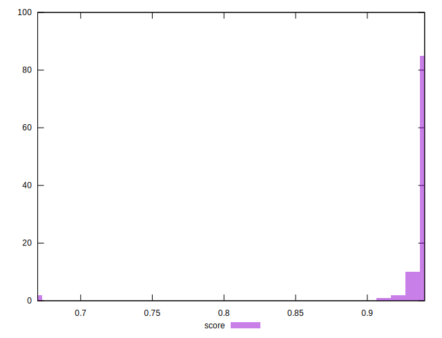
## Raw Estimate

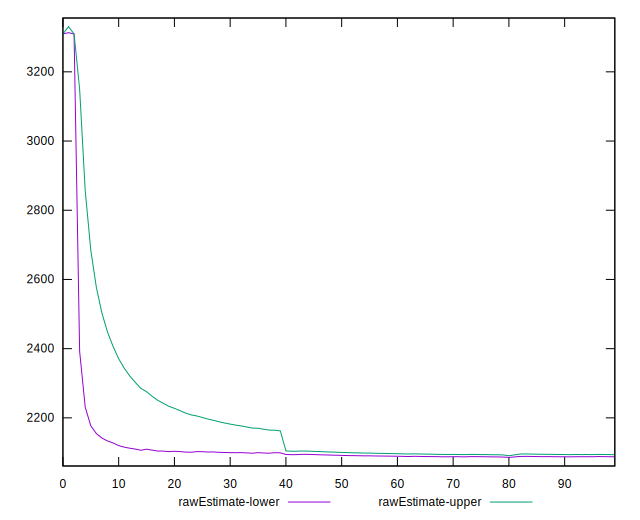
## Score Estimate

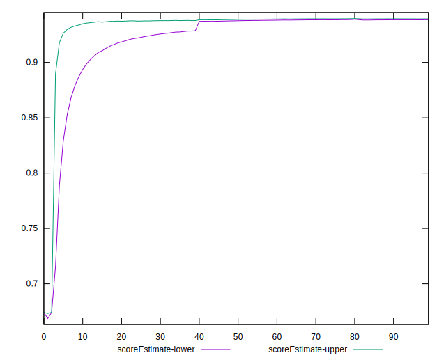
## P Score


```yaml
p90min: 0.917226391812986
p90max: 0.9431602530309476
p90range: 0.025933861217961596
p90mean: 0.9388692148926928
p90median: 0.9403603895525379
p90stdev: 0.004297454754383952
p90skewness: -2.9399015529676977
p90eccentricity: 0.9999999999999996
p90discretization: 1
outlandishness: 0.9882735647880039
confidence: 0.014838299031872773
p90confidence: 0.0017375026386895333

```

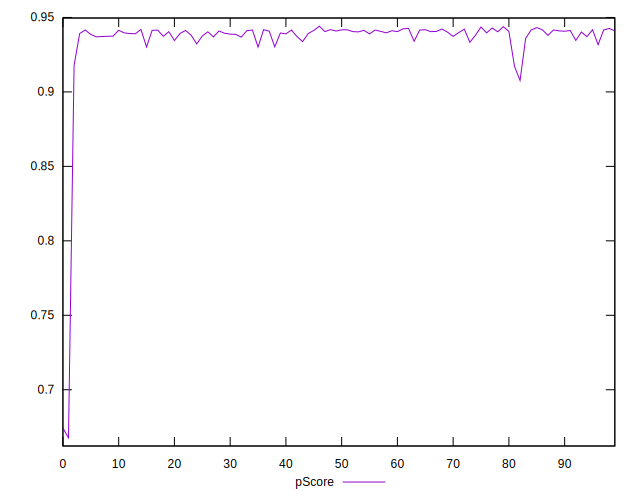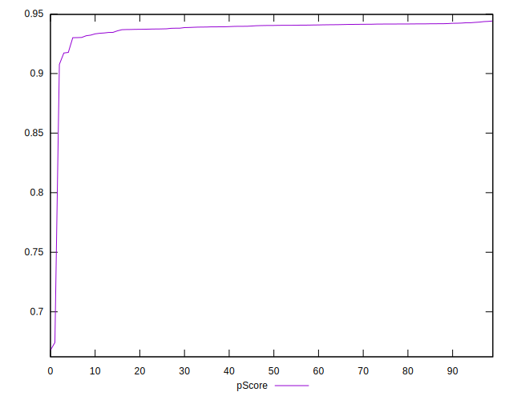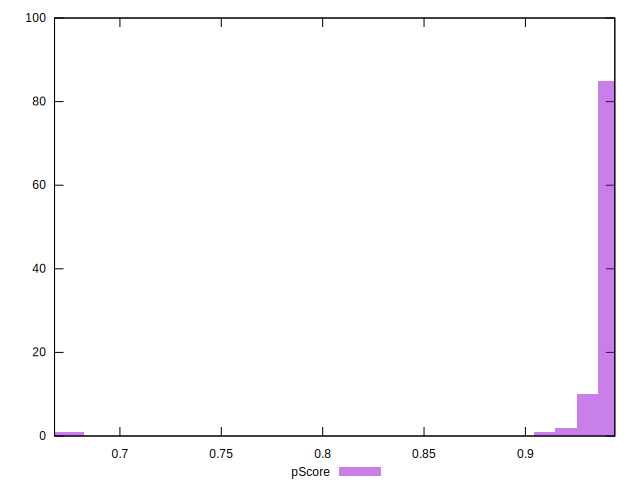
## Score Difference


```yaml
p90min: 0
p90max: 1.1102230246251565e-16
p90range: 1.1102230246251565e-16
p90mean: 9.684924257368387e-17
p90median: 1.1102230246251565e-16
p90stdev: 3.704929304568197e-17
p90skewness: -2.231518495721682
p90eccentricity: 0.999999999999998
p90discretization: 47
outlandishness: 0.9494363474122546
confidence: 1.5539727857965504e-17
p90confidence: 1.4979388523587196e-17

```

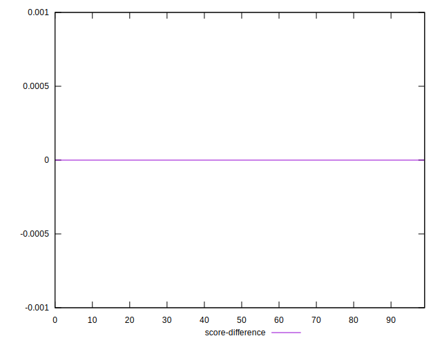
## P Score Difference


```yaml
p90min: -0.00302818520021364
p90max: 0.00409945470070483
p90range: 0.00712763990091847
p90mean: 0.0004470778584661246
p90median: 0.0006376929332539971
p90stdev: 0.001799779948606719
p90skewness: -0.22934544390994274
p90eccentricity: 1.0000000000000007
p90discretization: 1
outlandishness: 1.0049686050183937
confidence: 0.000782617984850824
p90confidence: 0.0007276684894877888

```

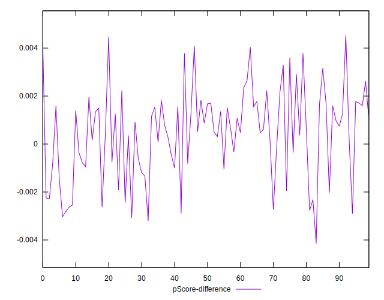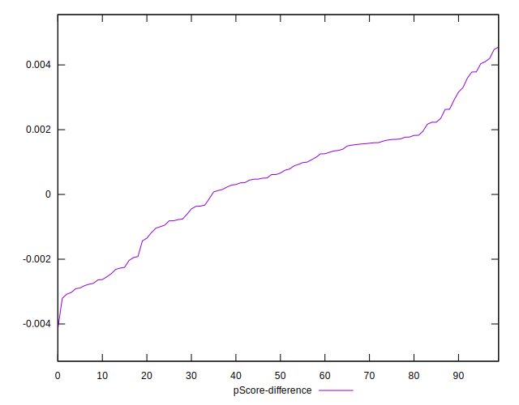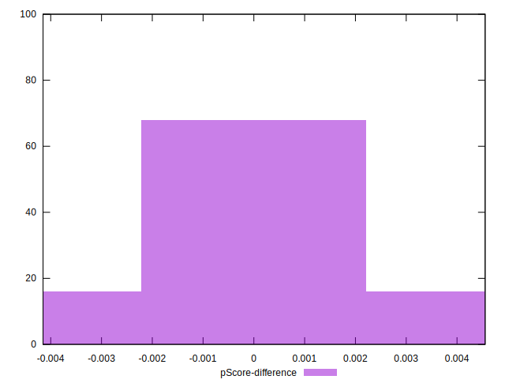