# //first-cpu-idle/samples/pages+cached+noadtech+nomedia+nocss

[→ Parent](../..)


## Raw


```yaml
p90min: 1585.5263999999997
p90max: 4028.4919999999997
p90range: 2442.9656
p90mean: 2678.9848718085095
p90median: 1599.0545
p90stdev: 1137.1221225406541
p90skewness: 0.08621371569863337
p90eccentricity: 1
p90discretization: 1
outlandishness: 1.0169663252384846
confidence: 456.6607914621585
p90confidence: 459.7495032172496

```

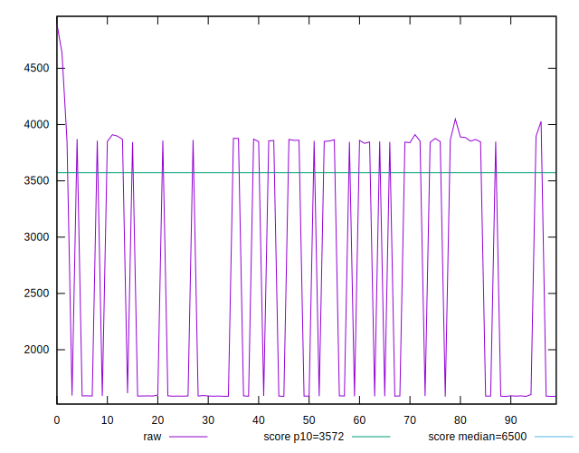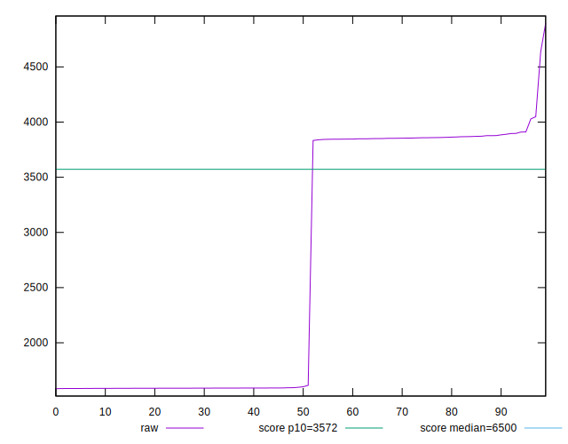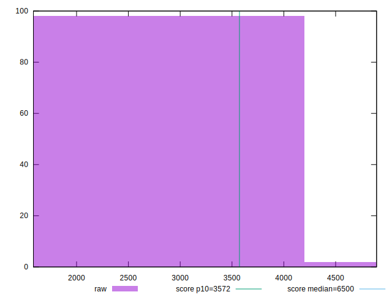
## Score


```yaml
p90min: 0.85
p90max: 1
p90range: 0.15000000000000002
p90mean: 0.9369148936170211
p90median: 1
p90stdev: 0.06589848084880387
p90skewness: -0.0918274784031673
p90eccentricity: 1.0000000000000009
p90discretization: 23.5
outlandishness: 0.9937873561743146
confidence: 0.027795578749470248
p90confidence: 0.026643394963873683

```

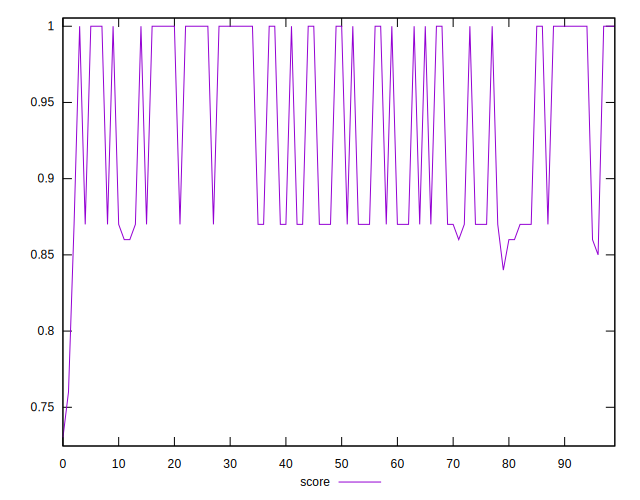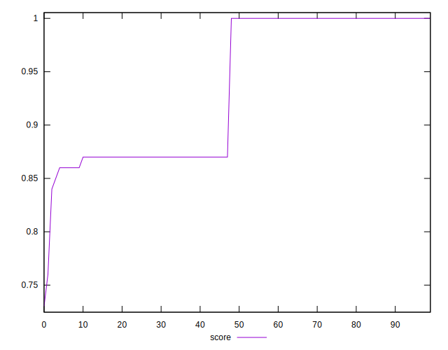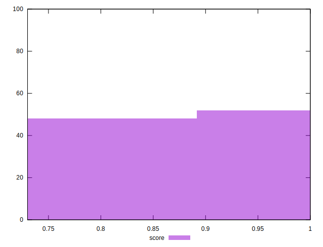
## Raw Estimate

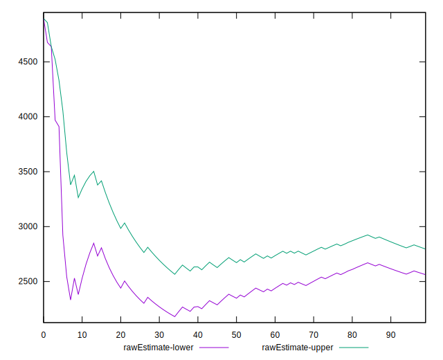
## Score Estimate

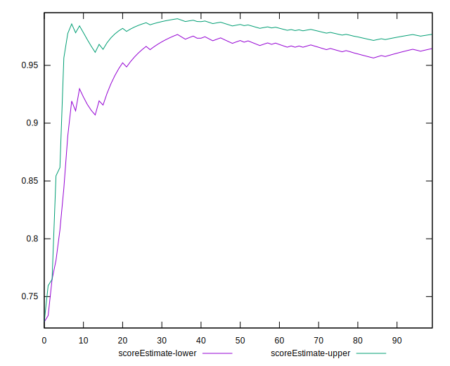
## P Score


```yaml
p90min: 0.8471069642745708
p90max: 0.9987368915293875
p90range: 0.15162992725481672
p90mean: 0.9356782380986278
p90median: 0.9986588688480833
p90stdev: 0.06582728003435613
p90skewness: -0.08996131940745132
p90eccentricity: 1.0000000000000009
p90discretization: 1
outlandishness: 0.994016913367631
confidence: 0.02769136947312235
p90confidence: 0.026614607784007836

```

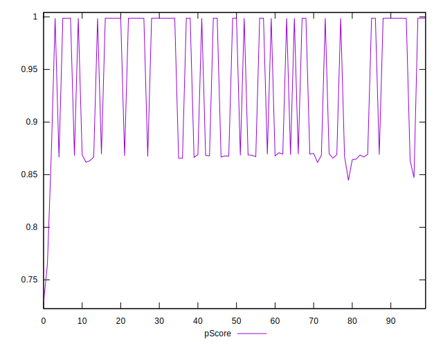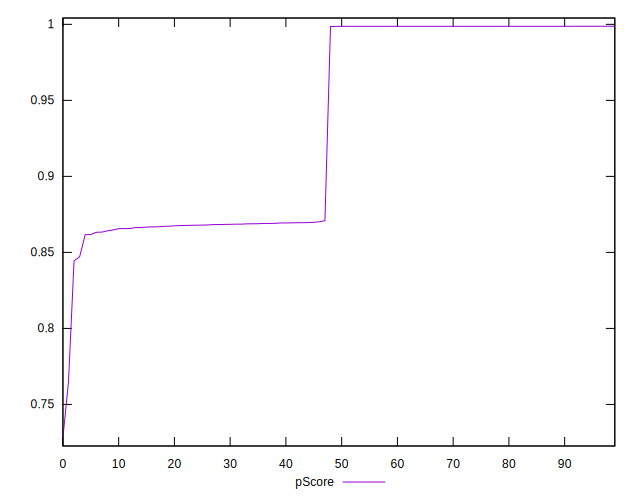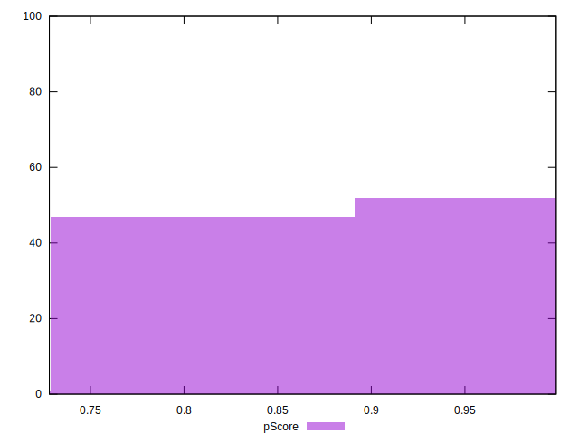
## Score Difference


```yaml
p90min: 0
p90max: 0
p90range: 0
p90mean: 0
p90median: 0
p90stdev: 0
p90skewness: .nan
p90eccentricity: .nan
p90discretization: 94
outlandishness: .nan
confidence: 0
p90confidence: 0

```


## P Score Difference


```yaml
p90min: -0.0036951580402677653
p90max: 0.00417563840163182
p90range: 0.007870796441899586
p90mean: -0.0012096834559580318
p90median: -0.0012799729495931444
p90stdev: 0.0012123181909954525
p90skewness: 1.9505088599830611
p90eccentricity: 0.9999999999999996
p90discretization: 1
outlandishness: 0.865019453686715
confidence: 0.0006476555976391966
p90confidence: 0.0004901520030285642

```

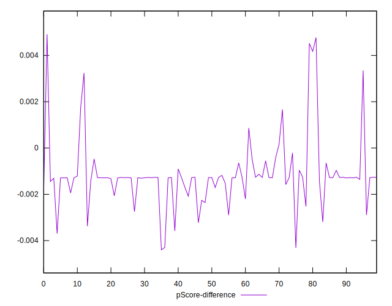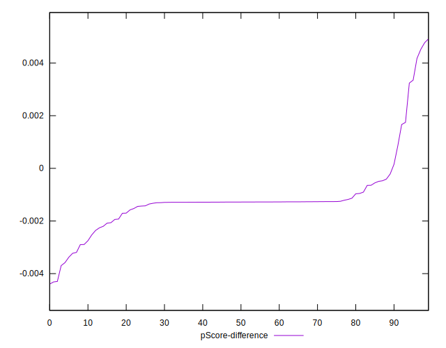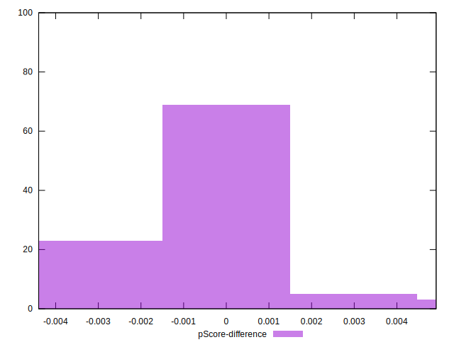