# //first-cpu-idle/samples/pages+cached+noadtech+nomedia

[→ Parent](../..)


## Raw


```yaml
p90min: 1909.4185000000002
p90max: 6282.2429999999995
p90range: 4372.824499999999
p90mean: 2398.680852659574
p90median: 1926.5066499999998
p90stdev: 1284.7891263664997
p90skewness: 2.539042171855303
p90eccentricity: 0.9999999999999994
p90discretization: 1
outlandishness: 1.0884007691964181
confidence: 556.7206871818295
p90confidence: 519.452705102749

```

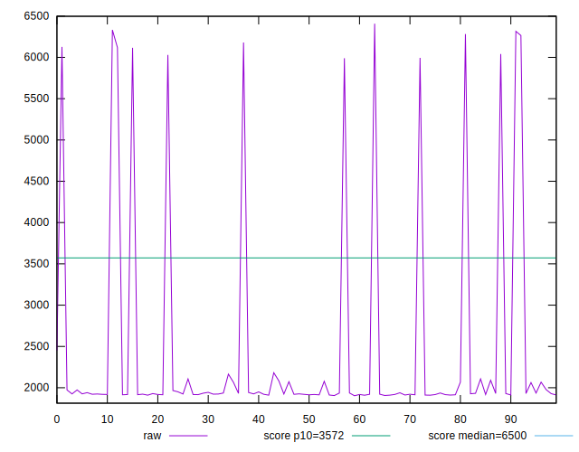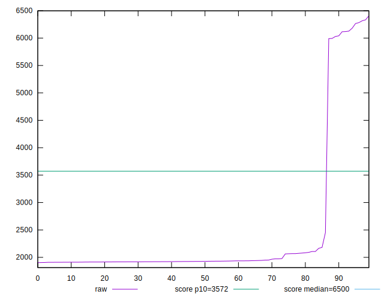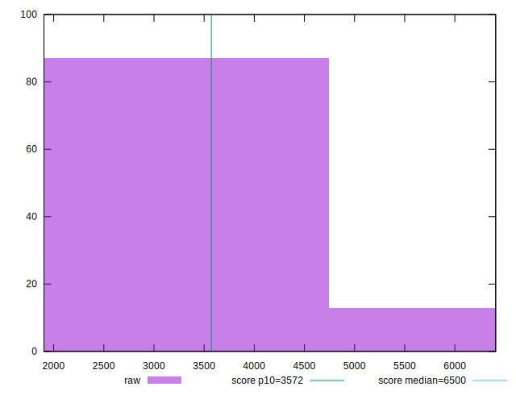
## Score


```yaml
p90min: 0.53
p90max: 1
p90range: 0.47
p90mean: 0.9503191489361698
p90median: 1
p90stdev: 0.1379134181648543
p90skewness: -2.5540592641377793
p90eccentricity: 1.0000000000000013
p90discretization: 11.75
outlandishness: 0.9759042314497961
confidence: 0.06004347027548133
p90confidence: 0.05575973260164738

```

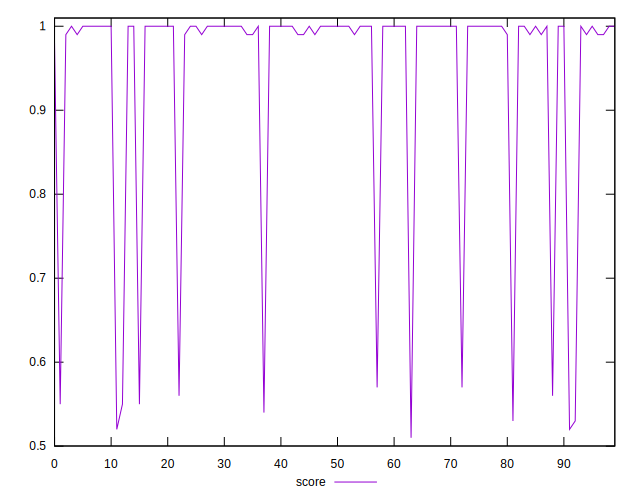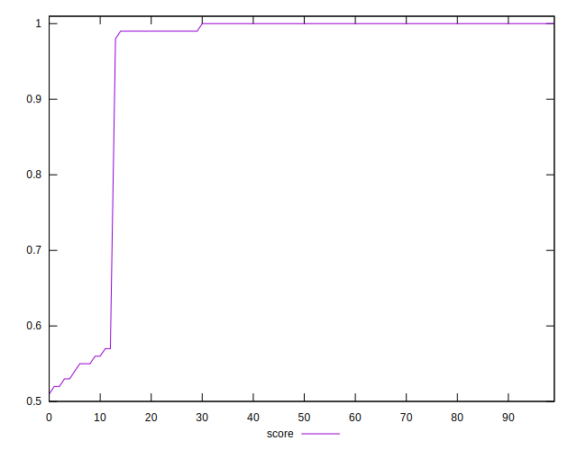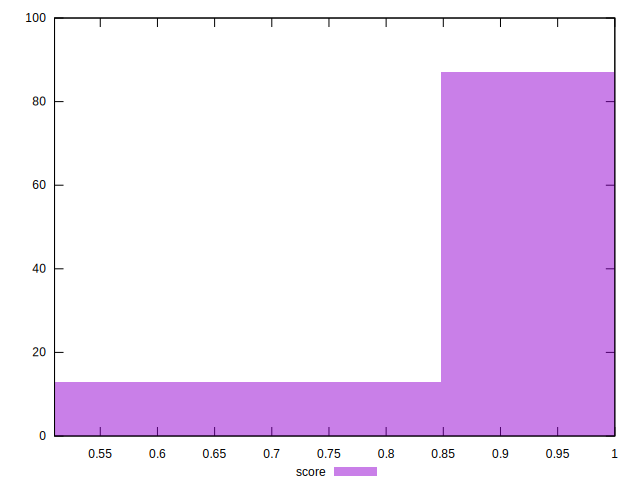
## Raw Estimate

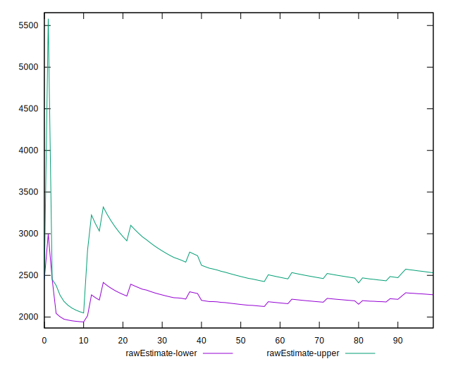
## Score Estimate

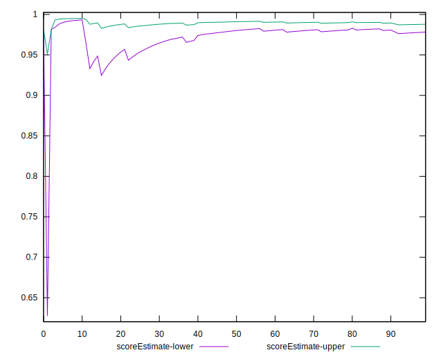
## P Score


```yaml
p90min: 0.5290741512125756
p90max: 0.995632943340917
p90range: 0.4665587921283414
p90mean: 0.9476939212735424
p90median: 0.9953823314139393
p90stdev: 0.13654939183712922
p90skewness: -2.557673264386885
p90eccentricity: 1.0000000000000002
p90discretization: 1
outlandishness: 0.9760870051386324
confidence: 0.05940003242012827
p90confidence: 0.05520824352750491

```

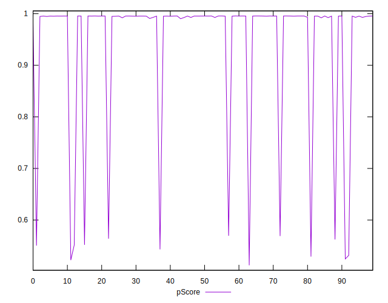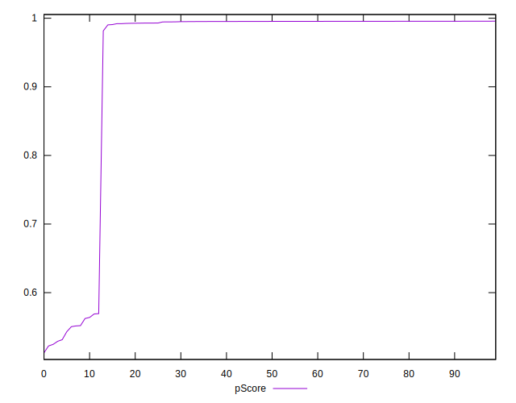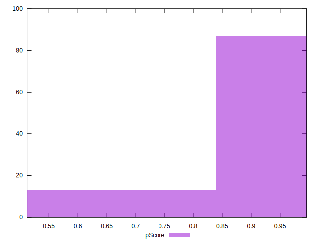
## Score Difference


```yaml
p90min: 0
p90max: 0
p90range: 0
p90mean: 0
p90median: 0
p90stdev: 0
p90skewness: .nan
p90eccentricity: .nan
p90discretization: 94
outlandishness: .inf
confidence: 6.092792000602807e-18
p90confidence: 0

```

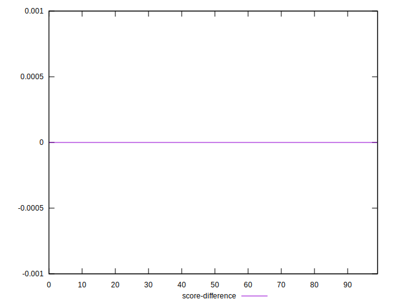
## P Score Difference


```yaml
p90min: -0.004858571293904879
p90max: 0.0045729637164230175
p90range: 0.009431535010327896
p90mean: -0.0026572644978454384
p90median: -0.004452629404868069
p90stdev: 0.003064308267718743
p90skewness: 1.1224635606267581
p90eccentricity: 1
p90discretization: 1
outlandishness: 0.8892068550021834
confidence: 0.0012750077584336404
p90confidence: 0.001238929553705728

```

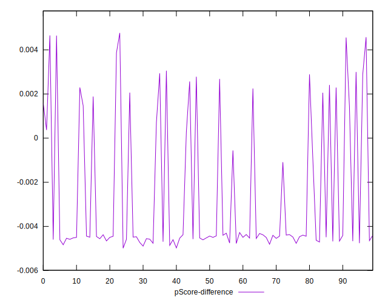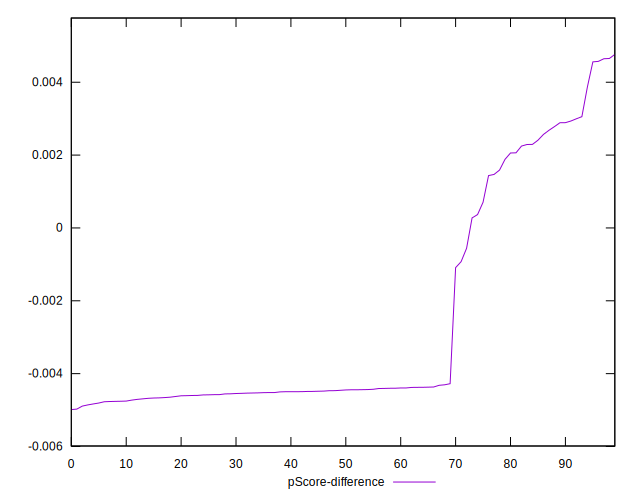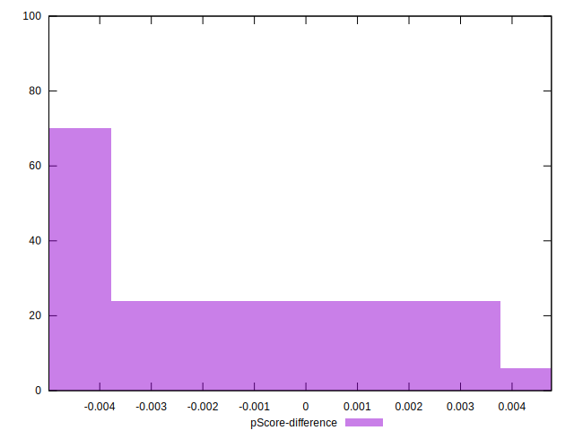