# //first-cpu-idle/samples/pages+cached+noadtech

[→ Parent](../..)


## Raw


```yaml
p90min: 1906.0105
p90max: 6280.571
p90range: 4374.5605
p90mean: 2869.9649616656243
p90median: 1921.614125
p90stdev: 1716.2019937349269
p90skewness: 1.3355466487539187
p90eccentricity: 1.0000000000000002
p90discretization: 1
outlandishness: 1.054157379550249
confidence: 697.1325396697089
p90confidence: 693.8771117012342

```

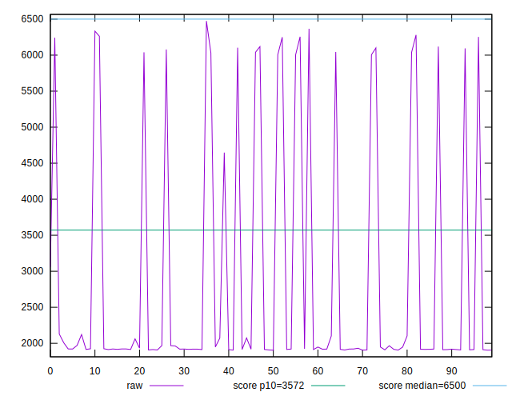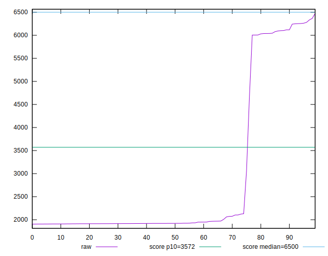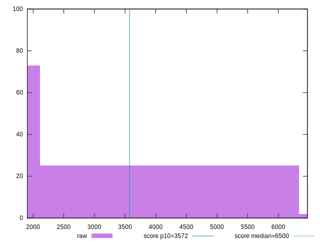
## Score


```yaml
p90min: 0.53
p90max: 1
p90range: 0.47
p90mean: 0.8997872340425531
p90median: 1
p90stdev: 0.18368554723375016
p90skewness: -1.3629898372544262
p90eccentricity: 0.9999999999999994
p90discretization: 11.75
outlandishness: 0.9810038261525759
confidence: 0.07481473924823737
p90confidence: 0.07426584833317766

```

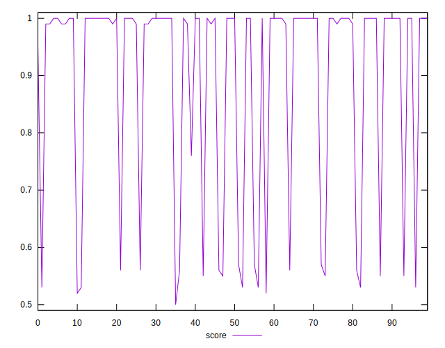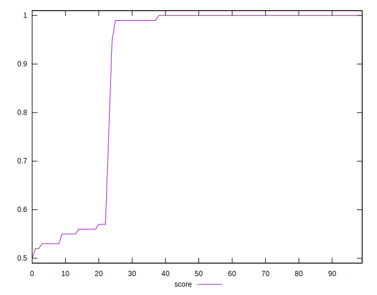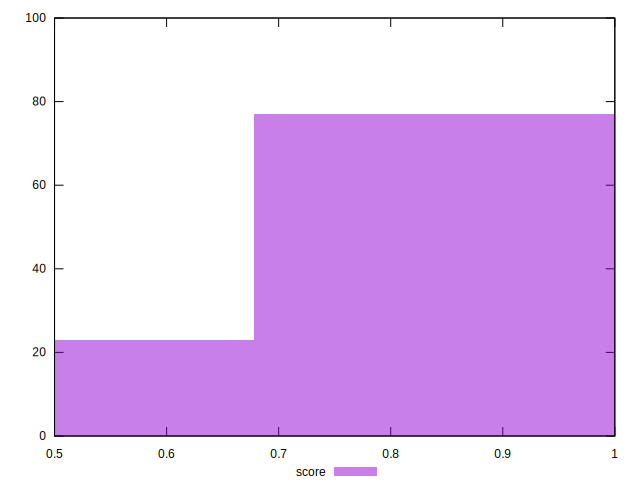
## Raw Estimate

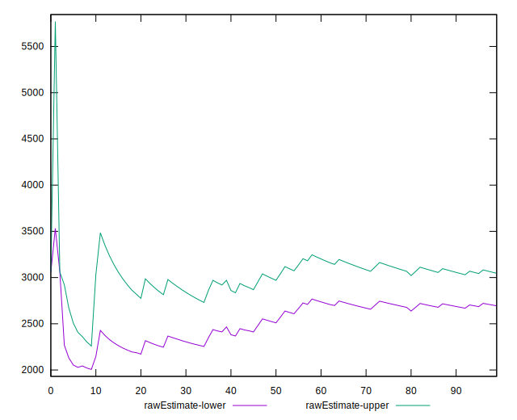
## Score Estimate

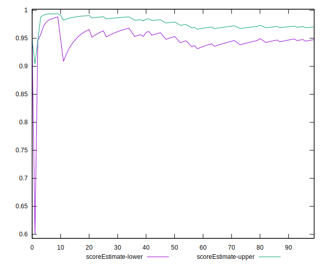
## P Score


```yaml
p90min: 0.5293008601501303
p90max: 0.9956817031960294
p90range: 0.4663808430458991
p90mean: 0.8977747156412133
p90median: 0.9954551385101127
p90stdev: 0.1816838009435692
p90skewness: -1.36454571778894
p90eccentricity: 0.9999999999999994
p90discretization: 1
outlandishness: 0.9810148416251341
confidence: 0.07401674172961022
p90confidence: 0.07345652289289736

```

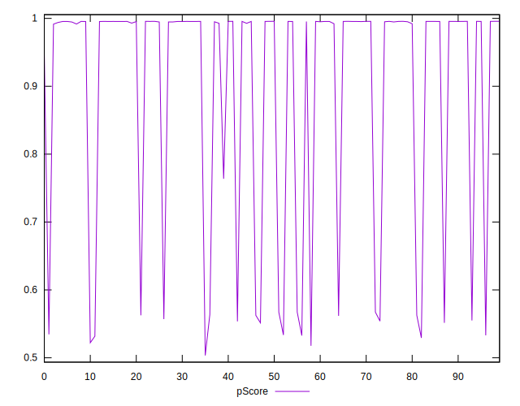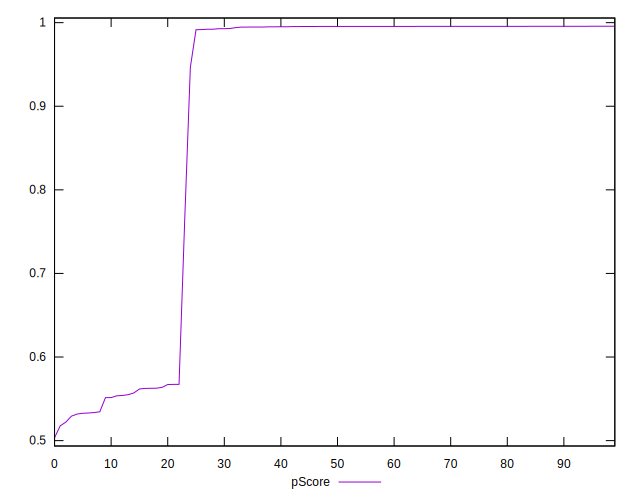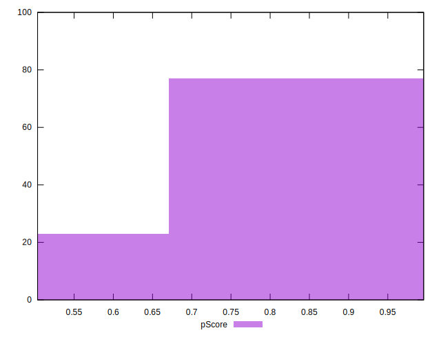
## Score Difference


```yaml
p90min: 0
p90max: 1.1102230246251565e-16
p90range: 1.1102230246251565e-16
p90mean: 1.1810883240693154e-18
p90median: 0
p90stdev: 1.139000331521095e-17
p90skewness: 9.539955591519902
p90eccentricity: 1.0000000000000007
p90discretization: 47
outlandishness: 14.137600000000003
confidence: 8.528132291650269e-18
p90confidence: 4.605088813249998e-18

```

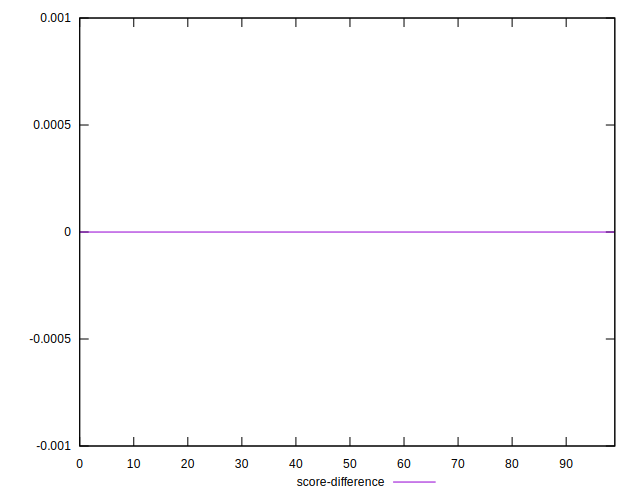
## P Score Difference


```yaml
p90min: -0.004945337941762773
p90max: 0.004729668044044066
p90range: 0.00967500598580684
p90mean: -0.002111080852627389
p90median: -0.004364158894904657
p90stdev: 0.003393665235229239
p90skewness: 0.9036394652284409
p90eccentricity: 1.0000000000000002
p90discretization: 1
outlandishness: 0.8870794926220831
confidence: 0.0013859474640826636
p90confidence: 0.001372091770140117

```

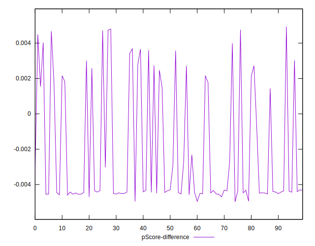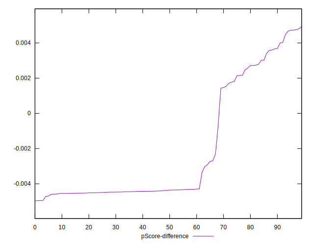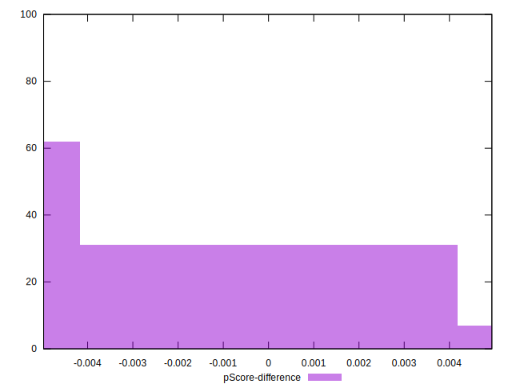