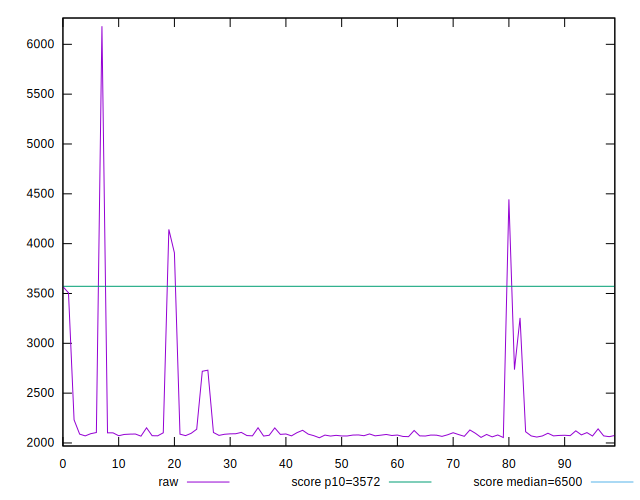

# //first-cpu-idle/samples/pages+cached

[→ Parent](../..)


## Raw


```yaml
p90min: 2059.3695000000002
p90max: 3907.625000000001
p90range: 1848.2555000000007
p90mean: 2171.721519680851
p90median: 2081.64055
p90stdev: 318.086689846961
p90skewness: 3.988236761767252
p90eccentricity: 1.0000000000000002
p90discretization: 1
outlandishness: 1.074092141961031
confidence: 228.76162095015246
p90confidence: 128.605533863344

```


## Score


```yaml
p90min: 0.86
p90max: 0.99
p90range: 0.13
p90mean: 0.985531914893616
p90median: 0.99
p90stdev: 0.019108704782398046
p90skewness: -4.893511151243418
p90eccentricity: 1.0000000000000029
p90discretization: 15.666666666666666
outlandishness: 0.9841693706961931
confidence: 0.02107926458526428
p90confidence: 0.007725834680978601

```


## Raw Estimate


## Score Estimate


## P Score


```yaml
p90min: 0.861992060999119
p90max: 0.9930620000401741
p90range: 0.13106993904105513
p90mean: 0.9877359306409137
p90median: 0.9926040005930528
p90stdev: 0.019662992414344608
p90skewness: -4.7369855723606
p90eccentricity: 0.9999999999999991
p90discretization: 1
outlandishness: 0.9842787233678578
confidence: 0.0211337260630505
p90confidence: 0.007949938546672048

```


## Score Difference


```yaml
p90min: 0
p90max: 0
p90range: 0
p90mean: 0
p90median: 0
p90stdev: 0
p90skewness: .nan
p90eccentricity: .nan
p90discretization: 94
outlandishness: .inf
confidence: 4.330179641073934e-18
p90confidence: 0

```


## P Score Difference


```yaml
p90min: -0.0010737150735432577
p90max: 0.0030620000401740954
p90range: 0.004135715113717353
p90mean: 0.0023566405041481283
p90median: 0.0026183964282271432
p90stdev: 0.0007379070281918099
p90skewness: -2.66075968200578
p90eccentricity: 1.0000000000000002
p90discretization: 1
outlandishness: 0.9042173498701442
confidence: 0.0004265181873135953
p90confidence: 0.0002983429685403669

```

