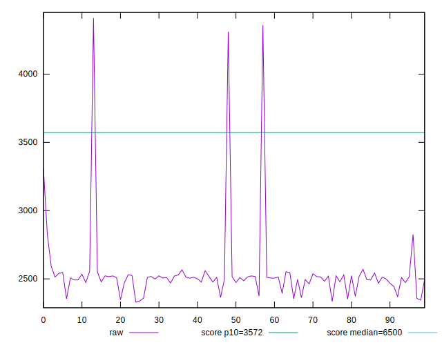

# //first-cpu-idle/samples/pages

[→ Parent](../..)


## Raw


```yaml
p90min: 2344.6229999999996
p90max: 3307.7509999999993
p90range: 963.1279999999997
p90mean: 2505.4951803191475
p90median: 2509.6105000000002
p90stdev: 112.01270065539015
p90skewness: 4.123862592610847
p90eccentricity: 0.9999999999999994
p90discretization: 1
outlandishness: 1.0407163663881178
confidence: 131.97594331589428
p90confidence: 45.28782129862835

```


## Score


```yaml
p90min: 0.93
p90max: 0.99
p90range: 0.05999999999999994
p90mean: 0.9796808510638295
p90median: 0.98
p90stdev: 0.00643331218414504
p90skewness: -5.244940868805179
p90eccentricity: 1.0000000000000038
p90discretization: 23.5
outlandishness: 0.9898575350441445
confidence: 0.012087814702726463
p90confidence: 0.002601050513460939

```


## Raw Estimate


## Score Estimate


## P Score


```yaml
p90min: 0.9259218954430232
p90max: 0.985473443215938
p90range: 0.059551547772914826
p90mean: 0.9789909683847396
p90median: 0.9791847555891592
p90stdev: 0.006449501043466186
p90skewness: -6.1669899054812864
p90eccentricity: 0.9999999999999991
p90discretization: 1
outlandishness: 0.9896989287004648
confidence: 0.012006787025222534
p90confidence: 0.002607595826302027

```


## Score Difference


```yaml
p90min: 0
p90max: 0
p90range: 0
p90mean: 0
p90median: 0
p90stdev: 0
p90skewness: .nan
p90eccentricity: .nan
p90discretization: 94
outlandishness: .nan
confidence: 0
p90confidence: 0

```


## P Score Difference


```yaml
p90min: -0.004760821728117648
p90max: 0.004576850711529357
p90range: 0.009337672439647005
p90mean: -0.0008137459791146705
p90median: -0.0009423919954481552
p90stdev: 0.0019332384295772458
p90skewness: 0.48735220343340757
p90eccentricity: 1.0000000000000007
p90discretization: 1
outlandishness: 0.88242430449093
confidence: 0.0008749430959895561
p90confidence: 0.0007816270477728378

```

