# //first-meaningful-paint/samples/pages+cached+noadtech+nomedia+nocss

[→ Parent](../..)


## Raw


```yaml
p90min: 1585.2314999999999
p90max: 1604.2685999999999
p90range: 19.03710000000001
p90mean: 1590.8908164893612
p90median: 1589.831475
p90stdev: 4.305824732225921
p90skewness: 1.2145871013093126
p90eccentricity: 1
p90discretization: 1
outlandishness: 1.0152057245371573
confidence: 33.17135031572736
p90confidence: 1.7408867019123884

```

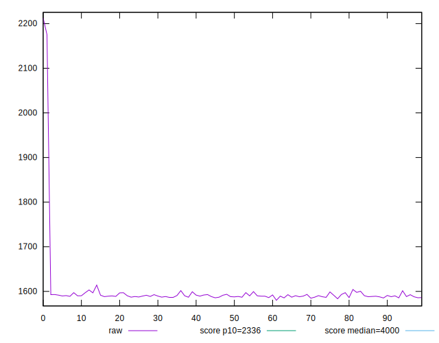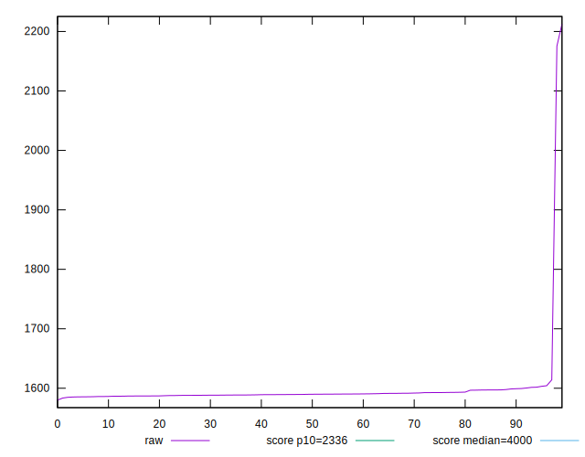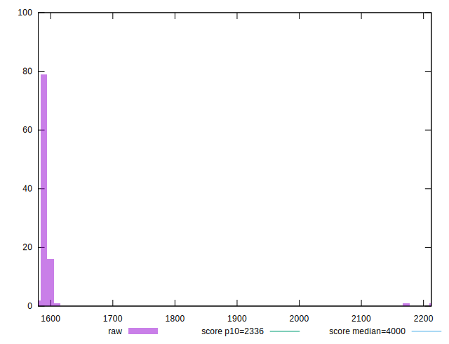
## Score


```yaml
p90min: 0.99
p90max: 0.99
p90range: 0
p90mean: 0.9899999999999988
p90median: 0.99
p90stdev: 1.2212453270876722e-15
p90skewness: 1
p90eccentricity: 1
p90discretization: 94
outlandishness: 0.9971737169676559
confidence: 0.0035935286240192056
p90confidence: 4.937613307359355e-16

```

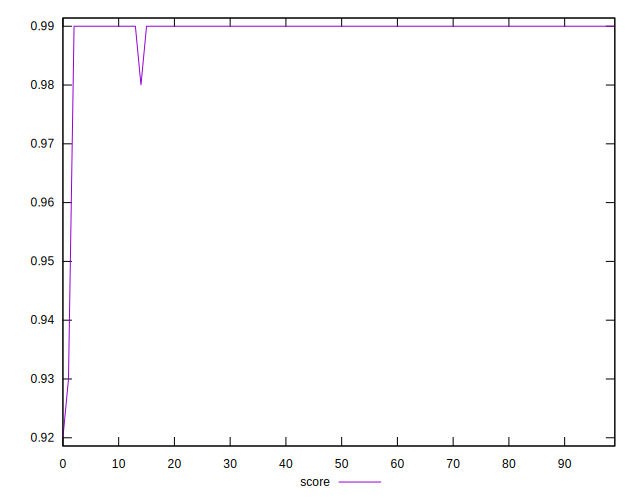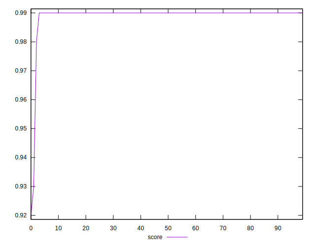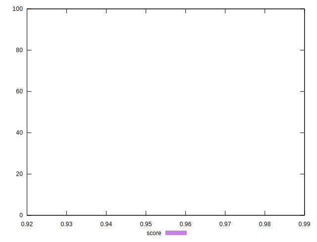
## Raw Estimate

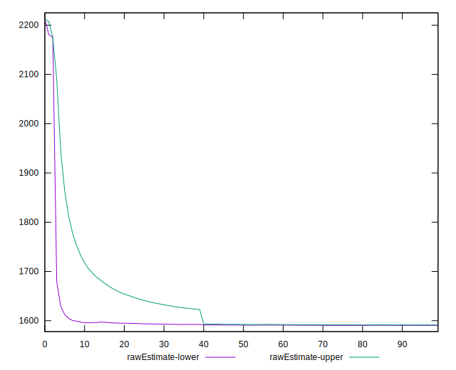
## Score Estimate

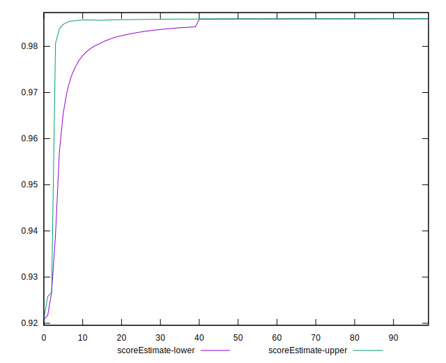
## P Score


```yaml
p90min: 0.9852563381728012
p90max: 0.9862853340971511
p90range: 0.001028995924349907
p90mean: 0.9859835200333844
p90median: 0.9860414362950616
p90stdev: 0.00023197370348177997
p90skewness: -1.2386243453900811
p90eccentricity: 1
p90discretization: 1
outlandishness: 0.9974774278811697
confidence: 0.00342040793425491
p90confidence: 0.00009378921825645952

```

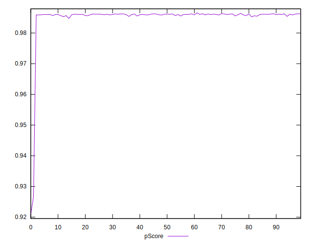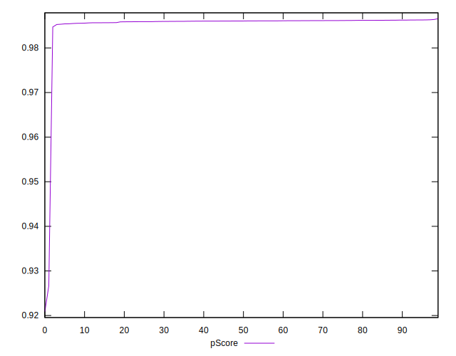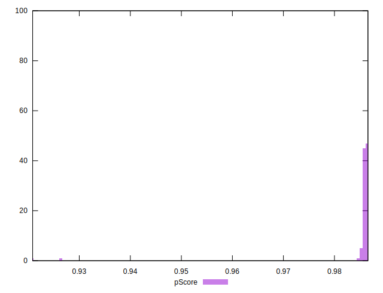
## Score Difference


```yaml
p90min: 0
p90max: 0
p90range: 0
p90mean: 0
p90median: 0
p90stdev: 0
p90skewness: .nan
p90eccentricity: .nan
p90discretization: 94
outlandishness: .nan
confidence: 0
p90confidence: 0

```


## P Score Difference


```yaml
p90min: -0.0045889124816738125
p90max: -0.003441413729623699
p90range: 0.0011474987520501134
p90mean: -0.003981567530496314
p90median: -0.003938834808831504
p90stdev: 0.0002117595772128338
p90skewness: -0.8118437473962697
p90eccentricity: 1.0000000000000004
p90discretization: 1
outlandishness: 0.9402920130528329
confidence: 0.0003987020219012243
p90confidence: 0.00008561645094686343

```

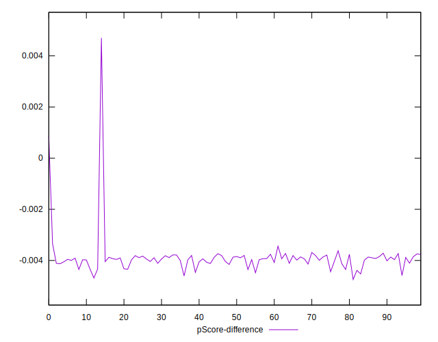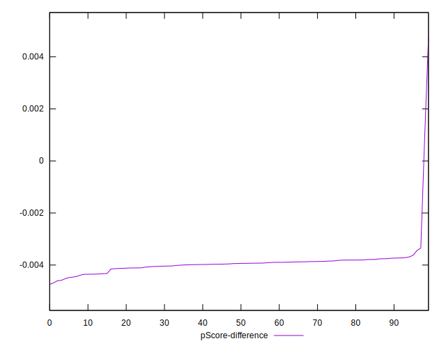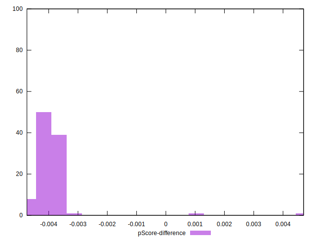