# //first-meaningful-paint/samples/pages

[→ Parent](../..)


## Raw


```yaml
p90min: 2344.6229999999996
p90max: 2582.3700000000003
p90range: 237.74700000000075
p90mean: 2488.281206914892
p90median: 2509.079025
p90stdev: 58.66284958100707
p90skewness: -1.2895559782398789
p90eccentricity: 1.0000000000000004
p90discretization: 1
outlandishness: 1.0011281234619869
confidence: 29.40262226643961
p90confidence: 23.717959063110225

```

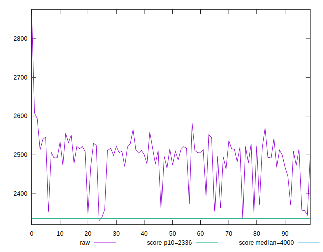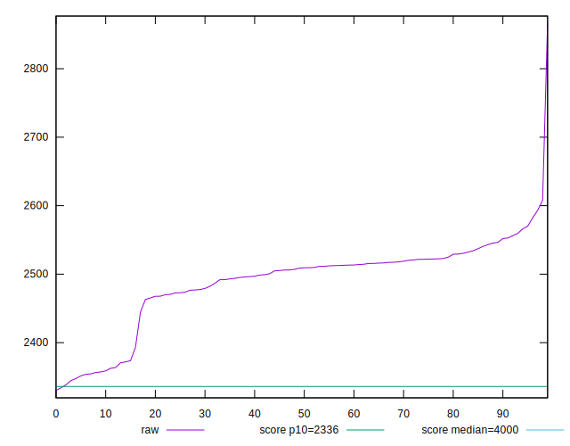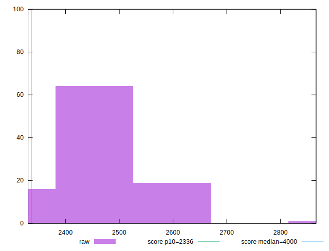
## Score


```yaml
p90min: 0.85
p90max: 0.9
p90range: 0.050000000000000044
p90mean: 0.8711702127659574
p90median: 0.87
p90stdev: 0.012278365593875197
p90skewness: 1.0867759478782804
p90eccentricity: 1.0000000000000016
p90discretization: 15.666666666666666
outlandishness: 0.999150259966038
confidence: 0.006089908048444527
p90confidence: 0.004964262298838597

```

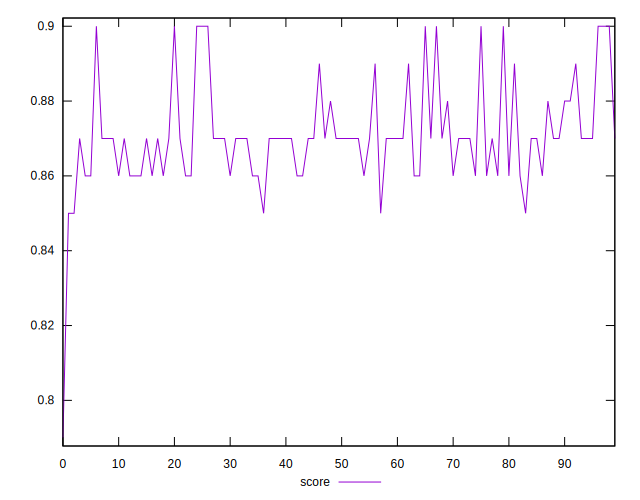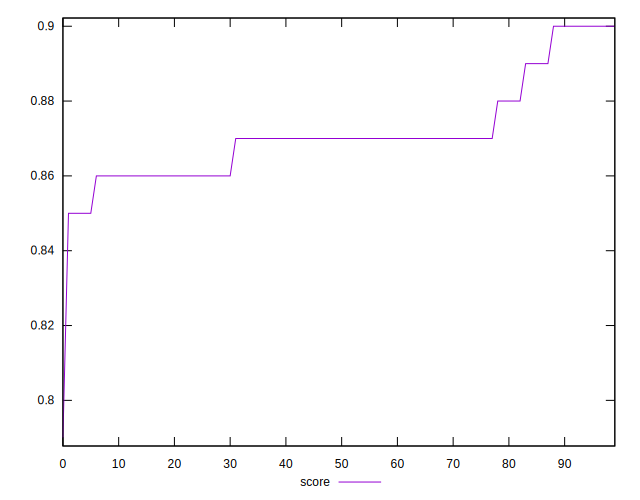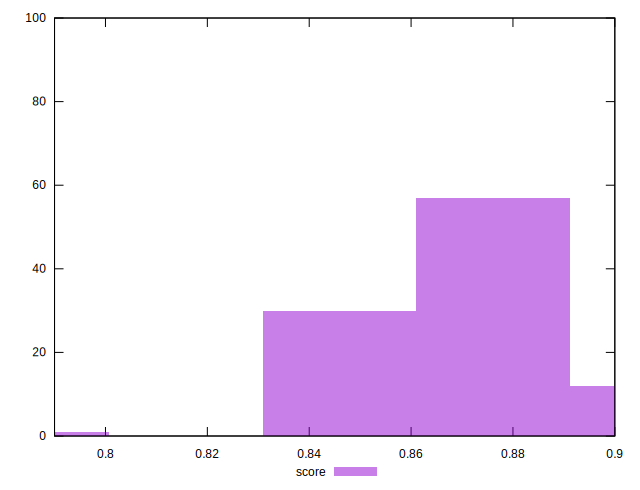
## Raw Estimate

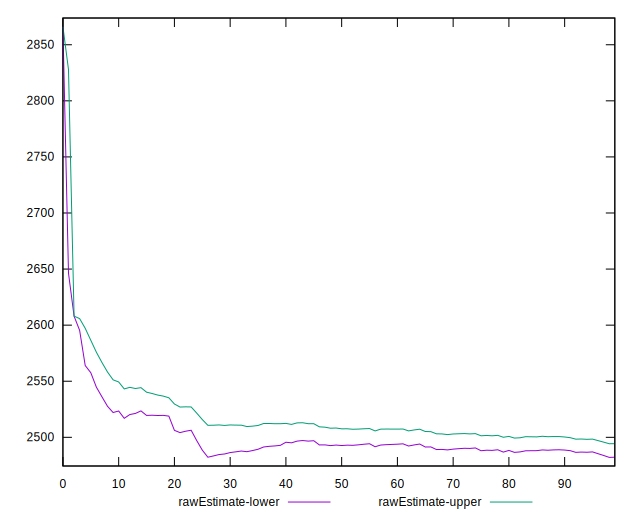
## Score Estimate

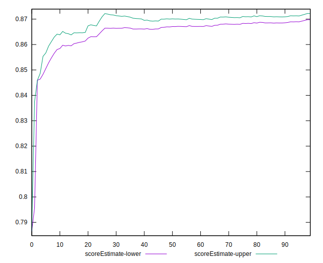
## P Score


```yaml
p90min: 0.8514431432953848
p90max: 0.8984505101089385
p90range: 0.047007366813553664
p90mean: 0.8707466543561994
p90median: 0.8667686241477148
p90stdev: 0.011501025493135588
p90skewness: 1.2218967668350718
p90eccentricity: 1
p90discretization: 1
outlandishness: 0.9990352576157543
confidence: 0.005974058879323954
p90confidence: 0.004649976156601394

```

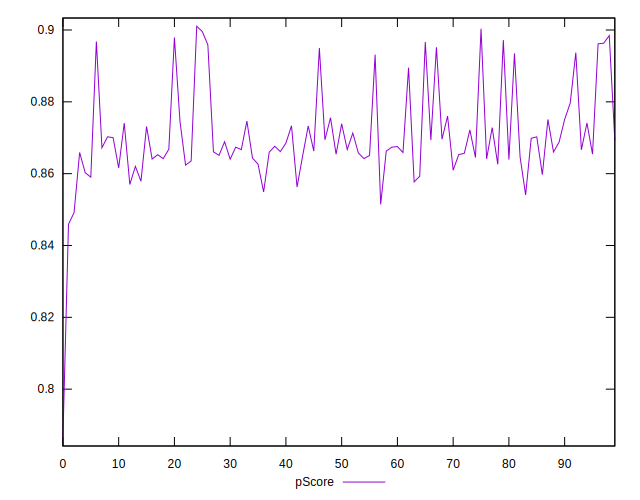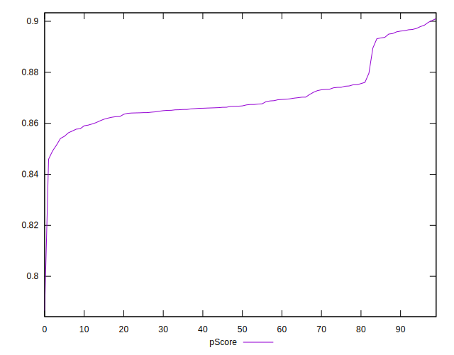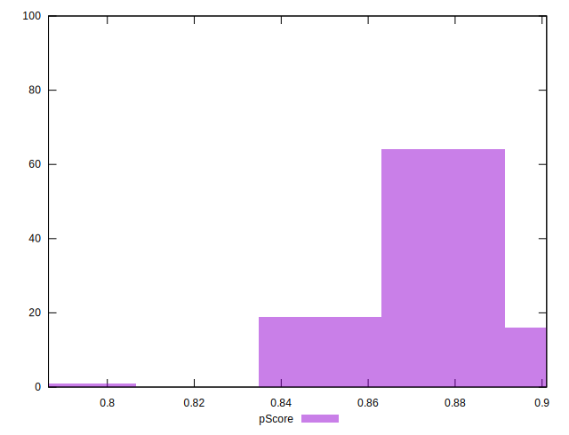
## Score Difference


```yaml
p90min: 0
p90max: 0
p90range: 0
p90mean: 0
p90median: 0
p90stdev: 0
p90skewness: .nan
p90eccentricity: .nan
p90discretization: 94
outlandishness: .nan
confidence: 0
p90confidence: 0

```


## P Score Difference


```yaml
p90min: -0.00488791675503486
p90max: 0.004746476037585601
p90range: 0.009634392792620461
p90mean: -0.0005045498349515495
p90median: -0.0007409860846223637
p90stdev: 0.003142446139991433
p90skewness: 0.26846378911597923
p90eccentricity: 0.9999999999999997
p90discretization: 1
outlandishness: 0.8805965418799576
confidence: 0.0012855041997606432
p90confidence: 0.001270521453333499

```

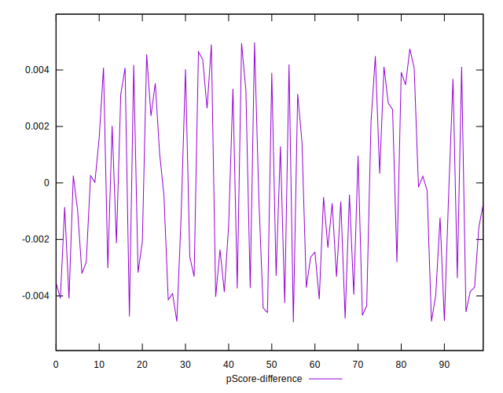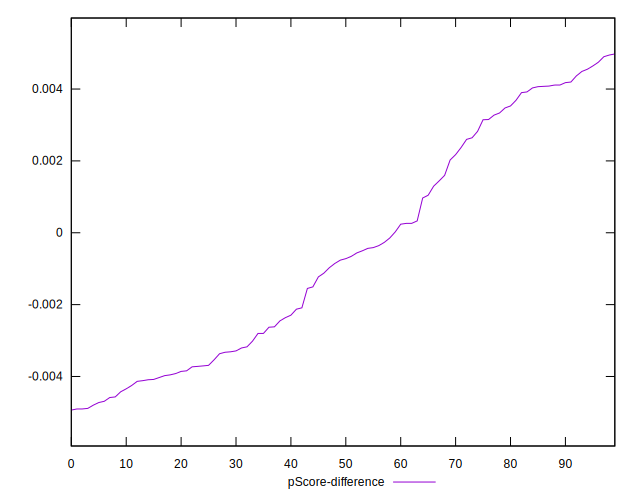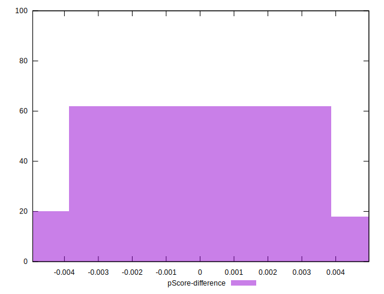