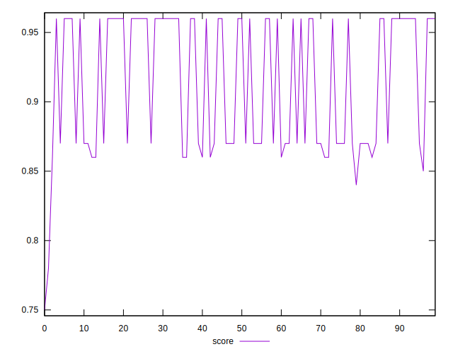

# //interactive/samples/pages+cached+noadtech+nomedia+nocss

[→ Parent](../..)


## Raw


```yaml
p90min: 2892.4050499999994
p90max: 4253.491999999999
p90range: 1361.08695
p90mean: 3481.46920212766
p90median: 2923.7652
p90stdev: 607.5492765455807
p90skewness: 0.09270814839527354
p90eccentricity: 1
p90discretization: 1
outlandishness: 1.0130010025248362
confidence: 252.4047335008541
p90confidence: 245.6380651954504

```


## Score


```yaml
p90min: 0.85
p90max: 0.96
p90range: 0.10999999999999999
p90mean: 0.9155319148936163
p90median: 0.96
p90stdev: 0.04653109281395444
p90skewness: -0.102589066976221
p90eccentricity: 1.0000000000000002
p90discretization: 23.5
outlandishness: 0.9946944832332203
confidence: 0.020000815462582394
p90confidence: 0.018812972134931324

```


## Raw Estimate


## Score Estimate


## P Score


```yaml
p90min: 0.8540279955068784
p90max: 0.9645658811559563
p90range: 0.11053788564907796
p90mean: 0.9182824866330577
p90median: 0.9628918286666436
p90stdev: 0.04797817863782627
p90skewness: -0.09853082847556331
p90eccentricity: 1
p90discretization: 1
outlandishness: 0.9946323597285492
confidence: 0.02061880782862637
p90confidence: 0.019398042968969215

```


## Score Difference


```yaml
p90min: 0
p90max: 0
p90range: 0
p90mean: 0
p90median: 0
p90stdev: 0
p90skewness: .nan
p90eccentricity: .nan
p90discretization: 94
outlandishness: .nan
confidence: 0
p90confidence: 0

```


## P Score Difference


```yaml
p90min: -0.003534090152939817
p90max: 0.004579714354519426
p90range: 0.008113804507459244
p90mean: 0.002880497365884111
p90median: 0.0040344471159654005
p90stdev: 0.002022540026383472
p90skewness: -1.4249902441224878
p90eccentricity: 0.9999999999999992
p90discretization: 1
outlandishness: 0.8881732728822933
confidence: 0.0009239655956745573
p90confidence: 0.0008177325495077244

```

