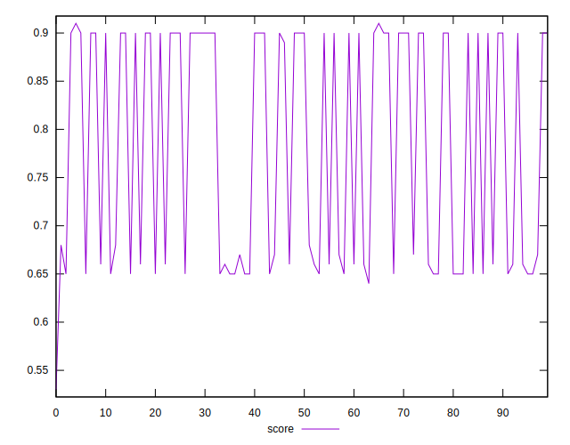

# //interactive/samples/pages+cached+noadtech+nomedia

[→ Parent](../..)


## Raw


```yaml
p90min: 3731.7064499999997
p90max: 6010.460000000001
p90range: 2278.7535500000013
p90mean: 4795.410032061265
p90median: 3807.3185000000003
p90stdev: 1084.754092035393
p90skewness: 0.08987352315626938
p90eccentricity: 1.0000000000000002
p90discretization: 1
outlandishness: 1.0060669278551928
confidence: 433.3902248841841
p90confidence: 438.57660056061445

```


## Score


```yaml
p90min: 0.65
p90max: 0.9
p90range: 0.25
p90mean: 0.7836170212765954
p90median: 0.9
p90stdev: 0.12140008643683856
p90skewness: -0.09281015359741088
p90eccentricity: 1.0000000000000007
p90discretization: 15.666666666666666
outlandishness: 0.9958771878542578
confidence: 0.04854067554392865
p90confidence: 0.04908323241936773

```


## Raw Estimate


## Score Estimate


## P Score


```yaml
p90min: 0.6477470835779697
p90max: 0.9047698390739192
p90range: 0.25702275549594944
p90mean: 0.7854260135103205
p90median: 0.8979719299494633
p90stdev: 0.12231557655621357
p90skewness: -0.09114607438984755
p90eccentricity: 1
p90discretization: 1
outlandishness: 0.9955728640511199
confidence: 0.04889457855736022
p90confidence: 0.04945337395407165

```


## Score Difference


```yaml
p90min: 0
p90max: 0
p90range: 0
p90mean: 0
p90median: 0
p90stdev: 0
p90skewness: .nan
p90eccentricity: .nan
p90discretization: 94
outlandishness: .nan
confidence: 0
p90confidence: 0

```


## P Score Difference


```yaml
p90min: -0.004821821326237985
p90max: 0.0047698390739191465
p90range: 0.009591660400157132
p90mean: 0.0017940857019505636
p90median: 0.0025456334610746145
p90stdev: 0.002713119284279008
p90skewness: -0.8794121785705028
p90eccentricity: 0.9999999999999999
p90discretization: 1
outlandishness: 0.8826053753718529
confidence: 0.0011447899731531286
p90confidence: 0.0010969404414799947

```

