# //interactive/samples/pages+cached+noadtech

[→ Parent](../..)


## Raw


```yaml
p90min: 4293.6965
p90max: 6679.704100000002
p90range: 2386.0076000000017
p90mean: 5259.248333205897
p90median: 4353.716424999999
p90stdev: 1074.3664527710794
p90skewness: 0.3226705948647745
p90eccentricity: 0.9999999999999996
p90discretization: 1
outlandishness: 1.0076863491503079
confidence: 430.59050566155736
p90confidence: 434.37677725518284

```

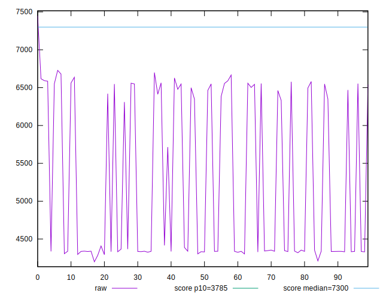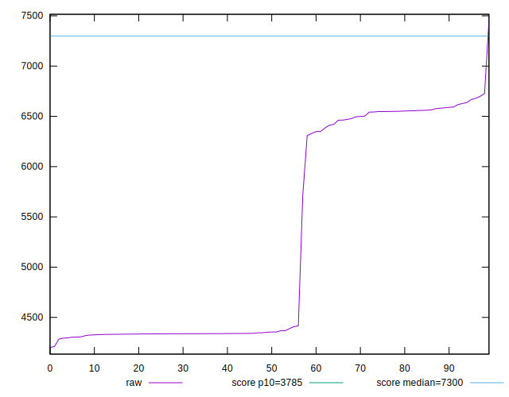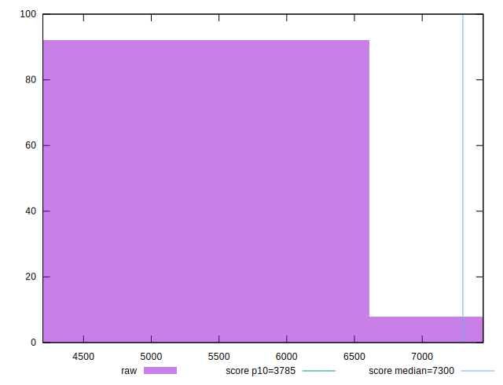
## Score


```yaml
p90min: 0.57
p90max: 0.85
p90range: 0.28
p90mean: 0.7362765957446811
p90median: 0.84
p90stdev: 0.12844391144936002
p90skewness: -0.3210366304387201
p90eccentricity: 0.9999999999999989
p90discretization: 11.75
outlandishness: 0.9935547045702752
confidence: 0.05138215205723256
p90confidence: 0.05193111919077316

```

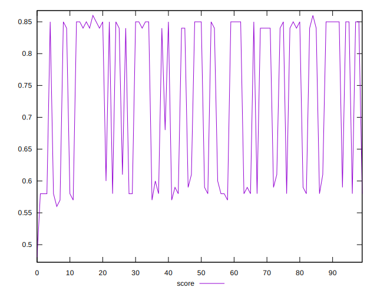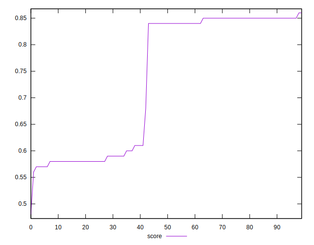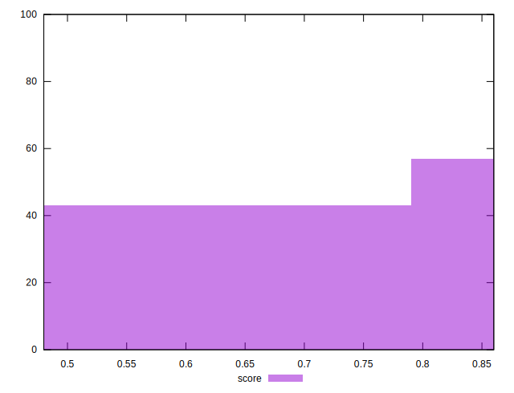
## Raw Estimate

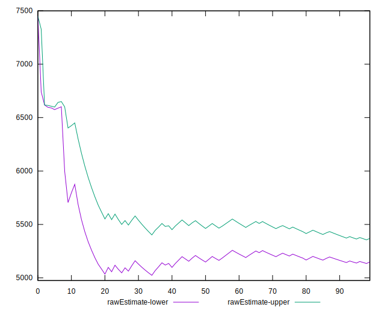
## Score Estimate

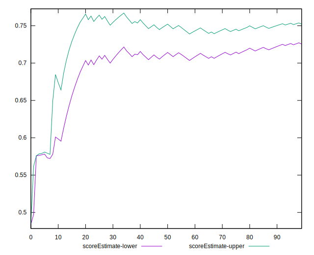
## P Score


```yaml
p90min: 0.5687767780511648
p90max: 0.8497848334686732
p90range: 0.2810080554175084
p90mean: 0.7362446197274914
p90median: 0.8433749839984204
p90stdev: 0.1269089778049445
p90skewness: -0.3228685509676013
p90eccentricity: 0.9999999999999987
p90discretization: 1
outlandishness: 0.9936348422328476
confidence: 0.05079233871104282
p90confidence: 0.05131053063084366

```

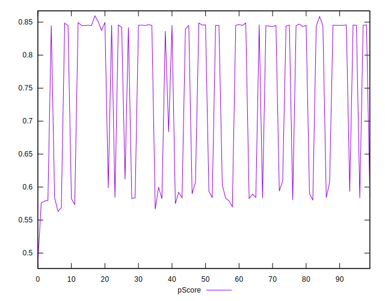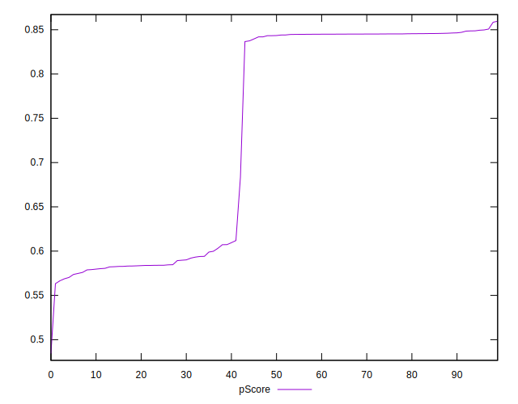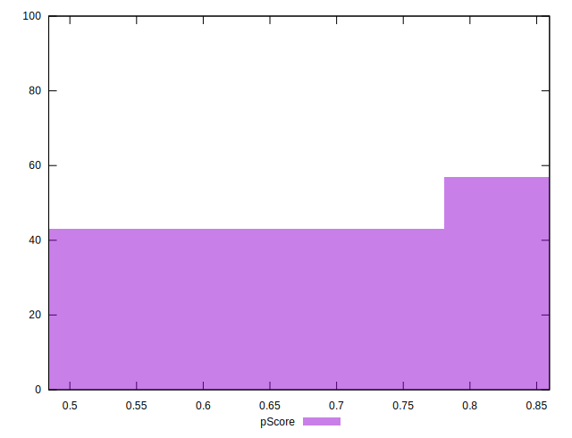
## Score Difference


```yaml
p90min: 0
p90max: 1.1102230246251565e-16
p90range: 1.1102230246251565e-16
p90mean: 2.362176648138631e-18
p90median: 0
p90stdev: 1.6021061506108986e-17
p90skewness: 6.634888026970373
p90eccentricity: 0.9999999999999988
p90discretization: 47
outlandishness: 5.522500000000001
confidence: 9.484951648085952e-18
p90confidence: 6.477470556979047e-18

```

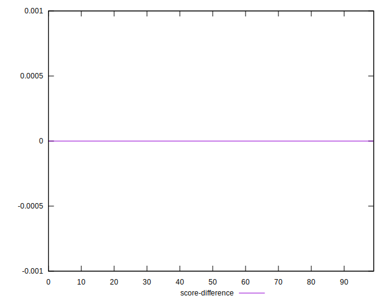
## P Score Difference


```yaml
p90min: -0.004920863053493485
p90max: 0.00492967522644816
p90range: 0.009850538279941645
p90mean: -0.000002607511428327208
p90median: -0.0002502951024179745
p90stdev: 0.003512877502050779
p90skewness: -0.07383748529694611
p90eccentricity: 0.9999999999999999
p90discretization: 1
outlandishness: 0.7628318179691691
confidence: 0.0014177757758484552
p90confidence: 0.0014202904458691136

```

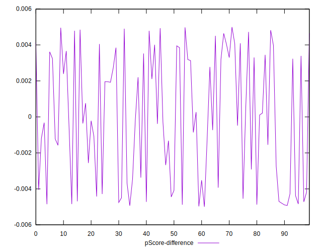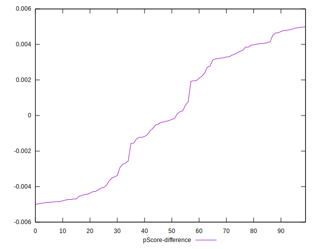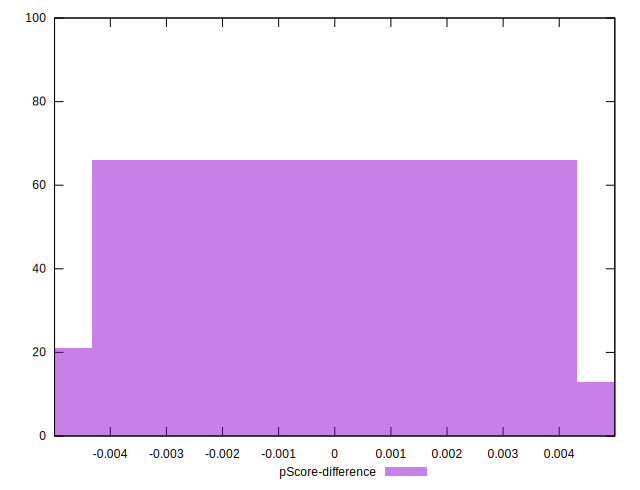