# //interactive/samples/pages+cached

[→ Parent](../..)


## Raw


```yaml
p90min: 13825.39545
p90max: 14541.197999999999
p90range: 715.8025499999985
p90mean: 14005.013588297881
p90median: 13976.133725
p90stdev: 138.72933451647336
p90skewness: 1.2562935440736382
p90eccentricity: 0.9999999999999991
p90discretization: 1
outlandishness: 1.005147132604328
confidence: 117.87499576001943
p90confidence: 56.08961549627049

```

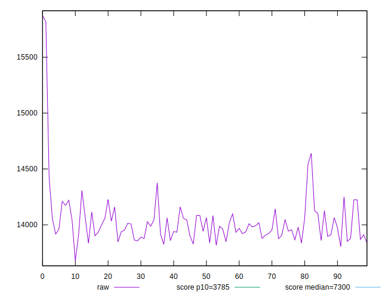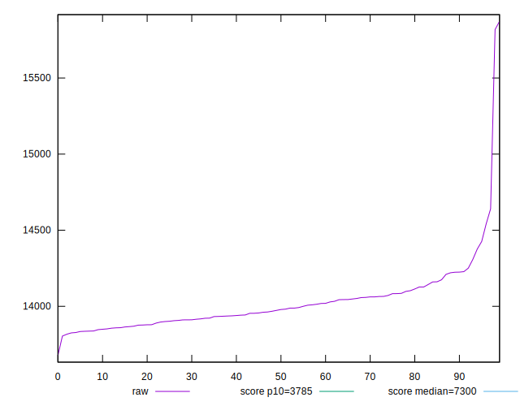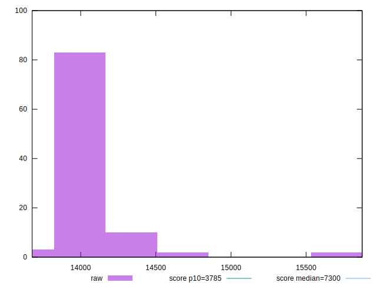
## Score


```yaml
p90min: 0.09
p90max: 0.11
p90range: 0.020000000000000004
p90mean: 0.10148936170212752
p90median: 0.1
p90stdev: 0.0046028314154859485
p90skewness: 0.5226982618276892
p90eccentricity: 0.9999999999999987
p90discretization: 31.333333333333332
outlandishness: 0.9884194669690451
confidence: 0.0027770690896024774
p90confidence: 0.0018609693846553042

```

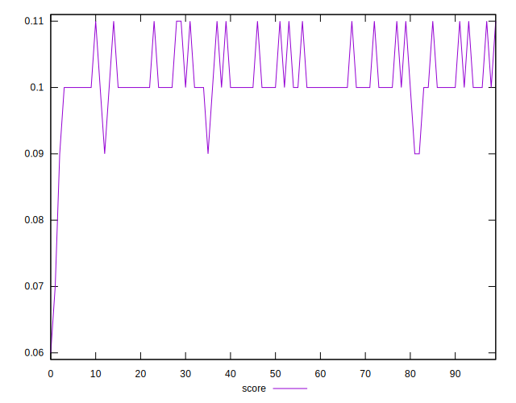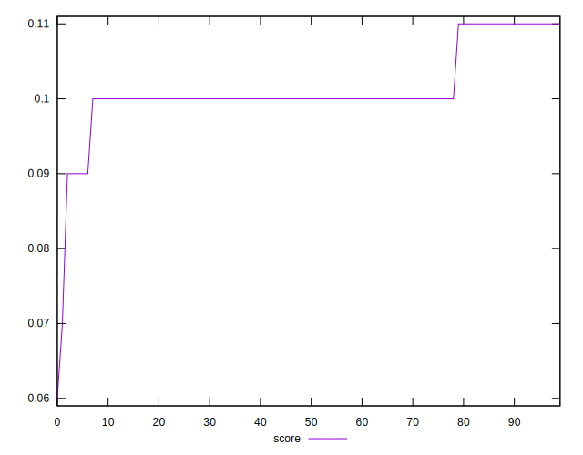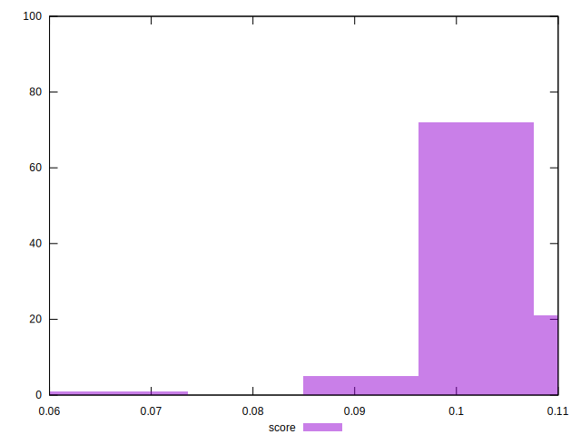
## Raw Estimate

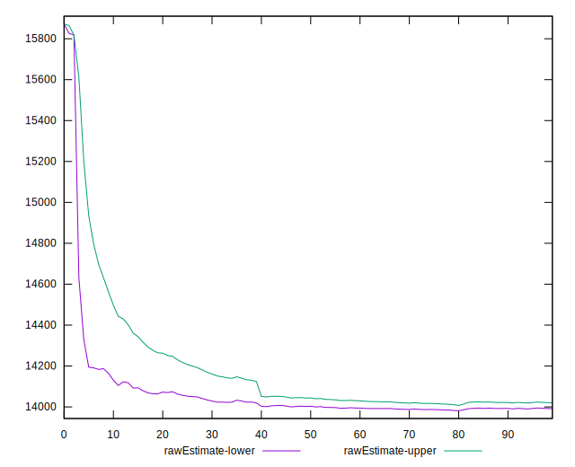
## Score Estimate

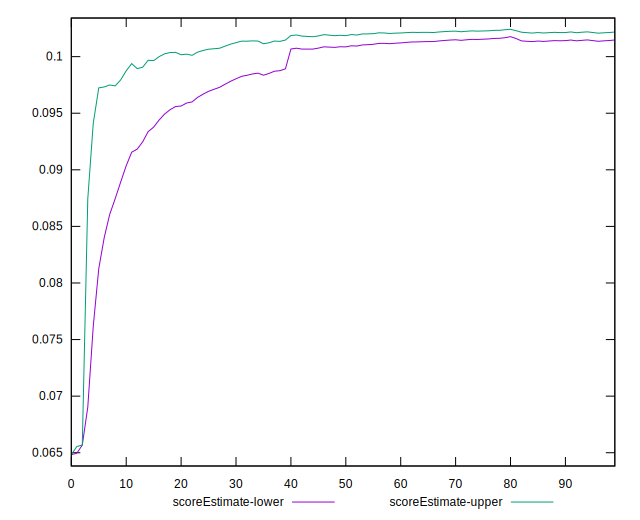
## P Score


```yaml
p90min: 0.08938702819579397
p90max: 0.10637315404826886
p90range: 0.016986125852474887
p90mean: 0.10188100488678721
p90median: 0.1025406339975389
p90stdev: 0.0033667612650147335
p90skewness: -1.1386443680907545
p90eccentricity: 1.0000000000000002
p90discretization: 1
outlandishness: 0.9863597025471292
confidence: 0.0024893107637446996
p90confidence: 0.00136121423403779

```

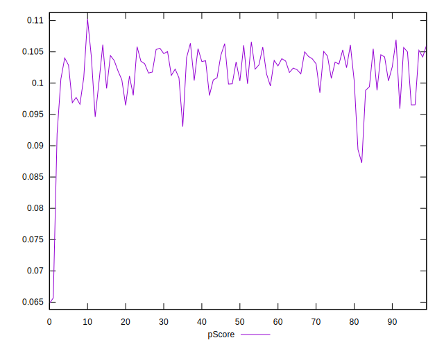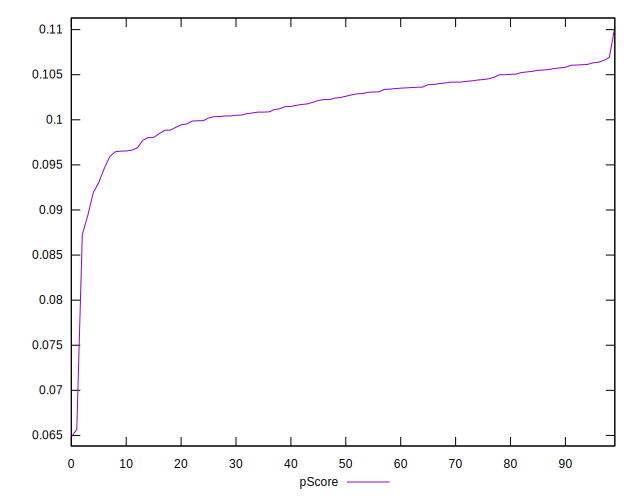
## Score Difference


```yaml
p90min: 0
p90max: 0
p90range: 0
p90mean: 0
p90median: 0
p90stdev: 0
p90skewness: .nan
p90eccentricity: .nan
p90discretization: 94
outlandishness: .nan
confidence: 0
p90confidence: 0

```


## P Score Difference


```yaml
p90min: -0.0047576118072879675
p90max: 0.0046030624401905695
p90range: 0.009360674247478537
p90mean: 0.0003055814498570681
p90median: 0.0007173792544808155
p90stdev: 0.0030175517989229723
p90skewness: -0.29220110480263195
p90eccentricity: 0.9999999999999999
p90discretization: 1
outlandishness: 0.8623744125594534
confidence: 0.0012402849484003994
p90confidence: 0.0012200254598754017

```

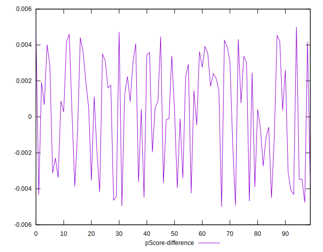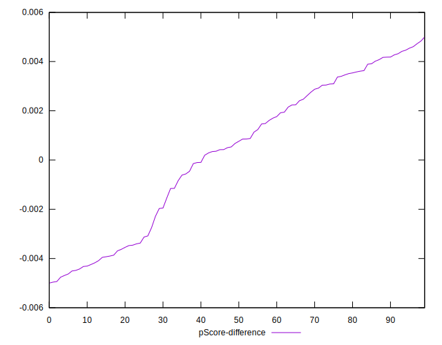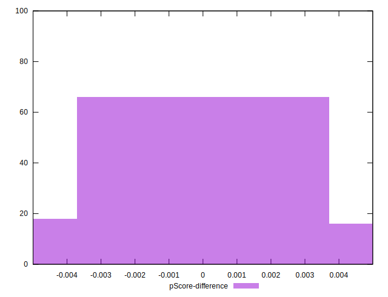