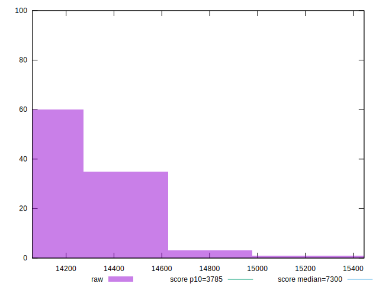

# //interactive/samples/pages

[→ Parent](../..)


## Raw


```yaml
p90min: 14069.119200000001
p90max: 14672.618499999999
p90range: 603.4992999999977
p90mean: 14264.540649468086
p90median: 14244.47075
p90stdev: 143.22373011241123
p90skewness: 0.9777476092296805
p90eccentricity: 0.9999999999999999
p90discretization: 1
outlandishness: 1.0026142644542368
confidence: 81.0427631134052
p90confidence: 57.90674322735142

```


## Score


```yaml
p90min: 0.09
p90max: 0.1
p90range: 0.010000000000000009
p90mean: 0.0964893617021275
p90median: 0.1
p90stdev: 0.004773028568973316
p90skewness: -0.6240740781687064
p90eccentricity: 0.9999999999999982
p90discretization: 47
outlandishness: 0.9898823921259248
confidence: 0.0022856911418964766
p90confidence: 0.0019297817445713867

```


## Raw Estimate


## Score Estimate


## P Score


```yaml
p90min: 0.0865841194793705
p90max: 0.1002470176355379
p90range: 0.013662898156167391
p90mean: 0.09565478610554135
p90median: 0.09606346040077246
p90stdev: 0.0032716016203429266
p90skewness: -0.896354103582772
p90eccentricity: 0.9999999999999999
p90discretization: 1
outlandishness: 0.9922291081171566
confidence: 0.0017637391600762707
p90confidence: 0.0013227402667329905

```


## Score Difference


```yaml
p90min: 0
p90max: 0
p90range: 0
p90mean: 0
p90median: 0
p90stdev: 0
p90skewness: .nan
p90eccentricity: .nan
p90discretization: 94
outlandishness: .nan
confidence: 0
p90confidence: 0

```


## P Score Difference


```yaml
p90min: -0.00463936071108037
p90max: 0.004861905041796483
p90range: 0.009501265752876853
p90mean: -0.0007668155662107253
p90median: -0.0012308395289257479
p90stdev: 0.002734792091828269
p90skewness: 0.5998967853608599
p90eccentricity: 0.9999999999999997
p90discretization: 1
outlandishness: 0.8757564026653175
confidence: 0.0011417240571084182
p90confidence: 0.0011057029677791342

```

