# //largest-contentful-paint/samples/pages+cached+noadtech+nomedia+nocss

[→ Parent](../..)


## Raw


```yaml
p90min: 4202.12195
p90max: 4349.174999999999
p90range: 147.05304999999953
p90mean: 4233.863956382979
p90median: 4218.941125
p90stdev: 35.0930454977961
p90skewness: 1.5185135367262927
p90eccentricity: 1.0000000000000002
p90discretization: 1
outlandishness: 1.0010083930527218
confidence: 47.01293915486708
p90confidence: 14.18845866611418

```

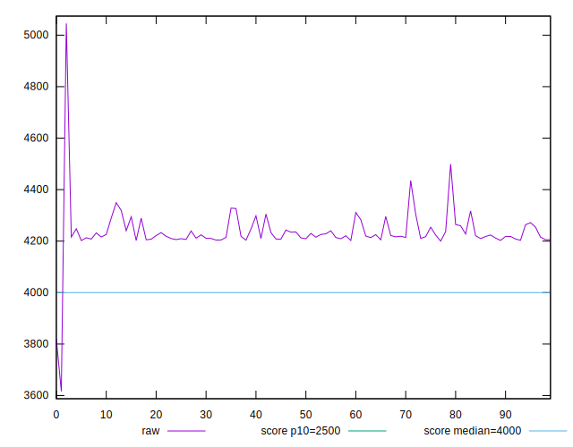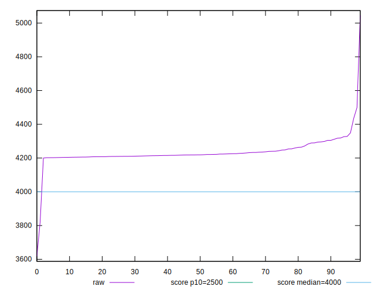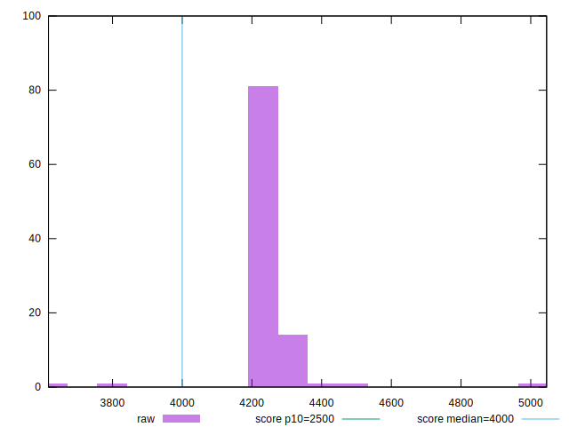
## Score


```yaml
p90min: 0.41
p90max: 0.45
p90range: 0.040000000000000036
p90mean: 0.4380851063829789
p90median: 0.44
p90stdev: 0.009484208122562846
p90skewness: -1.0321086401675328
p90eccentricity: 1.0000000000000007
p90discretization: 18.8
outlandishness: 1.0000679953277298
confidence: 0.011716519783314373
p90confidence: 0.003834557332342623

```

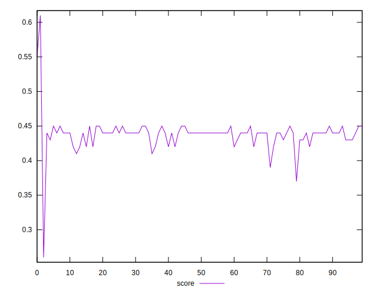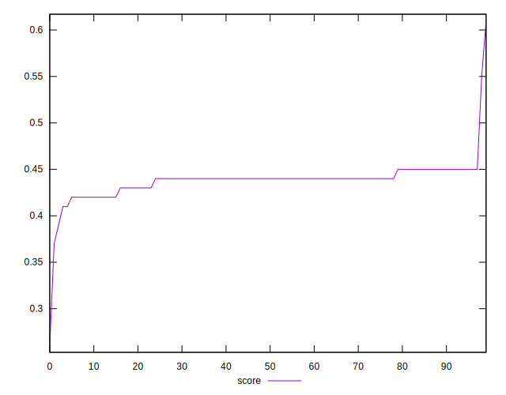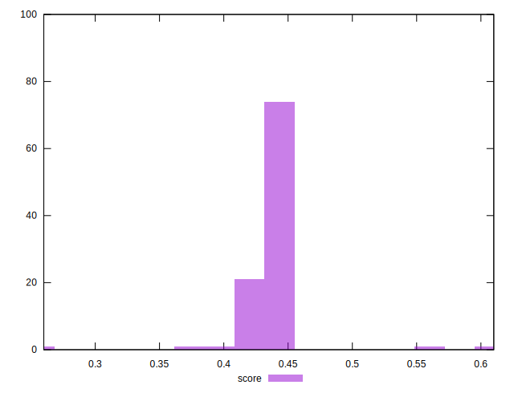
## Raw Estimate

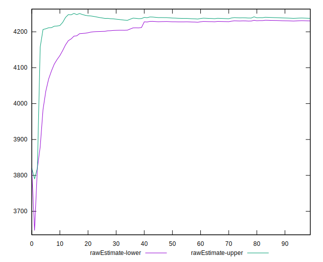
## Score Estimate

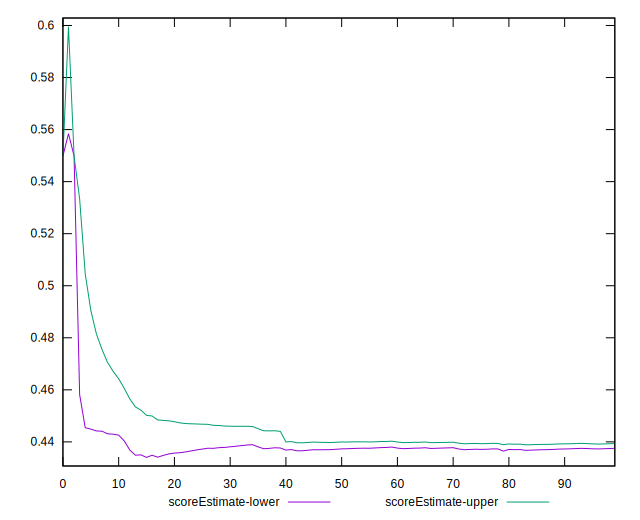
## P Score


```yaml
p90min: 0.409744975457075
p90max: 0.44653811889711054
p90range: 0.036793143440035536
p90mean: 0.43849052343598394
p90median: 0.4422352044253146
p90stdev: 0.008827488173951832
p90skewness: -1.5006176358181602
p90eccentricity: 1.0000000000000002
p90discretization: 1
outlandishness: 1.0000446570863586
confidence: 0.011488041455397259
p90confidence: 0.0035690390875192956

```

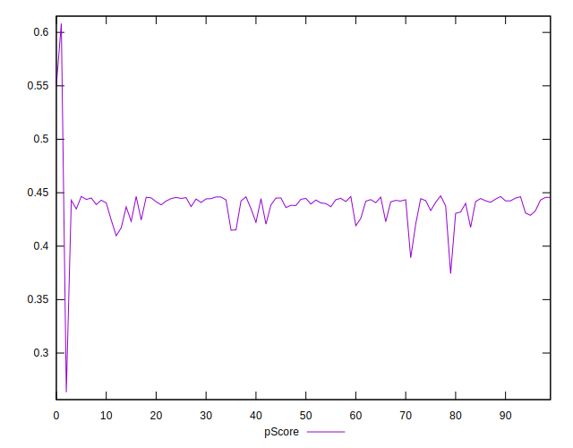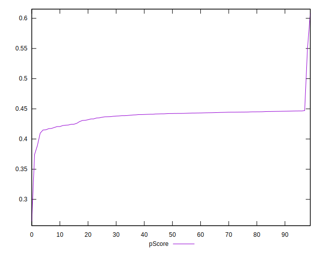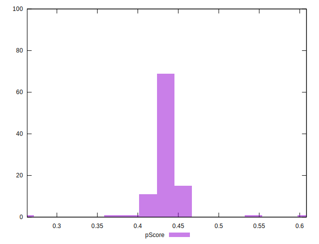
## Score Difference


```yaml
p90min: 0
p90max: 0
p90range: 0
p90mean: 0
p90median: 0
p90stdev: 0
p90skewness: .nan
p90eccentricity: .nan
p90discretization: 94
outlandishness: .inf
confidence: 3.0463960003014052e-18
p90confidence: 0

```

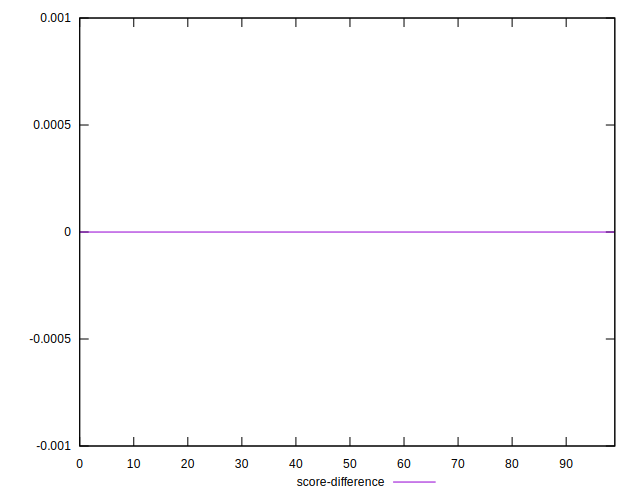
## P Score Difference


```yaml
p90min: -0.004911051719618531
p90max: 0.004743745576425318
p90range: 0.009654797296043849
p90mean: 0.0004274398928477448
p90median: 0.0009190265359164951
p90stdev: 0.0030972472713977368
p90skewness: -0.27772196752513406
p90eccentricity: 1
p90discretization: 1
outlandishness: 0.8771055240102351
confidence: 0.0012695852249133555
p90confidence: 0.001252247112372209

```

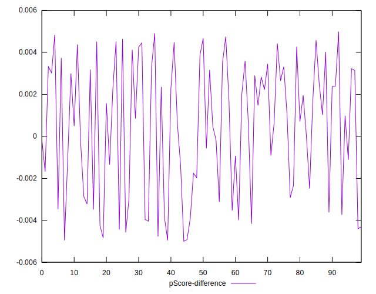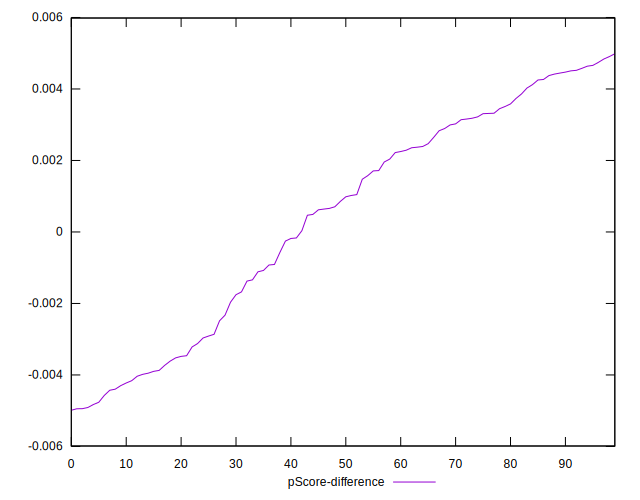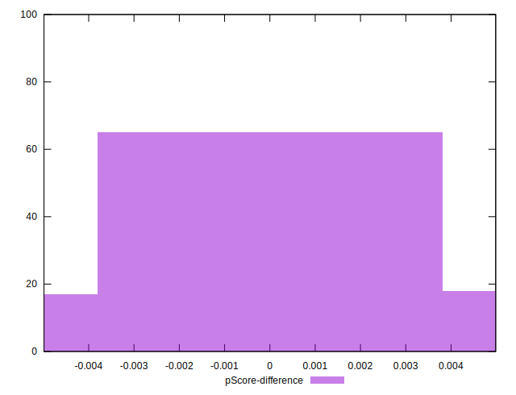