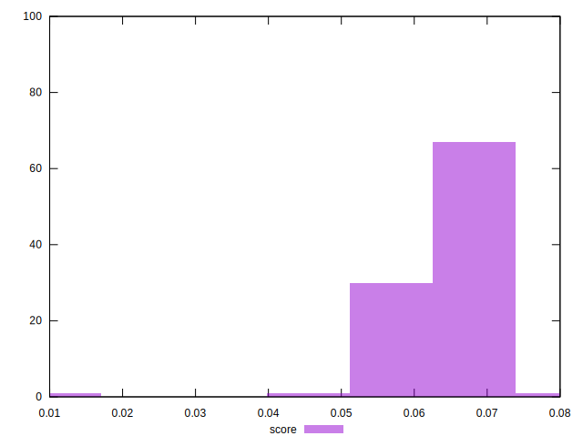
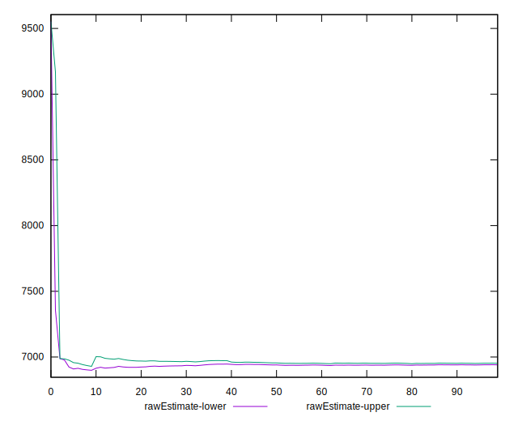

# //largest-contentful-paint/samples/pages+cached+noadtech+nomedia

[→ Parent](../..)


## Raw


```yaml
p90min: 6857.2406
p90max: 7112.568499999999
p90range: 255.32789999999932
p90mean: 6946.259262869106
p90median: 6944.363699999998
p90stdev: 57.77590545190984
p90skewness: 0.5526544049226152
p90eccentricity: 1.0000000000000007
p90discretization: 1
outlandishness: 1.0079894896017996
confidence: 105.82014497188206
p90confidence: 23.35935894914636

```


## Score


```yaml
p90min: 0.06
p90max: 0.07
p90range: 0.010000000000000009
p90mean: 0.06691489361702128
p90median: 0.07
p90stdev: 0.004618785818317536
p90skewness: -0.8291761914687868
p90eccentricity: 1.0000000000000013
p90discretization: 47
outlandishness: 0.9817060628195765
confidence: 0.002967517514785587
p90confidence: 0.0018674199044636445

```


## Raw Estimate


## Score Estimate


## P Score


```yaml
p90min: 0.058277949392009754
p90max: 0.07081989413822254
p90range: 0.012541944746212785
p90mean: 0.06623877171851746
p90median: 0.06627306783693318
p90stdev: 0.002885037130263407
p90skewness: -0.45259507556401807
p90eccentricity: 1.0000000000000002
p90discretization: 1
outlandishness: 0.9815540760868073
confidence: 0.002665484596097054
p90confidence: 0.001166448494061815

```


## Score Difference


```yaml
p90min: 0
p90max: 0
p90range: 0
p90mean: 0
p90median: 0
p90stdev: 0
p90skewness: .nan
p90eccentricity: .nan
p90discretization: 94
outlandishness: .nan
confidence: 0
p90confidence: 0

```


## P Score Difference


```yaml
p90min: -0.004572644492283506
p90max: 0.004744294209147681
p90range: 0.009316938701431188
p90mean: -0.0007192792101314252
p90median: -0.0007470069153511227
p90stdev: 0.0027046766020805513
p90skewness: 0.3673691723784347
p90eccentricity: 0.9999999999999994
p90discretization: 1
outlandishness: 0.8806411734449217
confidence: 0.0011300189675928602
p90confidence: 0.0010935269831806441

```

