# //largest-contentful-paint/samples/pages+cached+noadtech

[→ Parent](../..)


## Raw


```yaml
p90min: 7730.380999999999
p90max: 8053.33785
p90range: 322.9568500000005
p90mean: 7831.753846990297
p90median: 7830.122249999998
p90stdev: 66.58791453124714
p90skewness: 0.9733019127768859
p90eccentricity: 1
p90discretization: 1
outlandishness: 1.0076571472717673
confidence: 116.61950480644303
p90confidence: 26.922139688579534

```

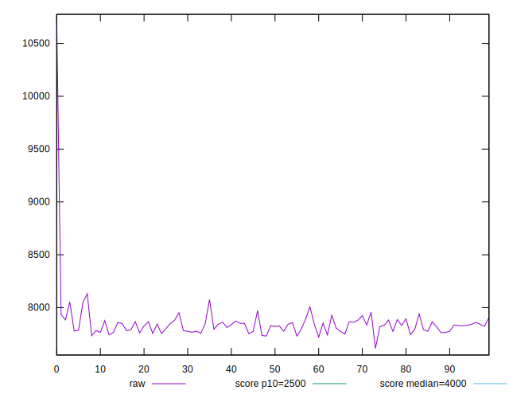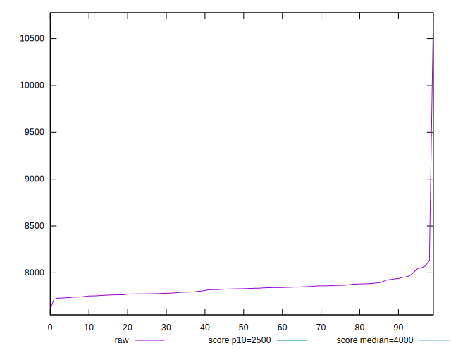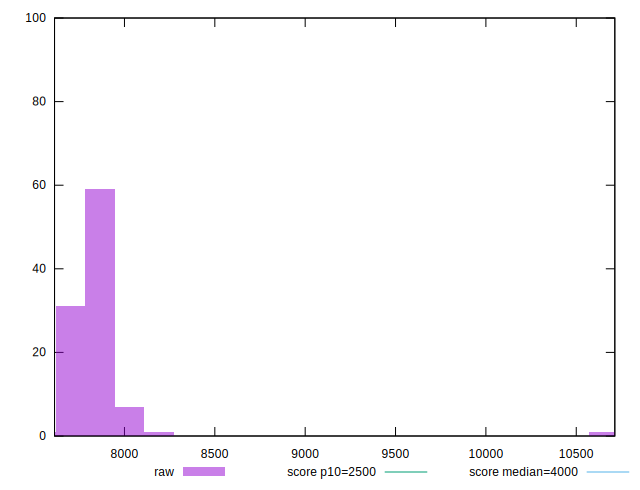
## Score


```yaml
p90min: 0.03
p90max: 0.04
p90range: 0.010000000000000002
p90mean: 0.03202127659574464
p90median: 0.03
p90stdev: 0.004015869380463162
p90skewness: 1.4834762399128807
p90eccentricity: 1.0000000000000027
p90discretization: 47
outlandishness: 0.9924395933819713
confidence: 0.002051512194444012
p90confidence: 0.0016236549408854672

```

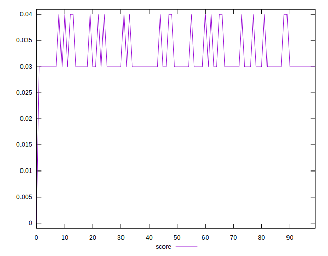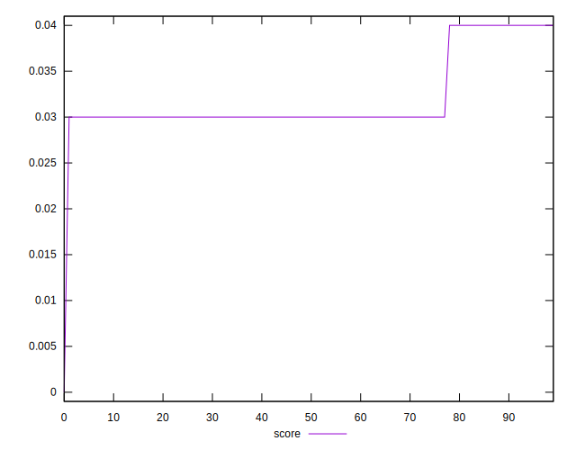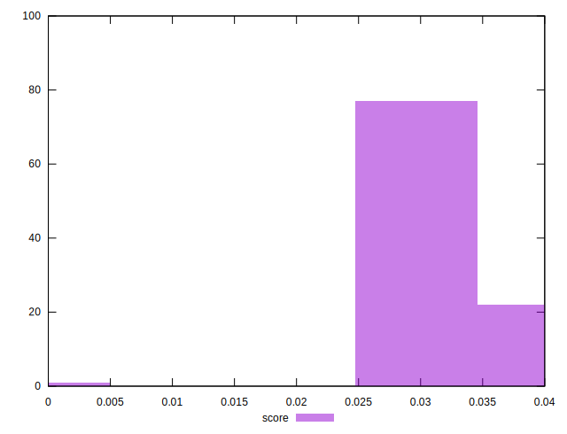
## Raw Estimate

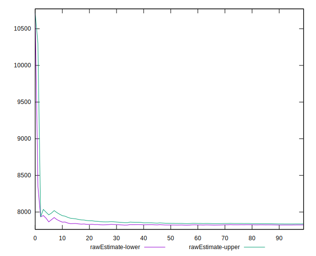
## Score Estimate

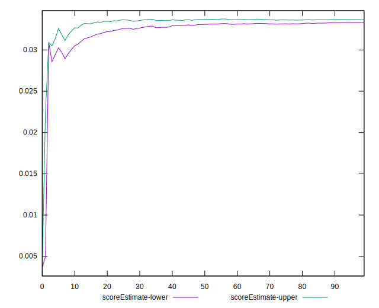
## P Score


```yaml
p90min: 0.028188258809298428
p90max: 0.036206382860331454
p90range: 0.008018124051033027
p90mean: 0.03351618795522721
p90median: 0.03351518227394276
p90stdev: 0.0016881878247154184
p90skewness: -0.8050806142124828
p90eccentricity: 0.9999999999999994
p90discretization: 1
outlandishness: 0.9816554985956482
confidence: 0.001407248906271958
p90confidence: 0.0006825507114541027

```

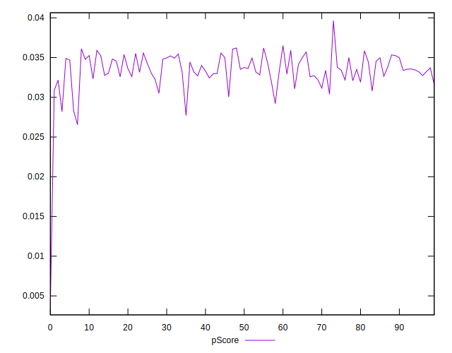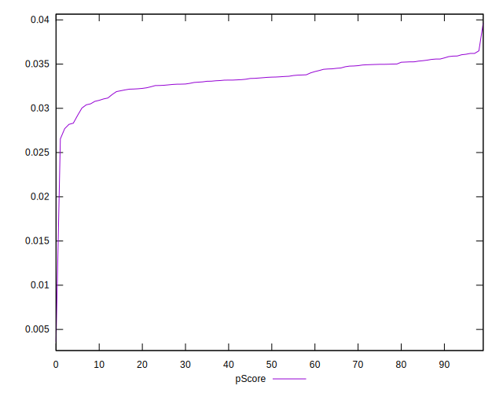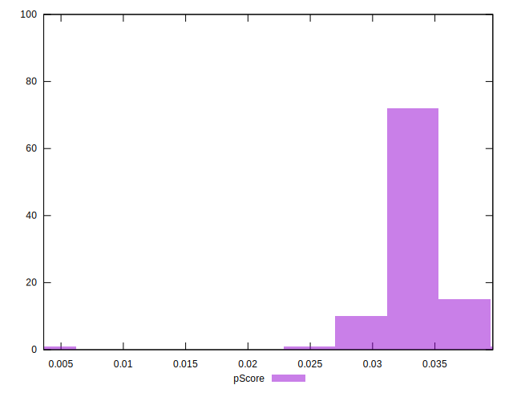
## Score Difference


```yaml
p90min: 0
p90max: 0
p90range: 0
p90mean: 0
p90median: 0
p90stdev: 0
p90skewness: .nan
p90eccentricity: .nan
p90discretization: 94
outlandishness: .nan
confidence: 0
p90confidence: 0

```


## P Score Difference


```yaml
p90min: -0.004769493156065417
p90max: 0.004959034616457053
p90range: 0.00972852777252247
p90mean: 0.0013891188571913322
p90median: 0.0027297599440455067
p90stdev: 0.003175257142569528
p90skewness: -0.9193964177103081
p90eccentricity: 1
p90discretization: 1
outlandishness: 0.8857320499524504
confidence: 0.0013032463732843378
p90confidence: 0.0012837872599133898

```

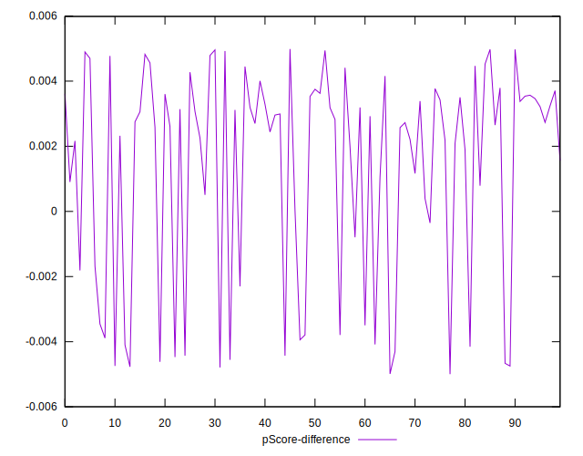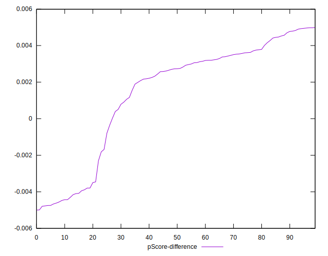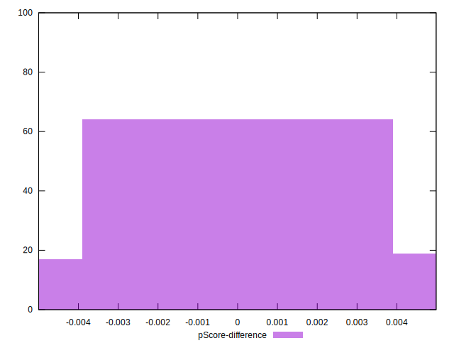