# //largest-contentful-paint/samples/pages+cached

[→ Parent](../..)


## Raw


```yaml
p90min: 13912.735300000002
p90max: 14388.507000000001
p90range: 475.7716999999993
p90mean: 14141.76146010638
p90median: 14155.340999999997
p90stdev: 128.5159856631244
p90skewness: 0.013455426410007038
p90eccentricity: 1.0000000000000002
p90discretization: 1
outlandishness: 0.9997059532157321
confidence: 61.94529415304633
p90confidence: 51.96025949445392

```

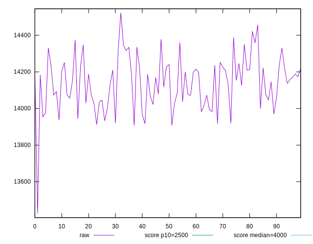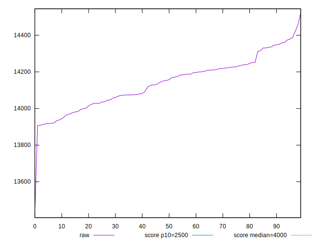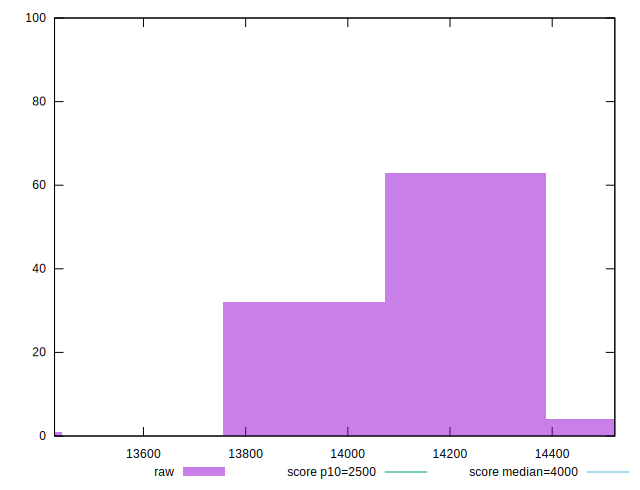
## Score


```yaml
p90min: 0
p90max: 0
p90range: 0
p90mean: 0
p90median: 0
p90stdev: 0
p90skewness: .nan
p90eccentricity: .nan
p90discretization: 94
outlandishness: .nan
confidence: 0
p90confidence: 0

```


## Raw Estimate

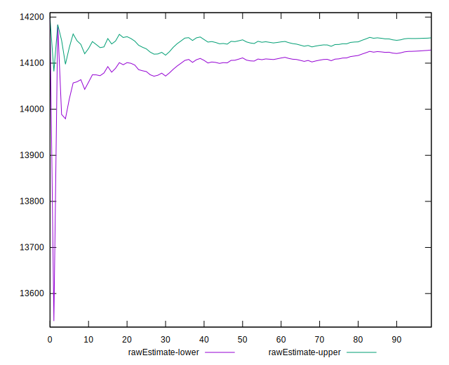
## Score Estimate

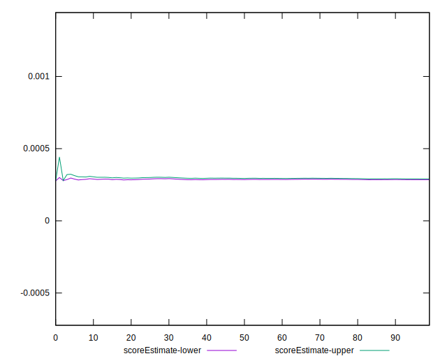
## P Score


```yaml
p90min: 0.00024108103867848119
p90max: 0.0003384129844438144
p90range: 0.00009733194576533322
p90mean: 0.00028855927247499913
p90median: 0.0002845477157658316
p90stdev: 0.000026424963067943485
p90skewness: 0.1408401641892475
p90eccentricity: 1.0000000000000002
p90discretization: 1
outlandishness: 1.0078362281454987
confidence: 0.000013504352002461521
p90confidence: 0.000010683868867028258

```

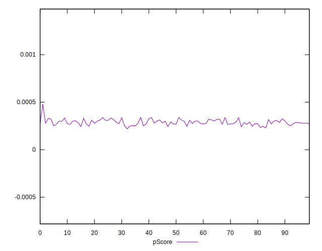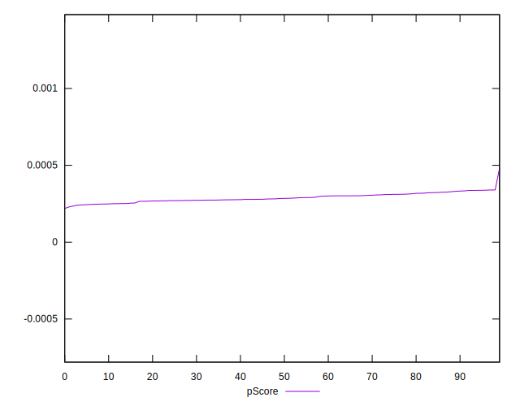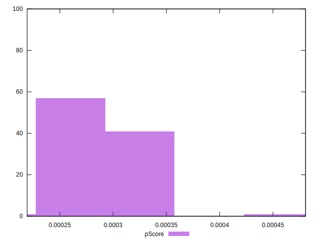
## Score Difference


```yaml
p90min: 0
p90max: 0
p90range: 0
p90mean: 0
p90median: 0
p90stdev: 0
p90skewness: .nan
p90eccentricity: .nan
p90discretization: 94
outlandishness: .nan
confidence: 0
p90confidence: 0

```


## P Score Difference


```yaml
p90min: 0.00024108103867848119
p90max: 0.0003384129844438144
p90range: 0.00009733194576533322
p90mean: 0.00028855927247499913
p90median: 0.0002845477157658316
p90stdev: 0.000026424963067943485
p90skewness: 0.1408401641892475
p90eccentricity: 1.0000000000000002
p90discretization: 1
outlandishness: 1.0078362281454987
confidence: 0.000013504352002461521
p90confidence: 0.000010683868867028258

```

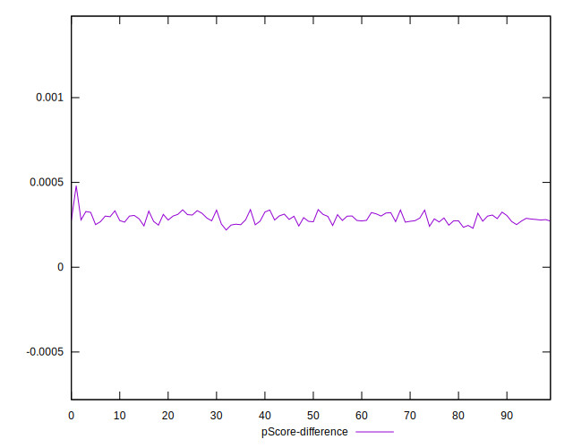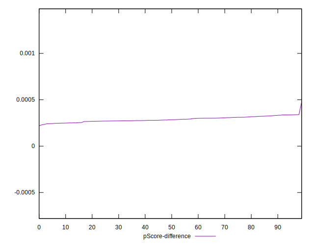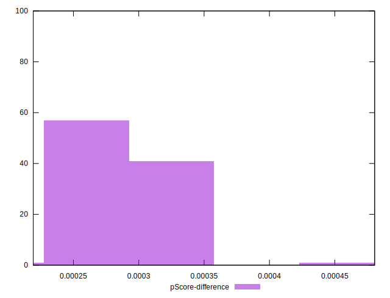