# //largest-contentful-paint/samples/pages

[→ Parent](../..)


## Raw


```yaml
p90min: 13468.968999999997
p90max: 14657.365000000002
p90range: 1188.3960000000043
p90mean: 14399.77241755319
p90median: 14453.666075000003
p90stdev: 215.46676053280257
p90skewness: -2.5433117251537753
p90eccentricity: 0.9999999999999997
p90discretization: 1
outlandishness: 0.9813464140553648
confidence: 384.99313868911463
p90confidence: 87.11530111951055

```

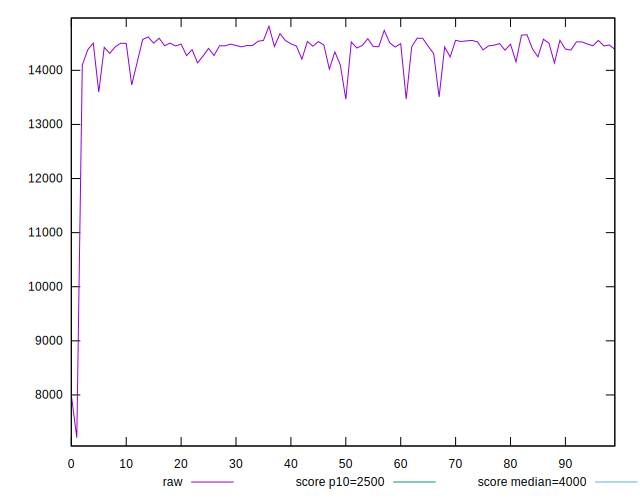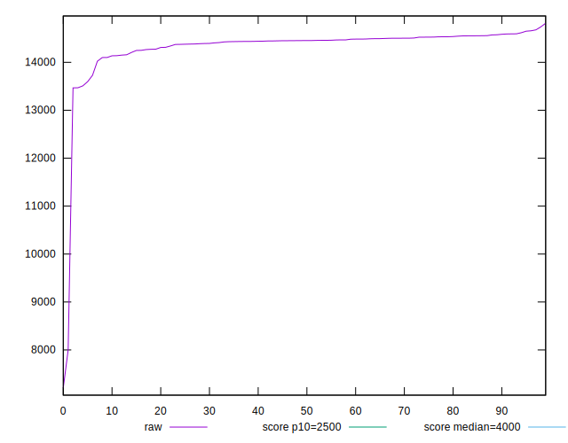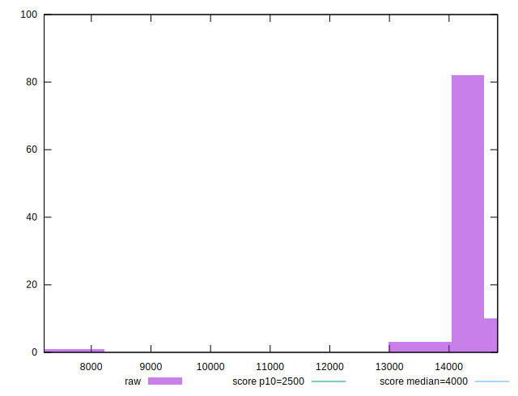
## Score


```yaml
p90min: 0
p90max: 0
p90range: 0
p90mean: 0
p90median: 0
p90stdev: 0
p90skewness: .nan
p90eccentricity: .nan
p90discretization: 94
outlandishness: .inf
confidence: 0.002264076555758273
p90confidence: 0

```

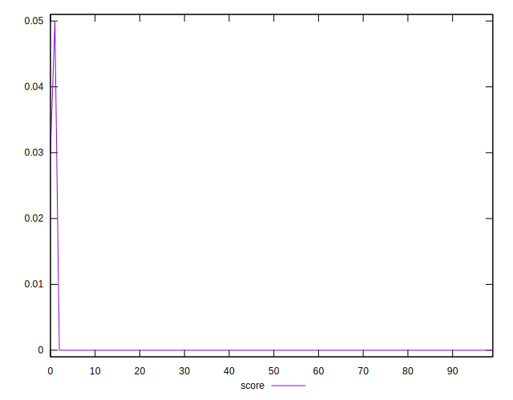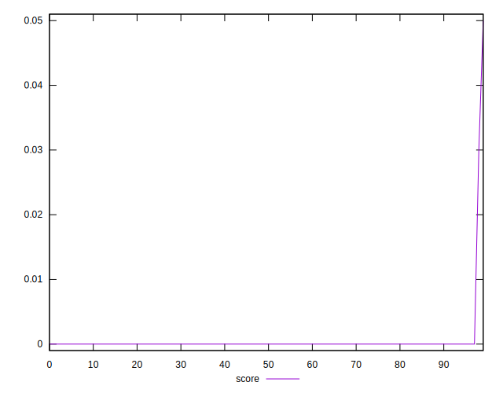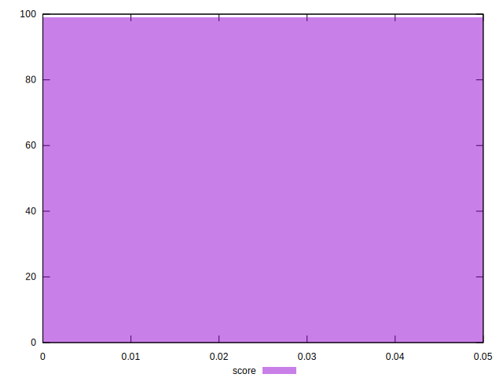
## Raw Estimate

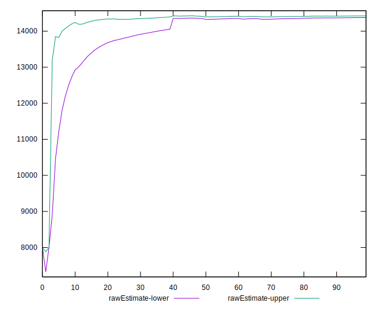
## Score Estimate

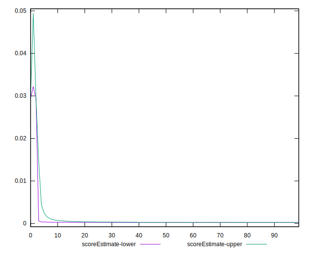
## P Score


```yaml
p90min: 0.00019934447255265386
p90max: 0.0004657858530446868
p90range: 0.0002664413804920329
p90mean: 0.0002425097989519189
p90median: 0.00023020248184624226
p90stdev: 0.000046145857619785924
p90skewness: 3.215515615101217
p90eccentricity: 0.9999999999999994
p90discretization: 1
outlandishness: 19.602347032992206
confidence: 0.002380151021031222
p90confidence: 0.000018657217809489955

```

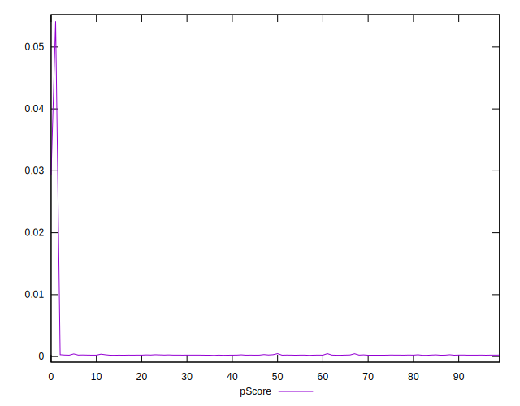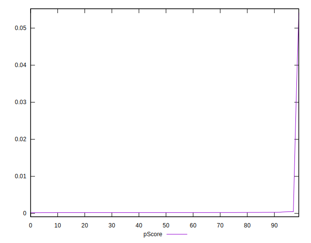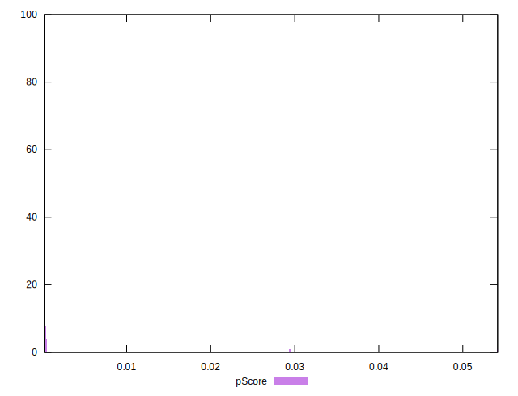
## Score Difference


```yaml
p90min: 0
p90max: 0
p90range: 0
p90mean: 0
p90median: 0
p90stdev: 0
p90skewness: .nan
p90eccentricity: .nan
p90discretization: 94
outlandishness: .nan
confidence: 0
p90confidence: 0

```


## P Score Difference


```yaml
p90min: 0.00019660280217320691
p90max: 0.0004527112014527379
p90range: 0.000256108399279531
p90mean: 0.00023964614947456273
p90median: 0.00023011295369734786
p90stdev: 0.00004016611605395572
p90skewness: 3.2470887730182505
p90eccentricity: 1
p90discretization: 1
outlandishness: 1.3044025168633342
confidence: 0.00015735185034780136
p90confidence: 0.00001623955029624563

```

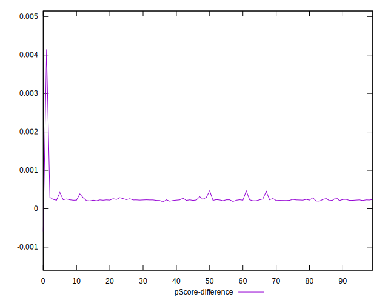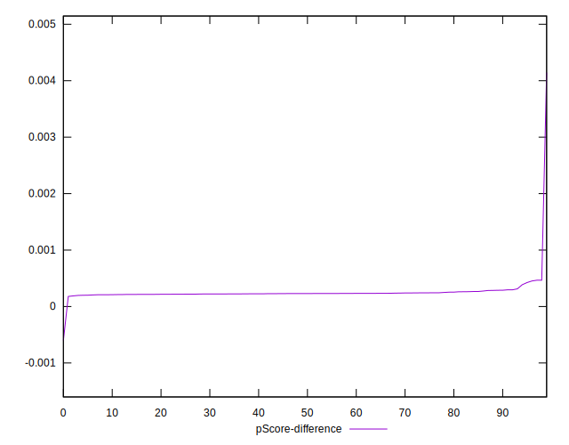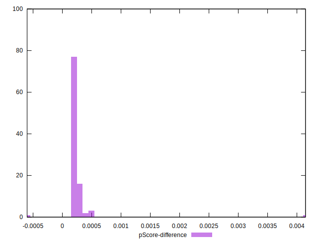