# //mainthread-work-breakdown/samples/pages+cached+noadtech+nomedia+nocss

[→ Parent](../..)


## Raw


```yaml
p90min: 352.78000000000003
p90max: 646.152
p90range: 293.372
p90mean: 428.84808510638294
p90median: 412.54
p90stdev: 69.84418552927714
p90skewness: 1.4874264779079478
p90eccentricity: 0.9999999999999996
p90discretization: 1
outlandishness: 1.0391355796661927
confidence: 36.189182845364726
p90confidence: 28.238681636017997

```

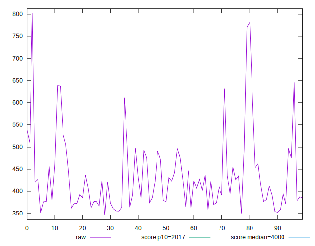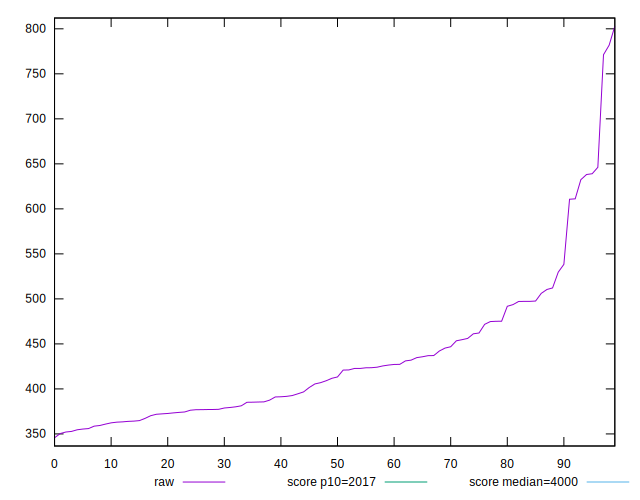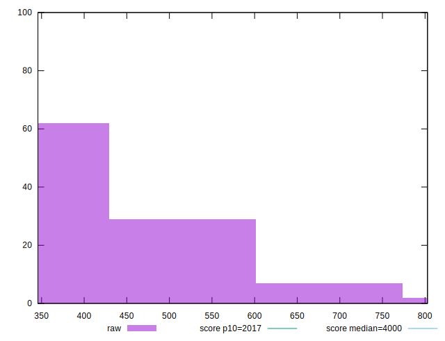
## Score


```yaml
p90min: 1
p90max: 1
p90range: 0
p90mean: 1
p90median: 1
p90stdev: 0
p90skewness: .nan
p90eccentricity: .nan
p90discretization: 94
outlandishness: 1
confidence: 0
p90confidence: 0

```

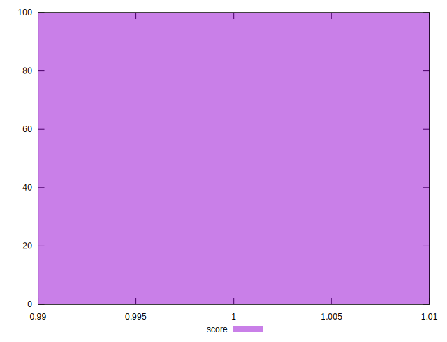
## Raw Estimate

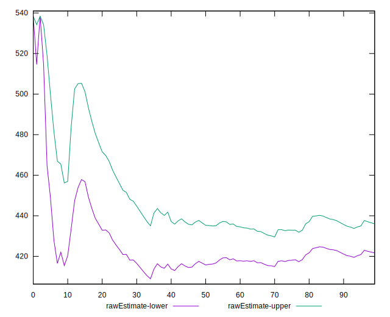
## Score Estimate

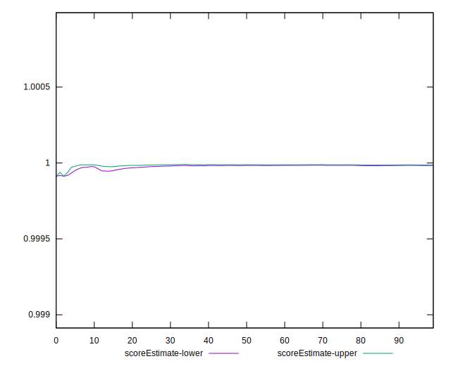
## P Score


```yaml
p90min: 0.9996777657404373
p90max: 0.9999972502861484
p90range: 0.00031948454571106844
p90mean: 0.9999673971965662
p90median: 0.9999894017715034
p90stdev: 0.00006548251884173492
p90skewness: -3.336273572733563
p90eccentricity: 0.9999999999999997
p90discretization: 1
outlandishness: 0.9999341589243647
confidence: 0.000079907182367869
p90confidence: 0.000026475217489953893

```

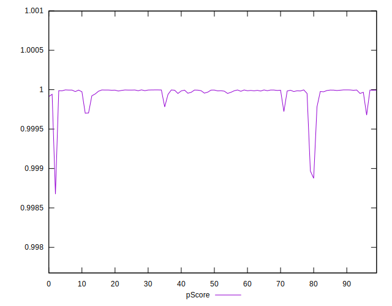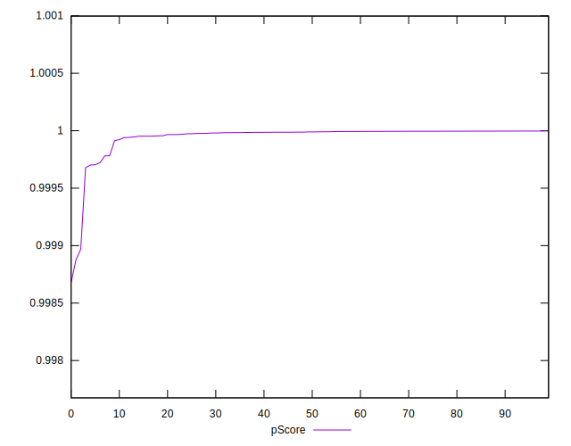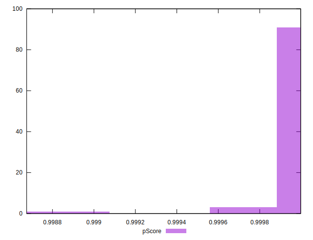
## Score Difference


```yaml
p90min: 0
p90max: 0
p90range: 0
p90mean: 0
p90median: 0
p90stdev: 0
p90skewness: .nan
p90eccentricity: .nan
p90discretization: 94
outlandishness: .nan
confidence: 0
p90confidence: 0

```


## P Score Difference


```yaml
p90min: -0.0003222342595626815
p90max: -0.000002749713851613045
p90range: 0.00031948454571106844
p90mean: -0.00003260280343325115
p90median: -0.000010598228496638828
p90stdev: 0.00006548251884173492
p90skewness: -3.3362735727363773
p90eccentricity: 0.9999999999999999
p90discretization: 1
outlandishness: 4.039011921949355
confidence: 0.000079907182367869
p90confidence: 0.000026475217489953893

```

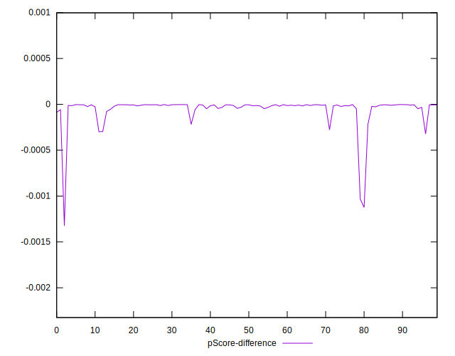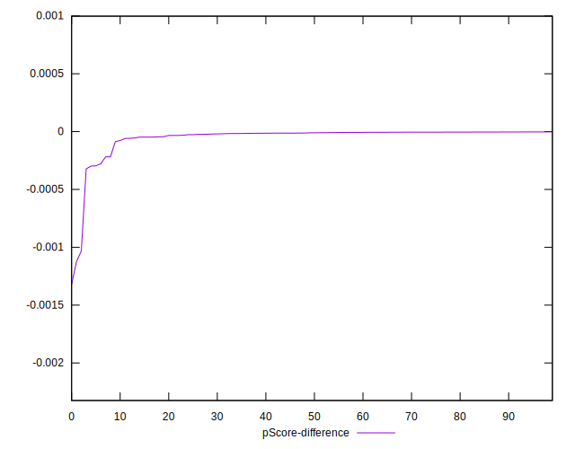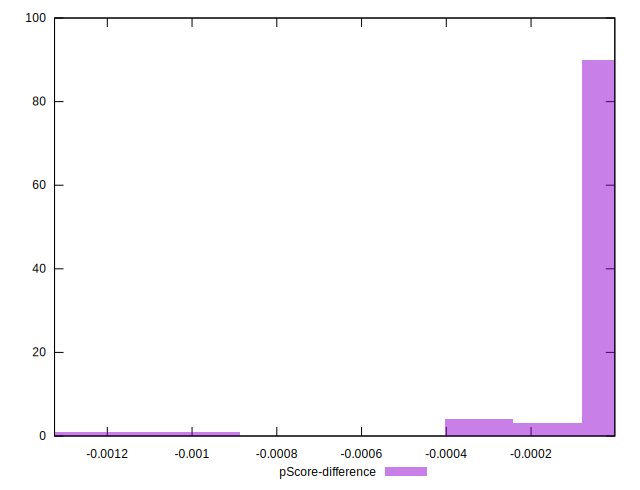