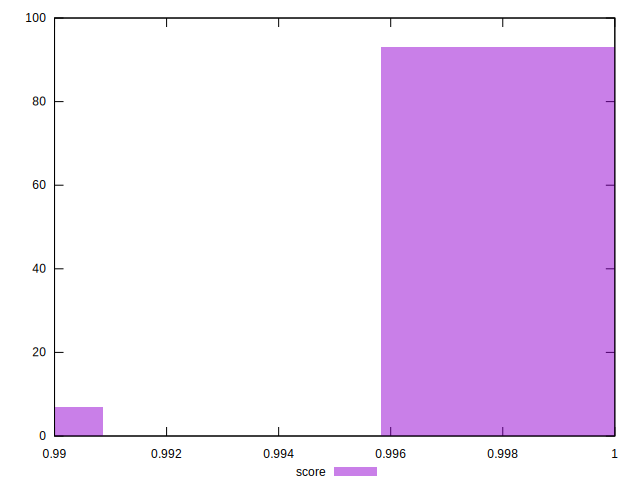
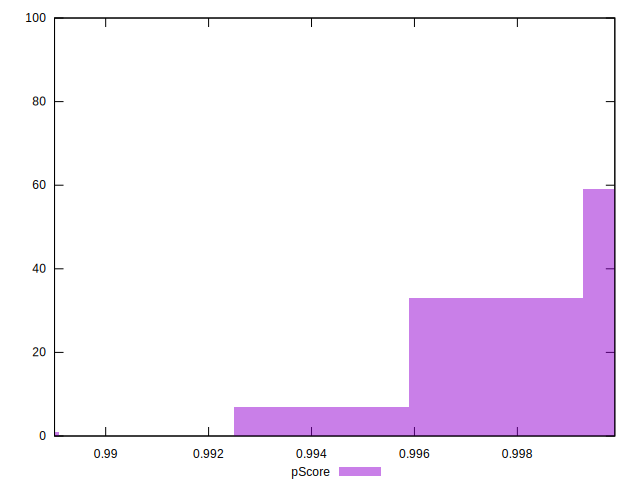
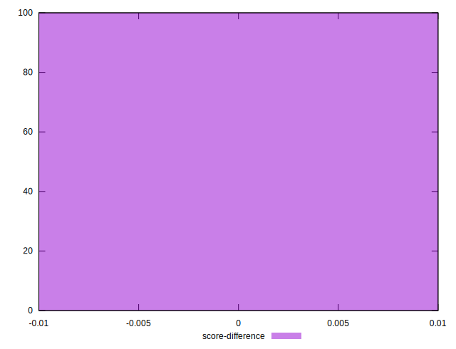

# //mainthread-work-breakdown/samples/pages+cached+noadtech+nomedia

[→ Parent](../..)


## Raw


```yaml
p90min: 586.4440000000003
p90max: 1051.6879999999999
p90range: 465.2439999999996
p90mean: 740.4406808510647
p90median: 704.2800000000005
p90stdev: 120.2659156718458
p90skewness: 0.9053625464106678
p90eccentricity: 1.0000000000000002
p90discretization: 1
outlandishness: 1.0163881192517203
confidence: 53.588803102656335
p90confidence: 48.624676178632654

```


## Score


```yaml
p90min: 0.99
p90max: 1
p90range: 0.010000000000000009
p90mean: 0.9995744680851064
p90median: 1
p90stdev: 0.002018475102235138
p90skewness: -4.532597979574556
p90eccentricity: 0.9999999999999991
p90discretization: 47
outlandishness: 0.999450905537369
confidence: 0.0010001579259840687
p90confidence: 0.0008160890612484012

```


## Raw Estimate


## Score Estimate


## P Score


```yaml
p90min: 0.993798360162327
p90max: 0.999836953046469
p90range: 0.006038592884141991
p90mean: 0.998816730799778
p90median: 0.9994248949660153
p90stdev: 0.0013789696574517322
p90skewness: -2.01564993396137
p90eccentricity: 1.0000000000000002
p90discretization: 1
outlandishness: 0.9996254153246488
confidence: 0.0007308122871069674
p90confidence: 0.0005575308072879647

```


## Score Difference


```yaml
p90min: 0
p90max: 0
p90range: 0
p90mean: 0
p90median: 0
p90stdev: 0
p90skewness: .nan
p90eccentricity: .nan
p90discretization: 94
outlandishness: .nan
confidence: 0
p90confidence: 0

```


## P Score Difference


```yaml
p90min: -0.003273071334690014
p90max: 0.0037983601623270413
p90range: 0.0070714314970170555
p90mean: -0.0007196987394789264
p90median: -0.0005433596666938878
p90stdev: 0.001062553930064079
p90skewness: 0.7194375324671194
p90eccentricity: 0.9999999999999999
p90discretization: 1
outlandishness: 0.8675837051908869
confidence: 0.0005789159314183229
p90confidence: 0.00042960085975376973

```

