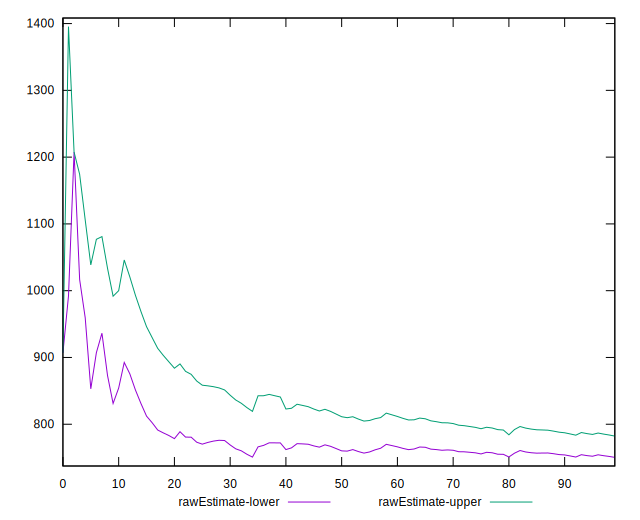

# //mainthread-work-breakdown/samples/pages+cached+noadtech

[→ Parent](../..)


## Raw


```yaml
p90min: 602.2280000000005
p90max: 1280.024000000001
p90range: 677.7960000000005
p90mean: 766.310127659575
p90median: 716.3140000000005
p90stdev: 155.4727501473062
p90skewness: 1.3256754326448699
p90eccentricity: 1.0000000000000007
p90discretization: 1
outlandishness: 1.038775763250543
confidence: 74.80496135494134
p90confidence: 62.85914083206846

```


## Score


```yaml
p90min: 0.98
p90max: 1
p90range: 0.020000000000000018
p90mean: 0.9989361702127658
p90median: 1
p90stdev: 0.0034108977748683843
p90skewness: -3.3232820779638015
p90eccentricity: 1.0000000000000036
p90discretization: 31.333333333333332
outlandishness: 0.9985266346882975
confidence: 0.0021740586314499574
p90confidence: 0.001379059053056544

```


## Raw Estimate


## Score Estimate


## P Score


```yaml
p90min: 0.9835251532666861
p90max: 0.9998028955208422
p90range: 0.016277742254156125
p90mean: 0.9982204680309578
p90median: 0.9993570296507159
p90stdev: 0.0028320730361099354
p90skewness: -2.9372491127717506
p90eccentricity: 1.0000000000000002
p90discretization: 1
outlandishness: 0.9985895567149453
confidence: 0.002019554475279113
p90confidence: 0.0011450345970909208

```


## Score Difference


```yaml
p90min: 0
p90max: 0
p90range: 0
p90mean: 0
p90median: 0
p90stdev: 0
p90skewness: .nan
p90eccentricity: .nan
p90discretization: 94
outlandishness: .nan
confidence: 0
p90confidence: 0

```


## P Score Difference


```yaml
p90min: -0.003628191187598606
p90max: 0.0024617139427377532
p90range: 0.006089905130336359
p90mean: -0.0007142521694331428
p90median: -0.0005274575014277971
p90stdev: 0.0010179788880326642
p90skewness: -0.10559742817948228
p90eccentricity: 1.0000000000000004
p90discretization: 1
outlandishness: 0.9164057237746772
confidence: 0.0005527418988238312
p90confidence: 0.00041157873792217346

```

