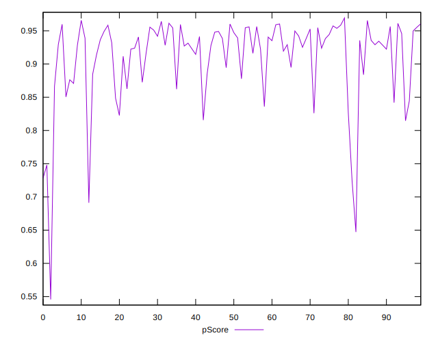

# //mainthread-work-breakdown/samples/pages+cached

[→ Parent](../..)


## Raw


```yaml
p90min: 1528.0520000000008
p90max: 2910.863999999995
p90range: 1382.8119999999942
p90mean: 1888.2325106382991
p90median: 1805.9560000000006
p90stdev: 308.8517166759739
p90skewness: 1.3251134415454018
p90eccentricity: 1.0000000000000002
p90discretization: 1
outlandishness: 1.0348458318306069
confidence: 157.35709099297694
p90confidence: 124.87174463928096

```


## Score


```yaml
p90min: 0.72
p90max: 0.96
p90range: 0.24
p90mean: 0.9146808510638298
p90median: 0.93
p90stdev: 0.05162677285935499
p90skewness: -1.7305427935903317
p90eccentricity: 1.0000000000000002
p90discretization: 5.222222222222222
outlandishness: 0.9850112313238593
confidence: 0.027953127006931405
p90confidence: 0.020873205000854832

```


## Raw Estimate


## Score Estimate


## P Score


```yaml
p90min: 0.7240527140088344
p90max: 0.9641628395820446
p90range: 0.2401101255732102
p90mean: 0.9147302771254012
p90median: 0.9316795050550042
p90stdev: 0.05135417083932995
p90skewness: -1.7575672841379988
p90eccentricity: 0.9999999999999996
p90discretization: 1
outlandishness: 0.9846751813663405
confidence: 0.027961771554474588
p90confidence: 0.02076298936016137

```


## Score Difference


```yaml
p90min: 0
p90max: 1.1102230246251565e-16
p90range: 1.1102230246251565e-16
p90mean: 3.5432649722079466e-17
p90median: 0
p90stdev: 5.1752697399898886e-17
p90skewness: 0.7759402897989853
p90eccentricity: 0.9999999999999989
p90discretization: 47
outlandishness: 1.069156
confidence: 2.0463630612268093e-17
p90confidence: 2.0924117513952867e-17

```


## P Score Difference


```yaml
p90min: -0.004522331981367311
p90max: 0.004607889343105853
p90range: 0.009130221324473164
p90mean: -0.00011376861656628021
p90median: -0.0005327285478390897
p90stdev: 0.0028400792516365117
p90skewness: 0.11110910710218905
p90eccentricity: 1
p90discretization: 1
outlandishness: 0.8651725353092564
confidence: 0.0011731564757338484
p90confidence: 0.0011482715876814913

```

