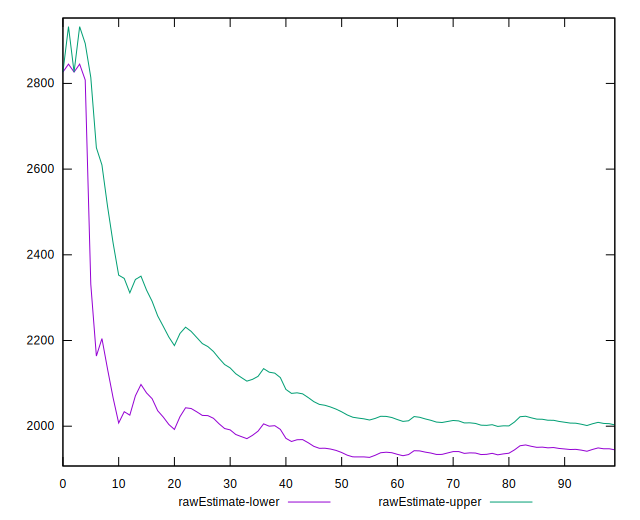

# //mainthread-work-breakdown/samples/pages

[→ Parent](../..)


## Raw


```yaml
p90min: 1643.932000000002
p90max: 2826.5400000000022
p90range: 1182.6080000000002
p90mean: 1973.9278297872345
p90median: 1878.8120000000008
p90stdev: 283.59549975477734
p90skewness: 1.2676905385064083
p90eccentricity: 1
p90discretization: 1
outlandishness: 1.026508049955319
confidence: 138.79434570629638
p90confidence: 114.66041117518148

```


## Score


```yaml
p90min: 0.74
p90max: 0.95
p90range: 0.20999999999999996
p90mean: 0.9028723404255318
p90median: 0.92
p90stdev: 0.04994938588052466
p90skewness: -1.5440997624028863
p90eccentricity: 1.000000000000001
p90discretization: 4.476190476190476
outlandishness: 0.9876945067129681
confidence: 0.02542129955512227
p90confidence: 0.020195021176150674

```


## Raw Estimate


## Score Estimate


## P Score


```yaml
p90min: 0.7421366141853724
p90max: 0.9519798931847432
p90range: 0.20984327899937083
p90mean: 0.9027737797204468
p90median: 0.9213762627120907
p90stdev: 0.04919558561011638
p90skewness: -1.5392966649130135
p90eccentricity: 1.0000000000000004
p90discretization: 1
outlandishness: 0.9876735153243469
confidence: 0.02519693974700398
p90confidence: 0.019890252415631863

```


## Score Difference


```yaml
p90min: 0
p90max: 1.1102230246251565e-16
p90range: 1.1102230246251565e-16
p90mean: 3.6613738046148777e-17
p90median: 0
p90stdev: 5.21955523577521e-17
p90skewness: 0.7241005155222738
p90eccentricity: 1.000000000000001
p90discretization: 47
outlandishness: 1.062894484911551
confidence: 2.0615778659641917e-17
p90confidence: 2.110316806871246e-17

```


## P Score Difference


```yaml
p90min: -0.004659281247631819
p90max: 0.004678896477403827
p90range: 0.009338177725035646
p90mean: -0.00011724913884999781
p90median: 0.000007953314230646491
p90stdev: 0.002871400293432258
p90skewness: -0.08185172508545695
p90eccentricity: 0.9999999999999994
p90discretization: 1
outlandishness: 0.8404054095234726
confidence: 0.0011880749461620102
p90confidence: 0.001160934988665783

```

