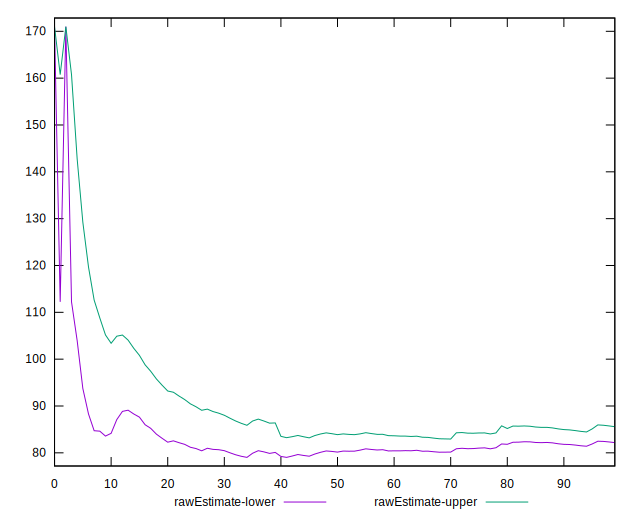

# //max-potential-fid/samples/pages+cached+noadtech+nomedia+nocss

[→ Parent](../..)


## Raw


```yaml
p90min: 67
p90max: 151
p90range: 84
p90mean: 83.88297872340425
p90median: 79
p90stdev: 16.560563500908792
p90skewness: 2.038096328193578
p90eccentricity: 0.9999999999999997
p90discretization: 2.41025641025641
outlandishness: 1.0821382026362638
confidence: 11.366117583413885
p90confidence: 6.69559644616652

```


## Score


```yaml
p90min: 0.84
p90max: 1
p90range: 0.16000000000000003
p90mean: 0.9780851063829784
p90median: 0.99
p90stdev: 0.027416278583565334
p90skewness: -3.4636452597580973
p90eccentricity: 0.9999999999999974
p90discretization: 7.833333333333333
outlandishness: 0.9798889606764657
confidence: 0.028039845103263242
p90confidence: 0.011084667344873721

```


## Raw Estimate


## Score Estimate


## P Score


```yaml
p90min: 0.8384441546430152
p90max: 0.9950681770426781
p90range: 0.1566240223996629
p90mean: 0.9788398620249665
p90median: 0.9880175836752019
p90stdev: 0.027245049877033647
p90skewness: -3.480970882135465
p90eccentricity: 1.0000000000000002
p90discretization: 2.41025641025641
outlandishness: 0.9796345366822272
confidence: 0.027948037565336935
p90confidence: 0.011015437918056672

```


## Score Difference


```yaml
p90min: 0
p90max: 0
p90range: 0
p90mean: 0
p90median: 0
p90stdev: 0
p90skewness: .nan
p90eccentricity: .nan
p90discretization: 94
outlandishness: .inf
confidence: 6.0927920006028104e-18
p90confidence: 0

```


## P Score Difference


```yaml
p90min: -0.004729327755706447
p90max: 0.004759762996895844
p90range: 0.009489090752602292
p90mean: 0.0006615180612941522
p90median: 0.0008507430743767141
p90stdev: 0.0026723759359281647
p90skewness: -0.3767605884339251
p90eccentricity: 0.9999999999999999
p90discretization: 2.35
outlandishness: 0.8821824206652884
confidence: 0.0011220130718072971
p90confidence: 0.001080467510567477

```

