# //max-potential-fid/samples/pages+cached+noadtech+nomedia

[→ Parent](../..)


## Raw


```yaml
p90min: 68
p90max: 129
p90range: 61
p90mean: 81.57446808510639
p90median: 79
p90stdev: 11.458054271812031
p90skewness: 1.5145701947606929
p90eccentricity: 0.9999999999999994
p90discretization: 2.6857142857142855
outlandishness: 1.0370027777777773
confidence: 6.3132761309663366
p90confidence: 4.632602475037619

```

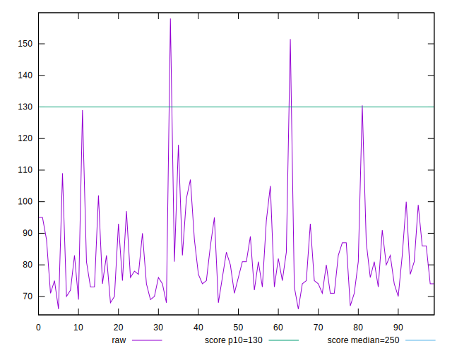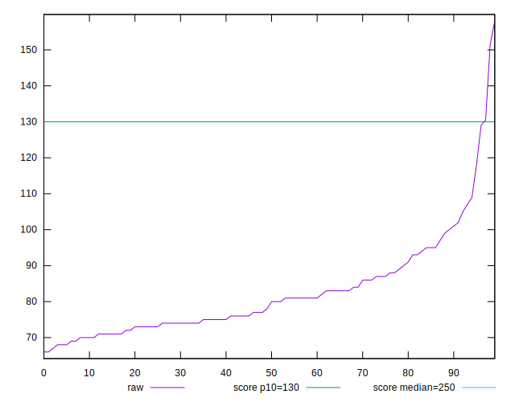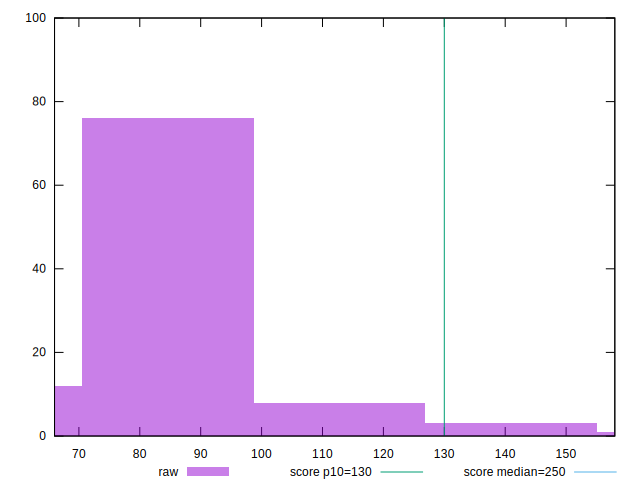
## Score


```yaml
p90min: 0.9
p90max: 0.99
p90range: 0.08999999999999997
p90mean: 0.982553191489361
p90median: 0.99
p90stdev: 0.013986024195357272
p90skewness: -3.1668582948325636
p90eccentricity: 0.9999999999999996
p90discretization: 13.428571428571429
outlandishness: 0.9931861811755494
confidence: 0.010498969282006951
p90confidence: 0.00565468523418869

```

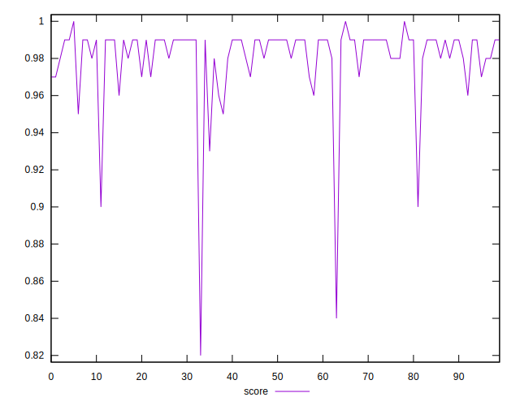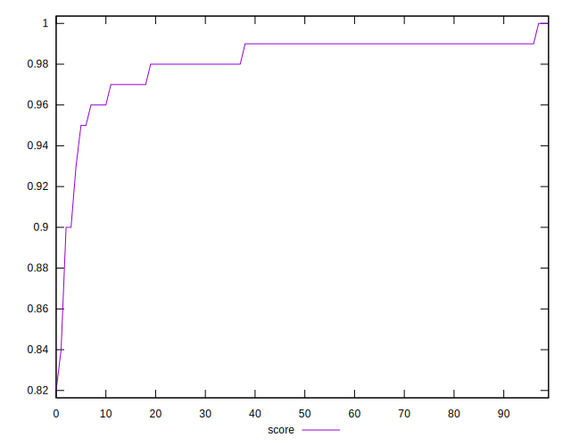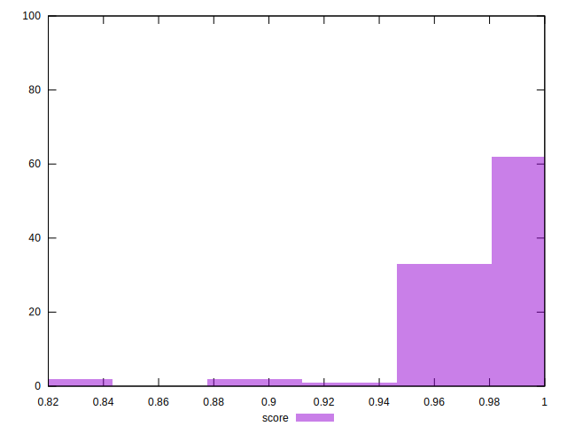
## Raw Estimate

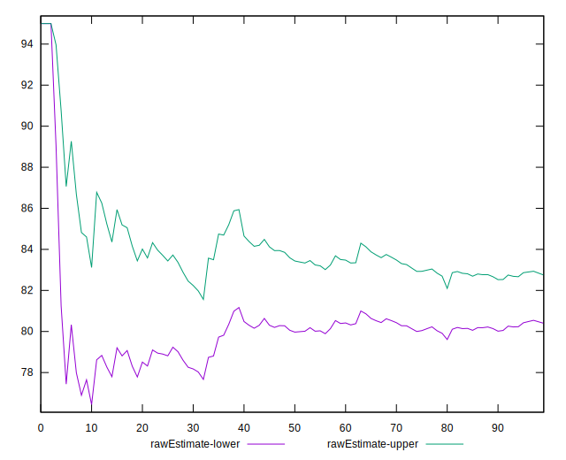
## Score Estimate

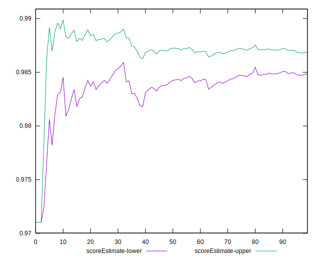
## P Score


```yaml
p90min: 0.9026301480675658
p90max: 0.9946375893622611
p90range: 0.09200744129469529
p90mean: 0.9835457910211206
p90median: 0.9880008118706489
p90stdev: 0.014207047004661806
p90skewness: -2.9896962126167255
p90eccentricity: 1.0000000000000007
p90discretization: 2.6857142857142855
outlandishness: 0.9926121804075987
confidence: 0.010731155677268438
p90confidence: 0.0057440468997153465

```

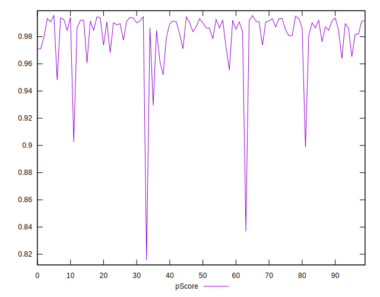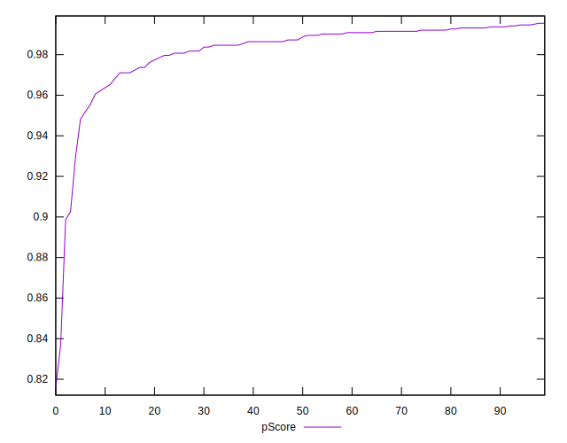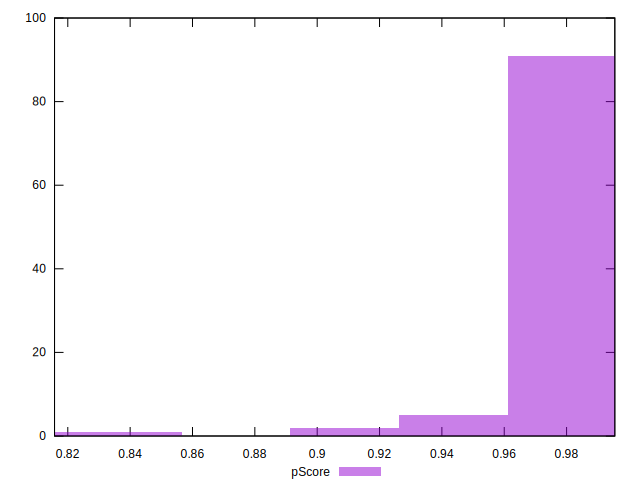
## Score Difference


```yaml
p90min: 0
p90max: 0
p90range: 0
p90mean: 0
p90median: 0
p90stdev: 0
p90skewness: .nan
p90eccentricity: .nan
p90discretization: 94
outlandishness: .inf
confidence: 7.423946114831066e-18
p90confidence: 0

```

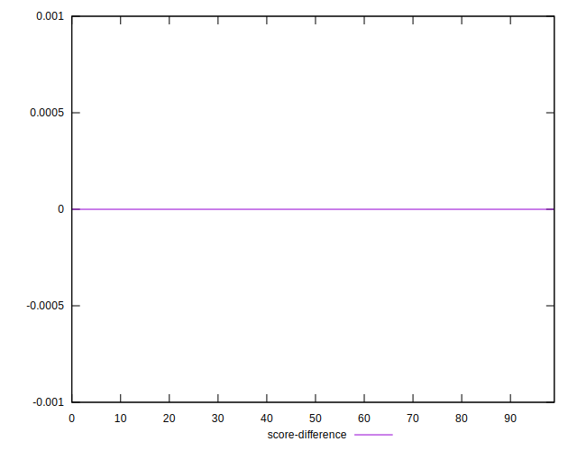
## P Score Difference


```yaml
p90min: -0.004526535494477901
p90max: 0.004648231415178894
p90range: 0.009174766909656795
p90mean: 0.0007538747066153332
p90median: 0.0012581380253738894
p90stdev: 0.0026189261049405473
p90skewness: -0.48630577789148455
p90eccentricity: 1
p90discretization: 2.5405405405405403
outlandishness: 0.8768404515315844
confidence: 0.0010951769316796896
p90confidence: 0.001058857225483322

```

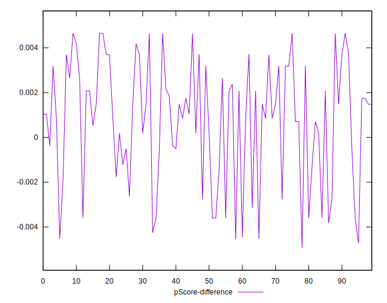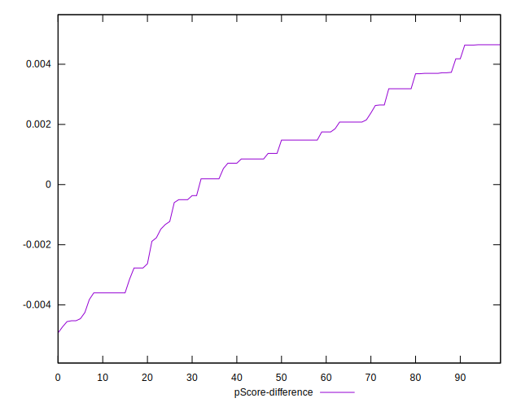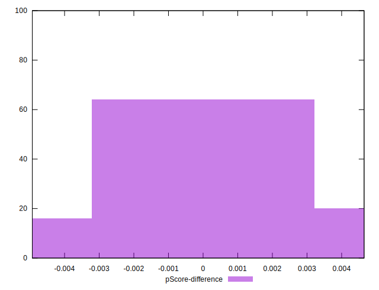