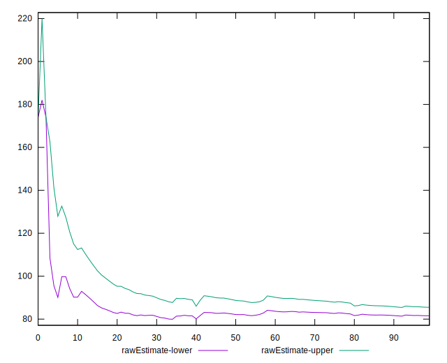

# //max-potential-fid/samples/pages+cached+noadtech

[→ Parent](../..)


## Raw


```yaml
p90min: 67
p90max: 165
p90range: 98
p90mean: 83.54255319148936
p90median: 77
p90stdev: 19.150392970589973
p90skewness: 2.387834553758584
p90eccentricity: 1
p90discretization: 2.473684210526316
outlandishness: 1.0690817397334236
confidence: 10.711059539493284
p90confidence: 7.742689619802975

```


## Score


```yaml
p90min: 0.79
p90max: 1
p90range: 0.20999999999999996
p90mean: 0.9772340425531905
p90median: 0.99
p90stdev: 0.03486766029893021
p90skewness: -3.4782298422424387
p90eccentricity: 0.9999999999999972
p90discretization: 7.833333333333333
outlandishness: 0.9832192643136977
confidence: 0.024589542866374225
p90confidence: 0.014097333244176564

```


## Raw Estimate


## Score Estimate


## P Score


```yaml
p90min: 0.7922688204000142
p90max: 0.9950681770426781
p90range: 0.2027993566426639
p90mean: 0.9775416398101898
p90median: 0.9894989257340682
p90stdev: 0.03502124590604303
p90skewness: -3.483370339235655
p90eccentricity: 1.0000000000000002
p90discretization: 2.473684210526316
outlandishness: 0.9830281173749705
confidence: 0.02452842729367719
p90confidence: 0.01415942939477618

```


## Score Difference


```yaml
p90min: 0
p90max: 0
p90range: 0
p90mean: 0
p90median: 0
p90stdev: 0
p90skewness: .nan
p90eccentricity: .nan
p90discretization: 94
outlandishness: .inf
confidence: 6.09279200060281e-18
p90confidence: 0

```


## P Score Difference


```yaml
p90min: -0.004931822957321863
p90max: 0.0046375893622611075
p90range: 0.00956941231958297
p90mean: 0.0002300563353702219
p90median: 0.0009436941130576137
p90stdev: 0.0028087978442539263
p90skewness: -0.3286269035687692
p90eccentricity: 1.0000000000000002
p90discretization: 2.238095238095238
outlandishness: 0.8394411635531841
confidence: 0.0011647073892215815
p90confidence: 0.0011356242112748594

```

